# **Advanced Module 4: Visual Documentation with Mermaid**

## **2 Weeks | 45 min live + 60 min homework per week**

-----

## **Prerequisites**

- Block 1 Certification: AI Prompting Practitioner (minimum)
- Familiarity with Markdown
- Understanding of workflow concepts
- GitHub repository for documentation

-----

## **Module Overview**

**Target Audience:** Any Block 1+ graduate who wants to create professional visual documentation for their AI workflows, agent architectures, and processes.

**Learning Objectives:**
- Master Mermaid diagram syntax for common diagram types
- Create flowcharts for workflow documentation
- Build sequence diagrams for agent interactions
- Design architecture diagrams for systems
- Integrate diagrams into GitHub documentation

**Capstone:** Visual Documentation Suite
- Complete workflow diagram library
- Agent interaction diagrams
- System architecture visualization
- Integrated documentation with embedded diagrams

-----

## **Week 1: Mermaid Fundamentals**

### **Entry Criteria**

- [ ] Markdown proficiency
- [ ] Workflows or agents to document
- [ ] GitHub repository access
- [ ] Text editor with Mermaid preview (VS Code, etc.)

### **Exit Criteria**

- [ ] Mermaid syntax understood
- [ ] Flowcharts created for workflows
- [ ] Sequence diagrams for interactions
- [ ] 5+ diagrams created and rendered

-----

### **Workshop Content (45 minutes)**

**Segment 1: Introduction to Mermaid (10 min)**

- **What is Mermaid?**
  - Text-based diagramming language
  - Renders in Markdown (GitHub, GitLab, etc.)
  - No external tools needed
  - Version-controllable diagrams

- **Why Mermaid for AI documentation?**
  - Describe workflows visually
  - Show agent interactions
  - Document system architecture
  - Easy to update as systems evolve

- **Where Mermaid renders:**
  - GitHub README files
  - GitLab documentation
  - Notion, Obsidian, many others
  - VS Code with extensions

- **Basic syntax:**
  ```
  ```mermaid
  graph TD
    A[Start] --> B[Process]
    B --> C[End]
  ```
  ```

**Segment 2: Flowcharts (15 min)**

- **Basic flowchart:**
  ```mermaid
  graph TD
      A[Start] --> B{Decision?}
      B -->|Yes| C[Action 1]
      B -->|No| D[Action 2]
      C --> E[End]
      D --> E
  ```

- **Direction options:**
  - `TD` or `TB` - Top to Bottom
  - `BT` - Bottom to Top
  - `LR` - Left to Right
  - `RL` - Right to Left

- **Node shapes:**
  ```
  A[Rectangle]
  B(Rounded)
  C([Stadium])
  D[[Subroutine]]
  E[(Database)]
  F((Circle))
  G{Diamond/Decision}
  H{{Hexagon}}
  I[/Parallelogram/]
  ```

- **Link styles:**
  ```
  A --> B        (Arrow)
  A --- B        (Line)
  A -.-> B       (Dotted arrow)
  A ==> B        (Thick arrow)
  A --text--> B  (Arrow with text)
  A -->|text| B  (Arrow with text)
  ```

- **Workflow example:**
  ```mermaid
  graph LR
      A[Trigger] --> B[Gather Data]
      B --> C[AI Generate]
      C --> D{Quality Check}
      D -->|Pass| E[Output]
      D -->|Fail| F[Retry]
      F --> C
  ```

**Segment 3: Sequence Diagrams (12 min)**

- **Basic sequence diagram:**
  ```mermaid
  sequenceDiagram
      participant U as User
      participant O as Orchestrator
      participant A as Agent

      U->>O: Submit request
      O->>A: Delegate task
      A->>A: Process
      A-->>O: Return result
      O-->>U: Deliver output
  ```

- **Arrow types:**
  ```
  ->>   Solid line with arrow
  -->>  Dotted line with arrow
  -x    Solid line with cross
  --x   Dotted line with cross
  -)    Solid line with open arrow
  --)   Dotted line with open arrow
  ```

- **Advanced features:**
  ```mermaid
  sequenceDiagram
      participant U as User
      participant S as System

      U->>S: Request

      alt Success
          S-->>U: Response
      else Failure
          S-->>U: Error
      end

      loop Retry
          S->>S: Attempt
      end

      Note over U,S: Important note
  ```

- **Agent interaction example:**
  ```mermaid
  sequenceDiagram
      participant O as Orchestrator
      participant R as Researcher
      participant W as Writer
      participant E as Editor

      O->>R: Gather information
      R-->>O: Research results
      O->>W: Generate draft
      W-->>O: Draft content
      O->>E: Review and edit
      E-->>O: Edited content
      O->>O: Final assembly
  ```

**Segment 4: Styling and Best Practices (8 min)**

- **Adding styles:**
  ```mermaid
  graph TD
      A[Start]:::startStyle --> B[Process]
      B --> C[End]:::endStyle

      classDef startStyle fill:#9f9,stroke:#333
      classDef endStyle fill:#f99,stroke:#333
  ```

- **Subgraphs (grouping):**
  ```mermaid
  graph TD
      subgraph Phase1[Research Phase]
          A[Gather] --> B[Analyze]
      end
      subgraph Phase2[Creation Phase]
          C[Draft] --> D[Edit]
      end
      B --> C
  ```

- **Best practices:**
  - Keep diagrams focused (one concept per diagram)
  - Use consistent naming
  - Add labels to arrows
  - Use subgraphs for complex systems
  - Test rendering before committing

-----

### **Self-Paced Exercises (60 minutes total)**

**Exercise 1.1: Workflow Flowcharts (20 minutes)**

*Create flowcharts for your workflows*

1. **Document your main workflow:**

```markdown
# Workflow Diagram: [Your Workflow Name]

## Overview
[Brief description of what this workflow does]

## Flowchart

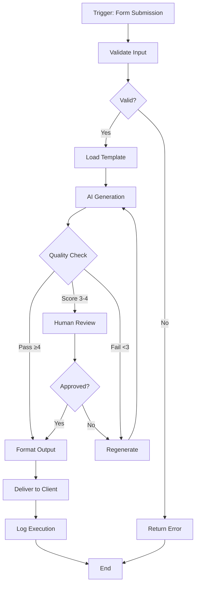

## Step Descriptions

| Step | Description |
|------|-------------|
| A | Workflow triggered by form submission |
| B | Validate required fields present |
| ... | ... |
```

2. **Create flowcharts for 2 more workflows**

3. **Add to your documentation**

**Deliverable:** 3 workflow flowcharts in markdown files

-----

**Exercise 1.2: Sequence Diagrams (20 minutes)**

*Document agent interactions*

1. **Create agent sequence diagram:**

```markdown
# Agent Interaction: [Scenario Name]

## Scenario
[What interaction this documents]

## Sequence Diagram

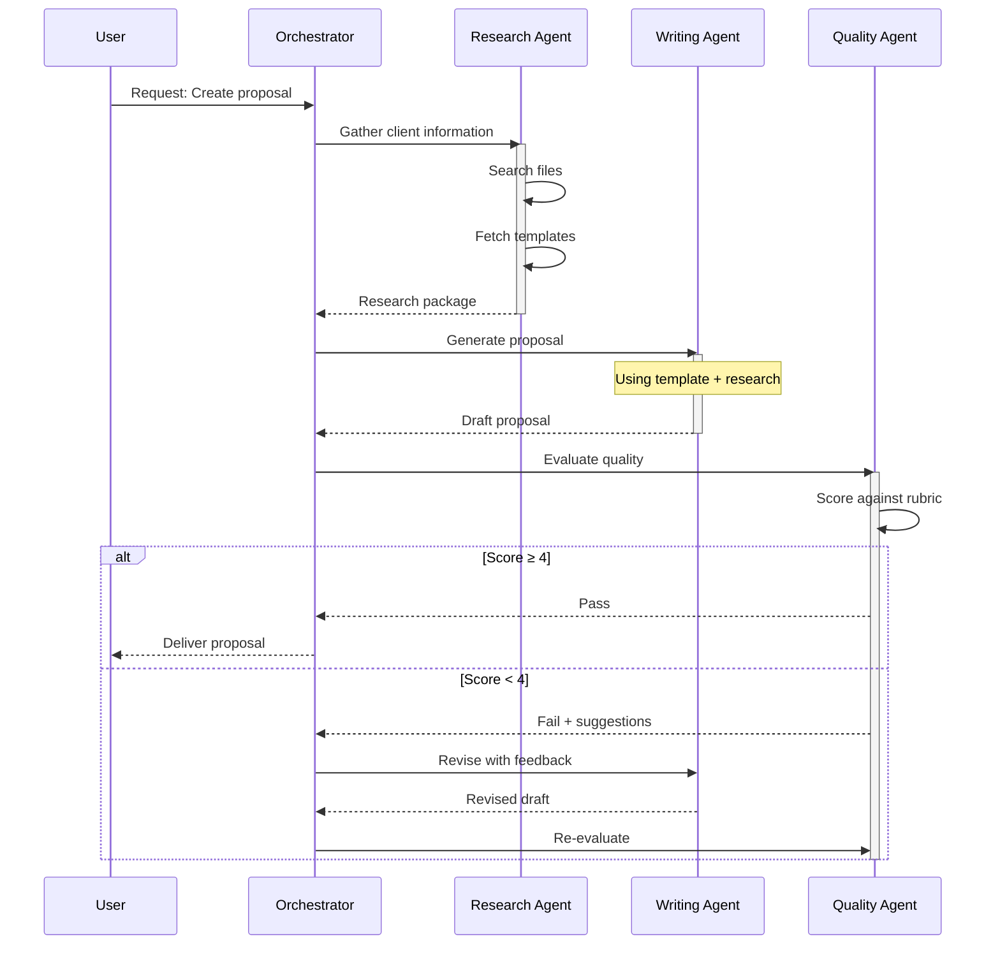

## Interaction Notes

1. **Research Phase:** Agent gathers all necessary context
2. **Generation Phase:** Writing agent produces draft
3. **Quality Phase:** Evaluation with potential iteration
```

2. **Create sequence diagram for error handling:**

```markdown
# Error Handling Flow

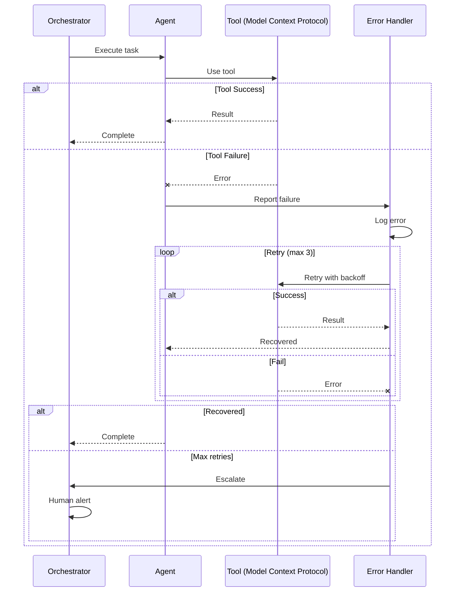
```

**Deliverable:** 2 sequence diagrams in documentation

-----

**Exercise 1.3: Combined Documentation (20 minutes)**

*Create integrated visual documentation*

```markdown
# [System Name] - Visual Documentation

## System Overview

This document provides visual documentation for [system description].

## High-Level Architecture

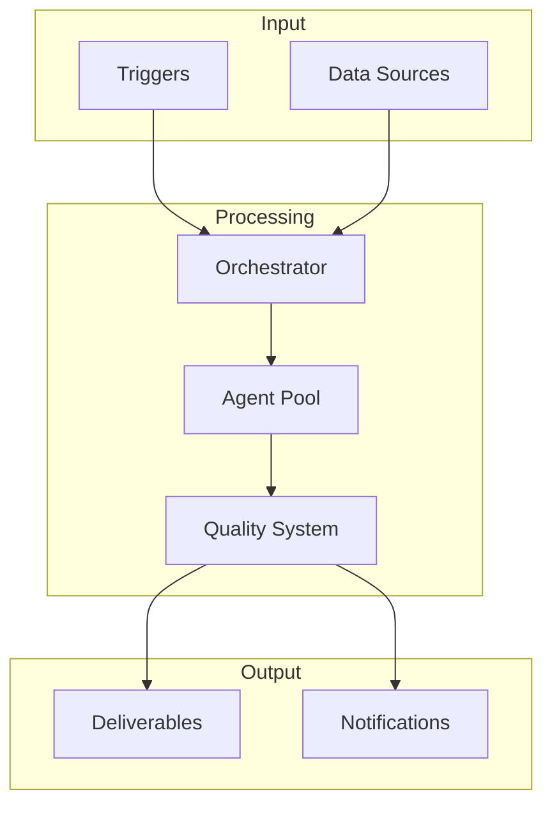

## Workflow Details

### Main Workflow

```mermaid
graph LR
    [Your flowchart here]
```

### Quality Workflow

```mermaid
graph TD
    [Quality process flowchart]
```

## Agent Interactions

### Standard Execution

```mermaid
sequenceDiagram
    [Standard flow sequence]
```

### Error Recovery

```mermaid
sequenceDiagram
    [Error handling sequence]
```

## Legend

| Symbol | Meaning |
|--------|---------|
| Rectangle | Process step |
| Diamond | Decision point |
| Database shape | Data storage |
| Dotted line | Optional/async |
```

**Deliverable:** Integrated visual documentation file

-----

## **Week 2: Advanced Diagrams & Integration**

### **Entry Criteria**

- [ ] 5+ basic diagrams created
- [ ] Flowcharts and sequence diagrams working
- [ ] Diagrams rendering in GitHub

### **Exit Criteria**

- [ ] State diagrams for agent states
- [ ] Architecture diagrams for systems
- [ ] Diagrams integrated into README files
- [ ] Module capstone completed

-----

### **Workshop Content (45 minutes)**

**Segment 1: State Diagrams (12 min)**

- **Use case:** Document agent/workflow states

- **Basic syntax:**
  ```mermaid
  stateDiagram-v2
      [*] --> Idle
      Idle --> Processing: Start
      Processing --> Completed: Success
      Processing --> Failed: Error
      Failed --> Processing: Retry
      Completed --> [*]
  ```

- **Composite states:**
  ```mermaid
  stateDiagram-v2
      [*] --> Active

      state Active {
          [*] --> Planning
          Planning --> Executing
          Executing --> Evaluating
          Evaluating --> Planning: Needs revision
          Evaluating --> [*]: Complete
      }

      Active --> Failed: Critical error
      Active --> Completed: Success
      Failed --> Active: Recover
      Completed --> [*]
  ```

- **Agent state example:**
  ```mermaid
  stateDiagram-v2
      [*] --> Idle

      Idle --> Analyzing: Receive task
      Analyzing --> ToolSelection: Plan ready

      state ToolSelection {
          [*] --> Evaluating
          Evaluating --> Selected: Tool chosen
          Selected --> [*]
      }

      ToolSelection --> Executing: Tool selected
      Executing --> Observing: Action complete
      Observing --> Analyzing: Need more work
      Observing --> Responding: Goal achieved
      Responding --> Idle: Response sent

      Executing --> ErrorState: Tool fails
      ErrorState --> Executing: Retry
      ErrorState --> Idle: Max retries
  ```

**Segment 2: Class & Entity Diagrams (10 min)**

- **System component diagram:**
  ```mermaid
  classDiagram
      class Orchestrator {
          +agents: Agent[]
          +state: State
          +execute(task)
          +route(result)
      }

      class Agent {
          +name: string
          +tools: Tool[]
          +process(input)
      }

      class Tool {
          +name: string
          +execute(params)
      }

      Orchestrator "1" --> "*" Agent
      Agent "1" --> "*" Tool
  ```

- **Data model documentation:**
  ```mermaid
  erDiagram
      WORKFLOW ||--o{ EXECUTION : has
      EXECUTION ||--o{ STEP : contains
      EXECUTION ||--|| RESULT : produces
      STEP ||--o| AGENT : uses

      WORKFLOW {
          string id PK
          string name
          string config
      }
      EXECUTION {
          string id PK
          datetime started
          string status
      }
  ```

**Segment 3: Architecture Diagrams (12 min)**

- **C4-style context diagram:**
  ```mermaid
  graph TB
      subgraph Users
          U1[Consultant]
          U2[Manager]
      end

      subgraph "AI Workflow System"
          A[Orchestrator]
          B[Agent Pool]
          C[Quality Engine]
      end

      subgraph "External Systems"
          D[(GitHub)]
          E[Claude API]
          F[Slack]
      end

      U1 --> A
      U2 --> A
      A --> B
      B --> C
      B --> D
      B --> E
      A --> F
  ```

- **Deployment diagram:**
  ```mermaid
  graph LR
      subgraph "Local Machine"
          A[Claude Desktop]
          B[MCP Servers]
      end

      subgraph "Cloud Services"
          C[GitHub]
          D[Make.com]
          E[Anthropic API]
      end

      A --> B
      A --> E
      B --> C
      D --> E
      D --> C
  ```

- **Integration architecture:**
  ```mermaid
  graph TD
      subgraph "Triggers"
          T1[Email]
          T2[Form]
          T3[Schedule]
      end

      subgraph "Automation Platform"
          P[Make/n8n]
      end

      subgraph "AI Layer"
          AI[Claude + MCP]
      end

      subgraph "Data Layer"
          D1[(Templates)]
          D2[(Logs)]
          D3[(Outputs)]
      end

      subgraph "Outputs"
          O1[Documents]
          O2[Notifications]
          O3[Reports]
      end

      T1 & T2 & T3 --> P
      P <--> AI
      AI <--> D1
      P --> D2
      P --> O1 & O2 & O3
      P --> D3
  ```

**Segment 4: GitHub Integration (11 min)**

- **README with diagrams:**
  ```markdown
  # My AI Workflow System

  ## Architecture

  ```mermaid
  graph TD
      [Your diagram here]
  ```

  ## How It Works

  ```mermaid
  sequenceDiagram
      [Your sequence here]
  ```
  ```

- **Documentation structure:**
  ```
  /docs
    /architecture
      overview.md (with diagrams)
      components.md
    /workflows
      workflow-1.md (with flowchart)
      workflow-2.md
    /agents
      agent-interactions.md (with sequence)
  ```

- **Maintaining diagrams:**
  - Update when system changes
  - Version diagrams with code
  - Review in PRs

-----

### **Self-Paced Exercises (60 minutes total)**

**Exercise 2.1: State Diagrams (20 minutes)**

*Document agent and workflow states*

```markdown
# State Diagrams

## Agent Execution States

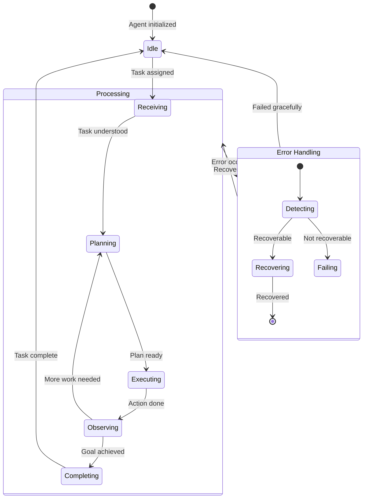

## Workflow States

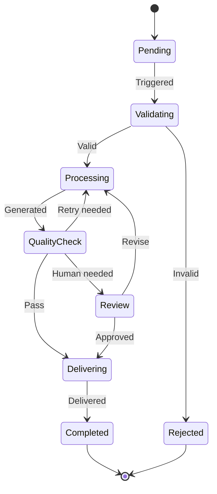

## Circuit Breaker States

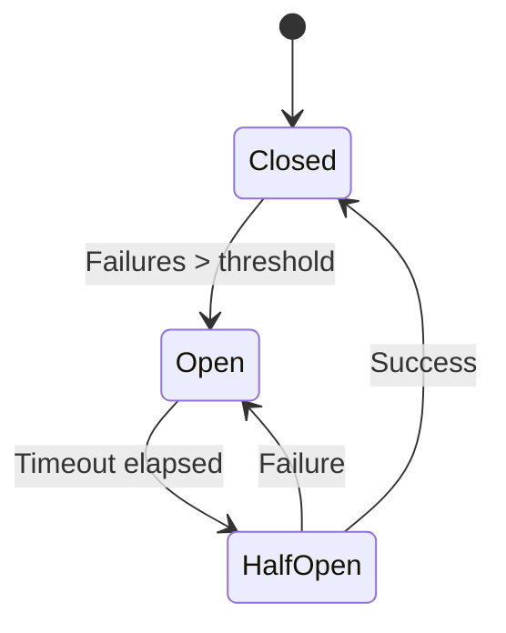
```

**Deliverable:** State diagrams for agents and workflows

-----

**Exercise 2.2: Architecture Documentation (20 minutes)**

*Create system architecture diagrams*

```markdown
# System Architecture Documentation

## Context Diagram

Who/what interacts with the system:

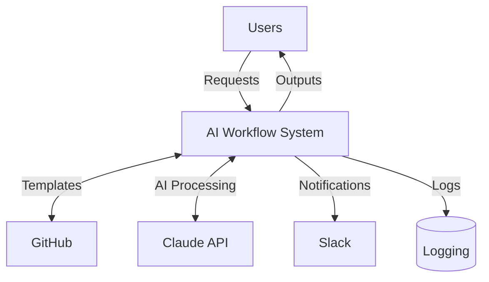

## Container Diagram

Major components of the system:

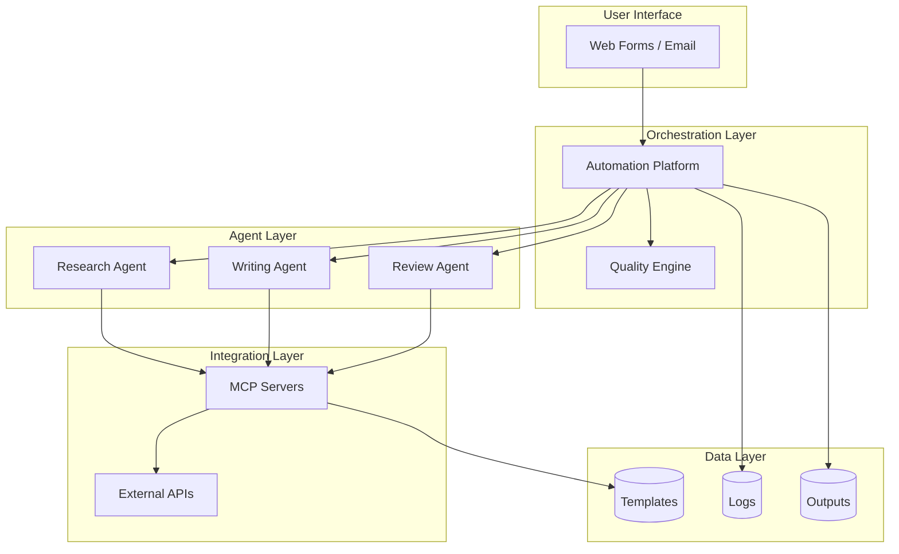

## Component Diagram

Detailed view of orchestration:

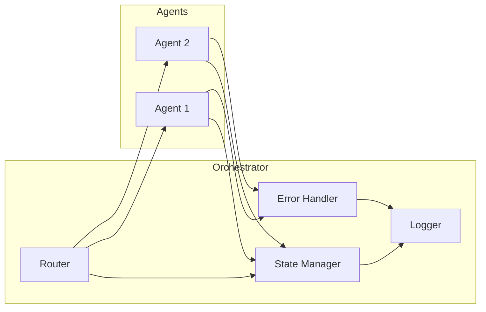

## Data Flow Diagram

How data moves through the system:

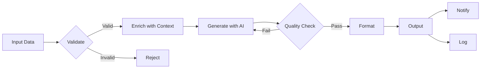
```

**Deliverable:** Complete architecture documentation

-----

**Exercise 2.3: Module Capstone (20 minutes)**

*Create comprehensive visual documentation suite*

```markdown
# Visual Documentation Suite

## Project: [Your System Name]

## Documentation Index

### Architecture
- [Context Diagram](#context-diagram)
- [Container Diagram](#container-diagram)
- [Deployment Diagram](#deployment-diagram)

### Workflows
- [Main Workflow](#main-workflow)
- [Quality Workflow](#quality-workflow)
- [Error Handling](#error-handling)

### Agent Interactions
- [Standard Flow](#standard-flow)
- [Multi-Agent Collaboration](#multi-agent)
- [Error Recovery](#error-recovery)

### States
- [Agent States](#agent-states)
- [Workflow States](#workflow-states)

---

## Architecture

### Context Diagram
```mermaid
[Your context diagram]
```

### Container Diagram
```mermaid
[Your container diagram]
```

### Deployment Diagram
```mermaid
[Your deployment diagram]
```

---

## Workflows

### Main Workflow
```mermaid
[Your main workflow flowchart]
```

### Quality Workflow
```mermaid
[Quality check flowchart]
```

### Error Handling
```mermaid
[Error handling flowchart]
```

---

## Agent Interactions

### Standard Flow
```mermaid
[Standard sequence diagram]
```

### Multi-Agent Collaboration
```mermaid
[Multi-agent sequence]
```

### Error Recovery
```mermaid
[Error recovery sequence]
```

---

## States

### Agent States
```mermaid
[Agent state diagram]
```

### Workflow States
```mermaid
[Workflow state diagram]
```

---

## Diagram Maintenance

| Diagram | Last Updated | Owner |
|---------|--------------|-------|
| Context | [Date] | [Name] |
| Workflow | [Date] | [Name] |
| ... | ... | ... |

## How to Update

1. Edit the markdown source
2. Preview locally (VS Code Mermaid extension)
3. Commit changes
4. Verify rendering in GitHub
```

**Deliverable:** Complete visual documentation suite

-----

# **APPENDICES**

## **Appendix A: Mermaid Cheat Sheet**

```markdown
# Mermaid Quick Reference

## Flowchart
```mermaid
graph TD|LR|BT|RL
    A[Rectangle] --> B(Rounded)
    B --> C{Decision}
    C -->|Yes| D[(Database)]
    C -->|No| E((Circle))
```

## Sequence
```mermaid
sequenceDiagram
    A->>B: Message
    B-->>A: Response
    Note over A,B: Note
    alt Condition
        A->>B: Alt 1
    else Other
        A->>B: Alt 2
    end
```

## State
```mermaid
stateDiagram-v2
    [*] --> State1
    State1 --> State2: Event
    State2 --> [*]
```

## Class
```mermaid
classDiagram
    Class1 <|-- Class2: Inherits
    Class1: +attribute
    Class1: +method()
```
```

-----

## **Appendix B: Common Diagram Patterns**

```markdown
# Reusable Patterns

## Workflow with Quality Gate
```mermaid
graph TD
    A[Input] --> B[Process]
    B --> C{Quality?}
    C -->|Pass| D[Output]
    C -->|Fail| E[Retry/Review]
    E --> B
```

## Multi-Agent Pipeline
```mermaid
sequenceDiagram
    O->>A: Task
    A-->>O: Result
    O->>B: Task + Context
    B-->>O: Result
    O->>C: Task + Context
    C-->>O: Final
```

## Error Recovery Pattern
```mermaid
graph TD
    A[Action] --> B{Success?}
    B -->|Yes| C[Continue]
    B -->|No| D{Retries?}
    D -->|Yes| E[Wait] --> A
    D -->|No| F[Escalate]
```
```

-----

## **Appendix C: Module Evaluation Rubric**

```markdown
# Visual Documentation - Evaluation Rubric

**Total Points: 20 (4 criteria × 5 points each)**

## Criterion 1: Flowcharts (5 points)

| Score | Description |
|-------|-------------|
| 5 | Clear, comprehensive flowcharts for all workflows. Proper symbols. Good layout. |
| 4 | Good flowcharts. Most workflows covered. |
| 3 | Basic flowcharts. Some workflows covered. |
| 2 | Limited flowcharts. Poor clarity. |
| 1 | No usable flowcharts. |

## Criterion 2: Sequence Diagrams (5 points)

| Score | Description |
|-------|-------------|
| 5 | Detailed sequence diagrams showing all interactions. Proper notation. Clear flow. |
| 4 | Good sequence diagrams. Main interactions covered. |
| 3 | Basic sequence diagrams. |
| 2 | Limited sequence diagrams. |
| 1 | No sequence diagrams. |

## Criterion 3: Architecture Diagrams (5 points)

| Score | Description |
|-------|-------------|
| 5 | Complete architecture documentation. Multiple views. Clear component relationships. |
| 4 | Good architecture diagrams. System clear. |
| 3 | Basic architecture diagram. |
| 2 | Limited architecture documentation. |
| 1 | No architecture diagrams. |

## Criterion 4: Integration & Maintenance (5 points)

| Score | Description |
|-------|-------------|
| 5 | Diagrams integrated into docs. Rendering verified. Maintenance plan in place. |
| 4 | Good integration. Diagrams render correctly. |
| 3 | Basic integration. Most diagrams work. |
| 2 | Poor integration. Rendering issues. |
| 1 | Not integrated. |
```

-----

**END OF ADVANCED MODULE 4**
