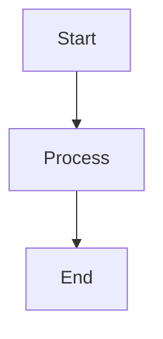
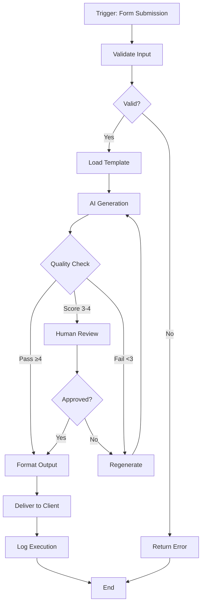
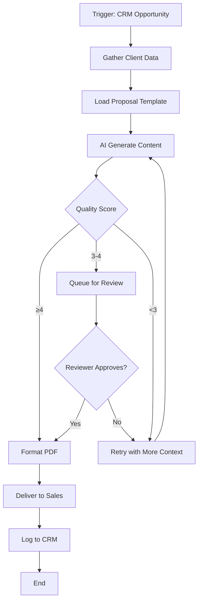
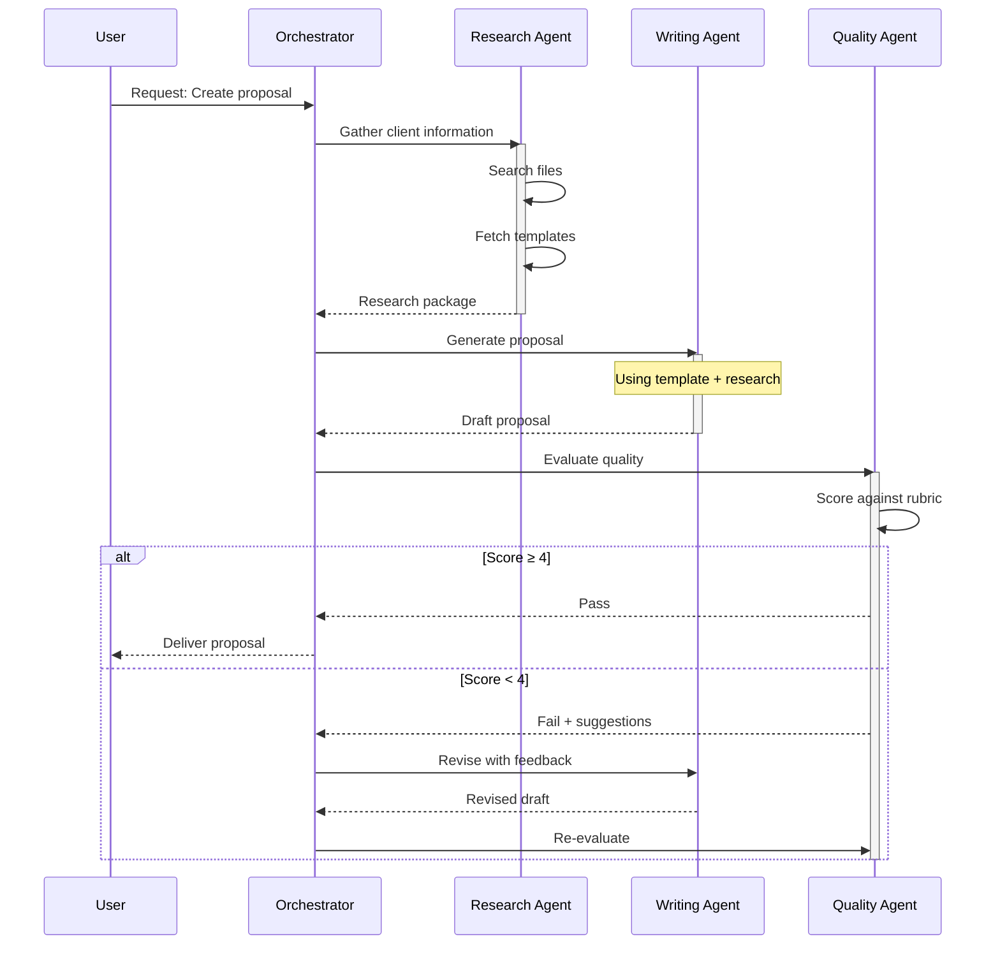
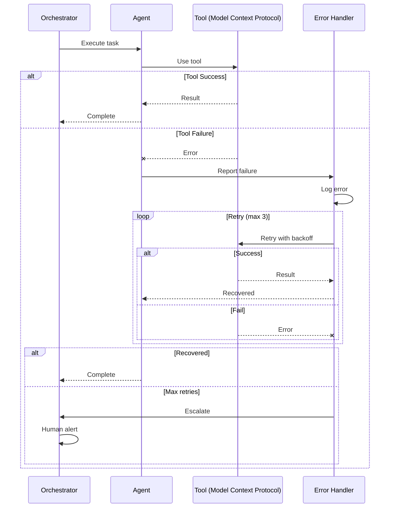
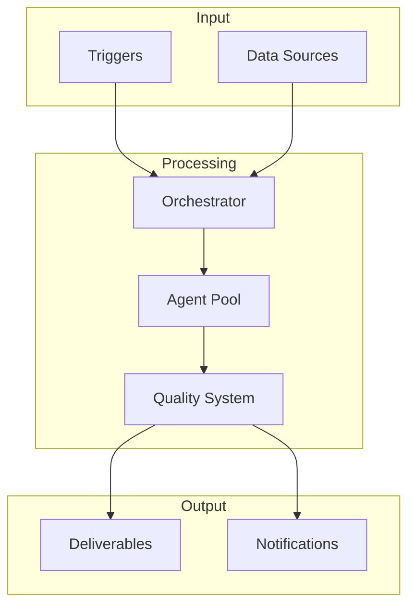
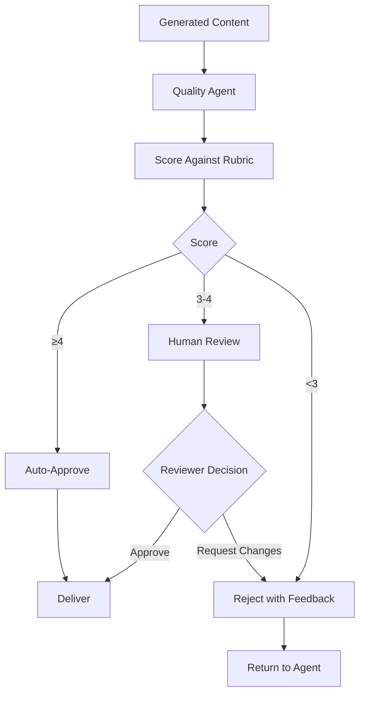

# **ADVANCED MODULE 4 SESSION 1: MERMAID FUNDAMENTALS**

**Module:** Advanced Module 4: Visual Documentation with Mermaid
**Session:** 1 of 2
**Estimated Self-Paced Time:** 60 minutes

---

## Navigation

**Session Navigation:** **Session 1** | [Session 2 →](../session-2/participant-guide.md)

**In This Guide:**
- [Learning Objectives](#learning-objectives)
- [Key Concepts](#key-concepts)
- [Workshop Recap](#workshop-recap)
- [Self-Paced Exercises](#self-paced-exercises)
- [Templates & Resources](#templates--resources)
- [Self-Assessment](#self-assessment)
- [Getting Help](#getting-help)

---

## Learning Objectives

By the end of this session, you will be able to:

| # | Objective | Practiced In |
|---|-----------|--------------|
| 1 | Understand Mermaid syntax and create basic diagrams | Exercise 1.1, 1.2, 1.3 |
| 2 | Create flowcharts to document workflow processes | Exercise 1.1 |
| 3 | Build sequence diagrams for agent interactions | Exercise 1.2 |
| 4 | Apply styling and best practices to diagrams | Exercise 1.3 |

---

## Entry Criteria

Before starting this session, confirm you have completed:

- [ ] Markdown proficiency (know how to use code fences)
- [ ] Have workflows or agents to document
- [ ] GitHub repository access
- [ ] Text editor with Mermaid preview (VS Code with Mermaid Preview extension recommended)

**Not ready?** Review [Block 2](../../block-2/block-2.md) materials for GitHub and markdown basics.

---

## Key Concepts

### Concept 1: Mermaid - Text-Based Diagramming

**Definition:**
Mermaid is a text-based diagramming language that renders automatically in markdown environments like GitHub, GitLab, and Notion.

**Why It Matters:**
Your AI workflows involve complex logic, multiple agents, and integrations. Traditional diagram tools (PowerPoint, Visio) create diagrams that are disconnected from your code and hard to maintain. Mermaid diagrams live in your repository, version-control with your code, and update as easily as editing text.

**Core Principle:**
> Diagrams as code - version-controllable, reviewable, and maintainable

**Example:**
```markdown

```

This simple text renders as a flowchart automatically in GitHub.

**Common Mistake:**
Forgetting the code fence markers (triple backticks) or using the wrong language identifier. Must be exactly:
````
```mermaid
[your diagram code]
```
````

---

### Concept 2: Flowcharts for Workflow Logic

**Definition:**
Flowcharts visualize workflow processes, showing decision points, loops, and branching logic.

**Why It Matters:**
AI workflows aren't linear - they have quality checks, retry logic, and error handling. Flowcharts make this logic immediately visible to teammates and stakeholders.

**The Pattern:**
```
graph TD
    Input --> Process
    Process --> Decision{Quality OK?}
    Decision -->|Yes| Output
    Decision -->|No| Retry
    Retry --> Process
```

**When to Use:**
- Documenting workflow logic
- Showing decision trees
- Illustrating retry/error handling
- Communicating process flow to stakeholders

**When NOT to Use:**
- Showing interactions between agents (use sequence diagrams)
- Documenting agent states (use state diagrams - Session 2)
- Simple linear processes (bullet list may be clearer)

---

### Concept 3: Sequence Diagrams for Agent Interactions

**Definition:**
Sequence diagrams show interactions between participants over time, with messages flowing between them.

**Key Components:**

| Component | Description | Example |
|-----------|-------------|---------|
| Participant | Agent, system, or user | `participant O as Orchestrator` |
| Message | Communication between participants | `O->>A: Execute task` |
| Activation | Shows when participant is processing | `activate A` / `deactivate A` |
| Conditional | Alt/else logic | `alt Success ... else Failure ... end` |

**Visual Reference:**
```
    Time flows DOWN
         ↓
User    Orchestrator    Agent
  |-------->>|             |    Request
  |          |-------->>|  |    Delegate
  |          |         [ ] |    Process (activated)
  |          |<<--------|  |    Result
  |<<--------|             |    Deliver
```

**When to Use:**
- Multi-agent systems showing collaboration
- Request/response patterns
- Showing timing and order of operations
- Error handling with escalation

---

### Quick Reference: Mermaid Syntax Essentials

**Flowchart Shapes:**

| Syntax | Shape | Use For |
|---------|---------|--------|
| `A[Text]` | Rectangle | Process steps |
| `A{Text}` | Diamond | Decision points |
| `A[(Text)]` | Database | Data storage |
| `A((Text))` | Circle | Start/end points |
| `A[[Text]]` | Subroutine | Sub-processes |

**Flowchart Connections:**

| Syntax | Meaning |
|---------|---------|
| `A --> B` | Solid arrow |
| `A -.-> B` | Dotted arrow (optional/async) |
| `A -->|label| B` | Labeled arrow |
| `A ==> B` | Thick arrow (emphasis) |

**Sequence Diagram Arrows:**

| Syntax | Meaning |
|---------|---------|
| `A->>B` | Solid arrow (call/request) |
| `A-->>B` | Dashed arrow (response/return) |
| `A-xB` | Failed call with X |

---

## Workshop Recap

### Session Summary

**Today's Focus:** Learn Mermaid syntax to create flowcharts and sequence diagrams for AI workflow documentation

**Key Points from Each Segment:**

**Segment 1: Introduction to Mermaid**
- Mermaid is text-based diagramming that renders automatically
- Works natively in GitHub, GitLab, Notion, and many other platforms
- Diagrams version-control with your code - no separate diagram files
- Basic syntax: code fence with "mermaid" language tag

**Segment 2: Flowcharts**
- Flowcharts show workflow logic: decisions, loops, branching
- Node shapes convey meaning (diamond for decisions, rectangle for processes)
- Direction: `graph TD` (top-down) or `graph LR` (left-right)
- Quality gate pattern: Generate → Check → Pass/Retry/Review

**Segment 3: Sequence Diagrams**
- Sequence diagrams show WHO does WHAT and WHEN
- Time flows top to bottom, messages flow between participants
- Solid arrows for calls, dashed arrows for responses
- Use `alt/else` for conditional logic, `loop` for retry patterns

**Segment 4: Styling and Best Practices**
- Keep diagrams focused - one concept per diagram
- Label all decision branches clearly
- Test rendering before committing
- Use consistent naming conventions

### Demo Recap

**What Was Demonstrated:**
Creating a Mermaid flowchart in VS Code with live preview, then committing to GitHub to show automatic rendering

**Key Steps:**
1. Created markdown file with code fence and "mermaid" language tag
2. Wrote flowchart syntax with decision point and loop
3. Showed real-time preview in VS Code
4. Committed to GitHub and verified rendering in README

**Result:**
Professional flowchart that lives in the repository, version-controls with code, and renders automatically on GitHub

---

## Self-Paced Exercises

**Total Time:** 60 minutes

| Exercise | Duration | Deliverable | Focus |
|----------|----------|-------------|-------|
| 1.1 | 20 min | 3 workflow flowcharts | Flowchart syntax, decision logic |
| 1.2 | 20 min | 2 sequence diagrams | Sequence syntax, agent interactions |
| 1.3 | 20 min | Integrated documentation | Multiple diagram types |

---

### Exercise 1.1: Workflow Flowcharts

**Duration:** 20 minutes

**Purpose:**
Practice creating flowcharts to document AI workflow logic, including decision points, loops, and error handling

**You Will Create:**
3 workflow flowchart diagrams in markdown files

---

#### Instructions

**Step 1: Choose Your Workflows**
Select 3 workflows you've built (or are planning to build) that have:
- At least one decision point (quality check, validation, etc.)
- Ideally: retry logic or error handling
- Multiple end states (success, failure, manual review)

**Step 2: Create Your First Flowchart**

Create a new markdown file: `workflow-1-[name].md`

Use this template:

```markdown
# Workflow Diagram: [Your Workflow Name]

## Overview
[Brief description of what this workflow does - 1-2 sentences]

## Flowchart



## Step Descriptions

| Step | Description |
|------|-------------|
| A | Workflow triggered by form submission |
| B | Validate required fields present and correctly formatted |
| C | Decision: Are all inputs valid? |
| ... | ... |
```

**Step 3: Adapt the Template**
Replace the example workflow with your actual workflow:
- Change node labels to match your process steps
- Adjust decision points to match your logic
- Add or remove loops as needed
- Label all decision branches clearly

**Step 4: Test Rendering**
- If using VS Code: Open preview pane to see diagram render
- Verify all nodes connect correctly
- Check that decision branches are labeled
- Ensure flowchart layout is readable

**Step 5: Create Two More Flowcharts**
Repeat steps 2-4 for your other two workflows in separate files:
- `workflow-2-[name].md`
- `workflow-3-[name].md`

**Step 6: Review Your Work**
Check that each deliverable includes:
- [ ] Properly formatted code fence with "mermaid" language tag
- [ ] At least one decision point (diamond shape)
- [ ] Clear node labels (action verbs)
- [ ] All decision branches labeled
- [ ] Diagram renders correctly (preview in VS Code or commit to GitHub)

---

#### Deliverable Specification

**File Names:**
- `workflow-1-[descriptive-name].md`
- `workflow-2-[descriptive-name].md`
- `workflow-3-[descriptive-name].md`

**Location:** Your GitHub repository (suggest `/docs/workflows/` folder)

**Format Requirements:**
- Markdown files with Mermaid code blocks
- Each file has: Overview, Flowchart, Step Descriptions table
- Diagrams must render correctly in GitHub

**Quality Criteria:**
- [ ] All three workflows documented
- [ ] Decision points used appropriately (diamond shapes)
- [ ] Decision branches are labeled (e.g., `|Yes|`, `|No|`, `|Pass|`, `|Fail|`)
- [ ] Workflows reflect real logic (not overly simplified)
- [ ] Diagrams render without syntax errors

---

#### Example

**Scenario:** Document generation workflow with quality gate and human review fallback

**Input:**
A consulting firm wants to automate proposal generation but needs quality assurance

**Output:**
```markdown
# Workflow Diagram: Automated Proposal Generation

## Overview
This workflow generates client proposals using AI, with quality gates and human review for edge cases.



## Step Descriptions

| Step | Description |
|------|-------------|
| A | Workflow triggered when CRM opportunity reaches "Proposal" stage |
| B | Gather client industry, size, pain points from CRM |
| C | Load appropriate template based on service line |
| D | AI generates proposal content using template + client data |
| E | Quality agent scores against rubric (1-5 scale) |
| F | Format as branded PDF with TOC and signatures |
| G | Queue in review dashboard for human review |
| H | Retry generation with additional context from knowledge base |
| I | Human reviewer approves or rejects with feedback |
| J | Deliver final proposal to sales rep via email |
| K | Log generation details, score, and delivery to CRM |
```

**Why This Works:**
- Clear decision logic visible at a glance
- Two paths to success: high quality → auto-deliver, medium quality → human review → deliver
- Retry loop prevents low-quality outputs from reaching client
- Node labels use action verbs
- All decision branches clearly labeled

---

#### Tips & Troubleshooting

**Tips:**
- Start with your main "happy path" flow, then add error handling
- Use verb phrases for node labels: "Generate Content" not "Generation"
- Keep diagrams focused - if you have >15 nodes, consider splitting into "Main Flow" and "Error Handling"
- Preview frequently to catch syntax errors early

**Common Issues:**

| Problem | Solution |
|---------|----------|
| Diagram doesn't render | Check code fence has triple backticks and "mermaid" language tag (lowercase) |
| Arrows point wrong way | Verify arrow direction: `A --> B` means A points to B |
| Decision diamond not showing | Use curly braces: `A{Decision?}` not square brackets |
| Graph layout looks weird | Try different direction: `graph LR` instead of `graph TD` |

---

### Exercise 1.2: Sequence Diagrams

**Duration:** 20 minutes

**Purpose:**
Practice creating sequence diagrams to document agent interactions, showing WHO does WHAT and WHEN

**You Will Create:**
2 sequence diagrams documenting agent interactions

---

#### Instructions

**Step 1: Create Agent Interaction Diagram**

Create a new markdown file: `agent-interaction.md`

Document a multi-agent interaction from your AI system (or plan one if you're building).

Use this template:

```markdown
# Agent Interaction: [Scenario Name]

## Scenario
[What interaction this documents - e.g., "Multi-agent proposal generation with research, writing, and quality agents"]

## Sequence Diagram



## Interaction Notes

1. **Research Phase:** Research Agent gathers all necessary context from files and templates
2. **Generation Phase:** Writing Agent produces draft using template and research
3. **Quality Phase:** Quality Agent evaluates and triggers iteration if needed
4. **Iteration:** Failed quality loops back to writing with specific improvement suggestions
```

**Step 2: Adapt to Your System**
- Replace participants with your actual agents/systems
- Adjust messages to match your workflow
- Add activation/deactivation to show when agents are processing
- Use `alt/else` for conditional logic
- Add notes to explain key steps

**Step 3: Create Error Handling Sequence**

Create file: `error-handling-sequence.md`

Document how your system handles errors and retries:

```markdown
# Error Handling Flow

## Scenario
[What error scenario this documents - e.g., "Tool failure with exponential backoff retry"]

## Sequence Diagram



## Error Strategy

- **Immediate Retry:** First failure triggers immediate retry
- **Exponential Backoff:** Subsequent retries wait 2s, 4s, 8s
- **Max Retries:** After 3 failures, escalate to human
- **Logging:** All failures logged for analysis
```

**Step 4: Test Rendering**
- Preview in VS Code or commit to GitHub
- Verify participants align vertically
- Check that arrows flow logically
- Ensure alt/else blocks render correctly

**Step 5: Review Your Work**
Check that deliverables include:
- [ ] Properly formatted code fences
- [ ] At least 3 participants defined
- [ ] Solid arrows for calls, dashed for responses
- [ ] Alt/else or loop blocks if applicable
- [ ] Notes explaining key interactions
- [ ] Diagrams render correctly

---

#### Deliverable Specification

**File Names:**
- `agent-interaction.md`
- `error-handling-sequence.md`

**Location:** Your GitHub repository (suggest `/docs/agents/` folder)

**Format Requirements:**
- Markdown files with Mermaid sequence diagrams
- Each file has: Scenario description, Sequence Diagram, Interaction Notes

**Quality Criteria:**
- [ ] Both diagrams created
- [ ] Participants clearly defined with aliases
- [ ] Arrows used correctly (solid for calls, dashed for responses)
- [ ] Conditional logic shown with alt/else blocks
- [ ] Diagrams tell a clear story of interaction flow

---

#### Example

See templates above - they are complete examples you can adapt.

**Key Elements to Notice:**
- Participants defined at top with clear aliases
- Solid arrows (`->>`) show calls/requests
- Dashed arrows (`-->>`) show responses
- `activate`/`deactivate` shows when agent is processing
- `alt/else` blocks show conditional paths
- Notes add context where helpful

---

### Exercise 1.3: Combined Documentation

**Duration:** 20 minutes

**Purpose:**
Create integrated visual documentation combining flowcharts, sequence diagrams, and architecture views

**You Will Create:**
One comprehensive visual documentation file for your AI system

---

#### Instructions

**Step 1: Create Documentation File**

Create file: `visual-documentation.md` in your repo root or `/docs` folder

Use this template:

```markdown
# [System Name] - Visual Documentation

## System Overview

This document provides visual documentation for [brief system description - what it does and why].

**Last Updated:** [Date]

## Table of Contents
- [High-Level Architecture](#high-level-architecture)
- [Workflow Details](#workflow-details)
- [Agent Interactions](#agent-interactions)
- [Legend](#legend)

---

## High-Level Architecture

This shows the major components and their relationships.



**Components:**
- **Triggers:** Form submissions, scheduled tasks, API calls
- **Data Sources:** Templates, knowledge base, CRM data
- **Orchestrator:** Routes tasks to appropriate agents
- **Agent Pool:** Specialized agents (research, writing, quality)
- **Quality System:** Evaluates outputs against rubrics
- **Deliverables:** Generated documents, reports, proposals
- **Notifications:** Email alerts, Slack messages, dashboard updates

---

## Workflow Details

### Main Workflow

[Embed your best flowchart from Exercise 1.1]

```mermaid
[Your flowchart here]
```

### Quality Workflow

[Create a focused flowchart showing just the quality check process]



---

## Agent Interactions

### Standard Execution

[Embed your agent interaction sequence from Exercise 1.2]

```mermaid
[Your sequence diagram here]
```

### Error Recovery

[Embed your error handling sequence from Exercise 1.2]

```mermaid
[Your error handling diagram here]
```

---

## Legend

| Symbol | Meaning |
|--------|---------|
| Rectangle | Process step or component |
| Diamond | Decision point |
| Database shape | Data storage or knowledge base |
| Dotted line | Optional or asynchronous path |
| Thick arrow | Primary/critical path |
| Subgraph | Grouped related components |

## Maintenance Notes

**Update Triggers:**
- When adding new agents → Update architecture and agent interaction diagrams
- When changing quality thresholds → Update quality workflow
- When adding new integrations → Update architecture diagram

**Diagram Sources:**
All diagrams in this document are Mermaid code blocks. To edit:
1. Edit the markdown source
2. Preview locally (VS Code Mermaid extension)
3. Commit changes
4. Verify rendering in GitHub

---

**Version History:**

| Version | Date | Changes |
|---------|------|---------|
| 1.0 | [Date] | Initial visual documentation created |
```

**Step 2: Populate Your Documentation**
- Copy your best flowchart from Exercise 1.1 into "Main Workflow"
- Copy your agent interaction sequence from Exercise 1.2 into "Standard Execution"
- Copy your error handling sequence into "Error Recovery"
- Create the quality workflow flowchart
- Update the architecture diagram to match your system

**Step 3: Customize Architecture**
Modify the high-level architecture diagram to match your actual system:
- Change component names in subgraphs
- Add or remove subgraphs as needed
- Adjust connections to show your data flow
- Update component descriptions list

**Step 4: Review Your Work**
Check that your deliverable includes:
- [ ] System overview describes what your system does
- [ ] Architecture diagram shows major components
- [ ] At least 2 workflow flowcharts
- [ ] At least 2 sequence diagrams
- [ ] Legend explains symbols used
- [ ] All diagrams render correctly
- [ ] Maintenance notes explain how to update

---

#### Deliverable Specification

**File Name:** `visual-documentation.md` or `README.md` (if making it your main documentation)

**Location:** Repository root or `/docs` folder

**Quality Criteria:**
- [ ] Contains multiple diagram types (flowcharts, sequence, architecture)
- [ ] Diagrams are integrated with text explanations
- [ ] Legend helps readers understand symbols
- [ ] Maintenance plan in place
- [ ] Professional presentation suitable for stakeholders

---

## Templates & Resources

### Templates Provided This Week

| Template | Purpose | Location |
|----------|---------|----------|
| Workflow Flowchart Template | Document workflow logic | Exercise 1.1 instructions |
| Agent Interaction Template | Document multi-agent collaboration | Exercise 1.2 instructions |
| Error Handling Template | Document retry and escalation | Exercise 1.2 instructions |
| Integrated Documentation Template | Combine all diagram types | Exercise 1.3 instructions |

---

### External Resources

| Resource | Type | Link | When to Use |
|----------|------|------|-------------|
| Mermaid Official Docs | Documentation | https://mermaid.js.org | Syntax reference, examples |
| Mermaid Live Editor | Online Tool | https://mermaid.live | Test diagrams without local setup |
| VS Code Mermaid Preview | Extension | Search "Mermaid Preview" in VS Code | Live preview while editing |
| GitHub Mermaid Guide | Tutorial | https://github.blog/mermaid | Understanding GitHub rendering |

---

### Setup: VS Code Mermaid Preview Extension

**Installation:**
1. Open VS Code
2. Go to Extensions (Ctrl+Shift+X or Cmd+Shift+X)
3. Search "Mermaid Preview"
4. Install "Mermaid Preview" by Mermaid
5. Reload VS Code

**Usage:**
1. Open any .md file with Mermaid code blocks
2. Right-click in editor → "Open Preview" or "Open Preview to Side"
3. Preview pane shows rendered diagrams in real-time
4. Edit code and see updates immediately

---

## Self-Assessment

### Exit Criteria Checklist

Before moving to Session 2, confirm you can:

| # | Skill | Demonstrated By | Done? |
|---|-------|-----------------|-------|
| 1 | Create properly formatted Mermaid code blocks | All three exercises render correctly | ☐ |
| 2 | Create flowcharts with decision points and loops | Exercise 1.1 workflows have diamonds and loops | ☐ |
| 3 | Create sequence diagrams showing agent interactions | Exercise 1.2 shows messages between participants | ☐ |
| 4 | Integrate multiple diagram types into documentation | Exercise 1.3 combines flowcharts and sequences | ☐ |

---

### Deliverables Checklist

| Deliverable | File Name | Location | Complete? |
|-------------|-----------|----------|-----------|
| Workflow flowcharts (3) | `workflow-1.md`, `workflow-2.md`, `workflow-3.md` | `/docs/workflows/` | ☐ |
| Agent interaction sequence | `agent-interaction.md` | `/docs/agents/` | ☐ |
| Error handling sequence | `error-handling-sequence.md` | `/docs/agents/` | ☐ |
| Integrated documentation | `visual-documentation.md` | Repo root or `/docs/` | ☐ |

---

### Reflection Questions

Take 5 minutes to consider:

1. **What clicked this week?**
   - Which diagram type (flowchart vs. sequence) feels more natural to you?
   - What workflow logic became clearer when you diagrammed it?

2. **What's still fuzzy?**
   - Any Mermaid syntax you're uncertain about?
   - Diagram types you want to explore more?

3. **How will you apply this?**
   - Which documentation in your current projects would benefit from visual diagrams?
   - What's your plan for keeping diagrams updated as systems evolve?

4. **What surprised you?**
   - Was Mermaid easier or harder than expected?
   - Did visualizing your workflows reveal any gaps or improvements?

---

## Getting Help

### Quick Answers
- **Support Channel** - Post questions with your Mermaid code
- **Peer Discussion** - Share diagrams and get feedback

### Common Questions This Session

**Q: My diagram doesn't render in GitHub. What's wrong?**
A: 99% of the time it's the code fence. Check: (1) Triple backticks before and after, (2) Language tag is exactly "mermaid" (lowercase) right after opening backticks, (3) No spaces before closing backticks. Test in VS Code preview first.

**Q: My flowchart layout looks weird. How do I control it?**
A: Mermaid auto-layouts most diagrams well. If it's not working, try: (1) Different direction (TD vs. LR), (2) Reorder your node definitions, (3) Use subgraphs to group related nodes. Don't try to pixel-perfect it - focus on clarity.

**Q: Can I use Mermaid if I don't have VS Code?**
A: Yes - you can write Mermaid in any text editor and preview at mermaid.live or by committing to GitHub. VS Code just makes it faster with live preview.

**Q: How detailed should my diagrams be?**
A: Start simple. Show the key decision points and major steps. You can always add detail later. Better to have a clear simple diagram than an overwhelming complex one.

**Q: Should I create diagrams before or after building the workflow?**
A: Both! Diagramming during planning helps you think through the logic. Diagramming after building documents what you actually built. Do both.

### When to Ask for Help

- **Before asking:** Check that your code fence is formatted correctly (most common issue)
- **Good to ask:** "I want to show [specific scenario]. Here's my diagram code. Why isn't [element] rendering?"
- **Include:** Your Mermaid code, what you expected, what you're seeing

---

## Looking Ahead

### Next Session Preview: Session 2 - Advanced Diagrams & Integration

**Focus:**
Advanced diagram types (state diagrams, architecture diagrams) and GitHub integration best practices

**How It Builds on This Session:**
Session 2 adds state diagrams (perfect for agent states), class diagrams (for system components), and architecture patterns. You'll also complete the module capstone: a comprehensive visual documentation suite.

**To Prepare:**
- [ ] Complete all Session 1 exercises
- [ ] Commit diagrams to GitHub and verify they render
- [ ] Think about your system's architecture for Session 2 capstone

---

## Glossary

| Term | Definition |
|------|------------|
| Code Fence | Triple backticks (```) used to create code blocks in markdown |
| Mermaid | Text-based diagramming language that renders in markdown |
| Flowchart | Diagram showing workflow logic with decision points and loops |
| Sequence Diagram | Diagram showing interactions between participants over time |
| Node | Individual element in a flowchart (represented by shape + label) |
| Participant | Agent, system, or user in a sequence diagram |
| Activation | Visual indicator showing when a participant is processing |
| Subgraph | Grouped set of nodes in a flowchart |

---

## Version History

| Version | Date | Changes |
|---------|------|---------|
| 1.0 | 2026-01-02 | Initial participant guide created |

---

**Navigation:** **Session 1** | [Session 2 →](../session-2/participant-guide.md)
