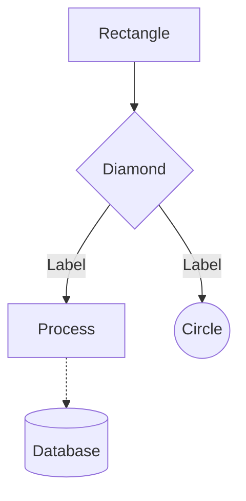
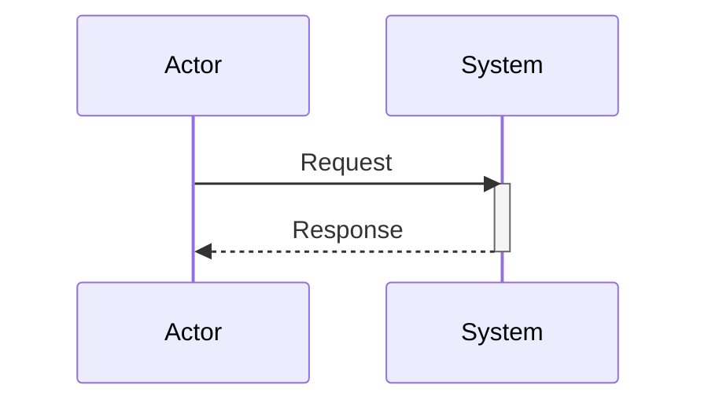
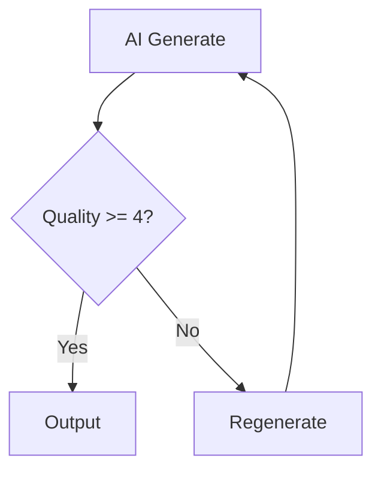
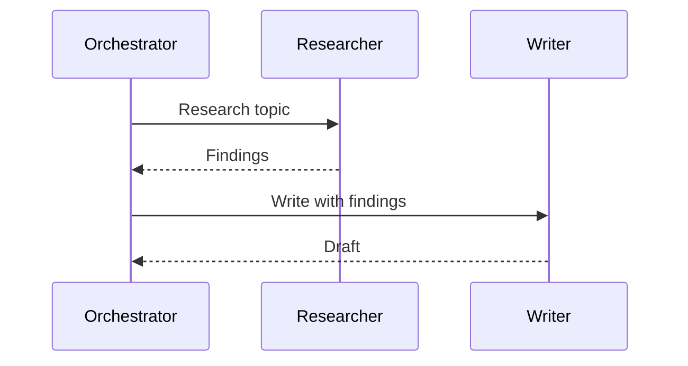
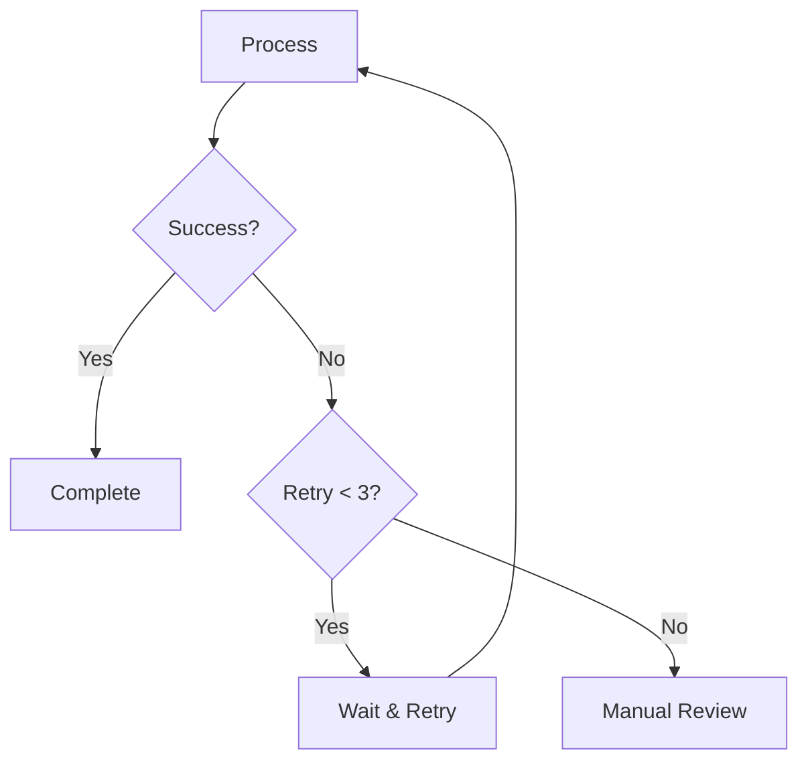
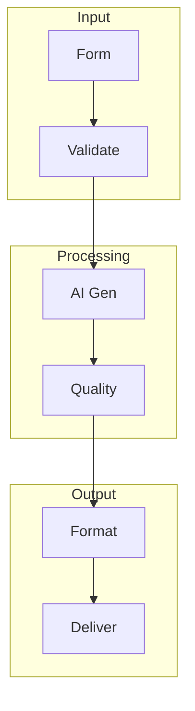
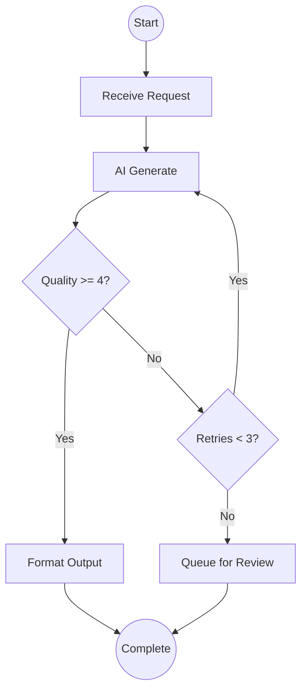
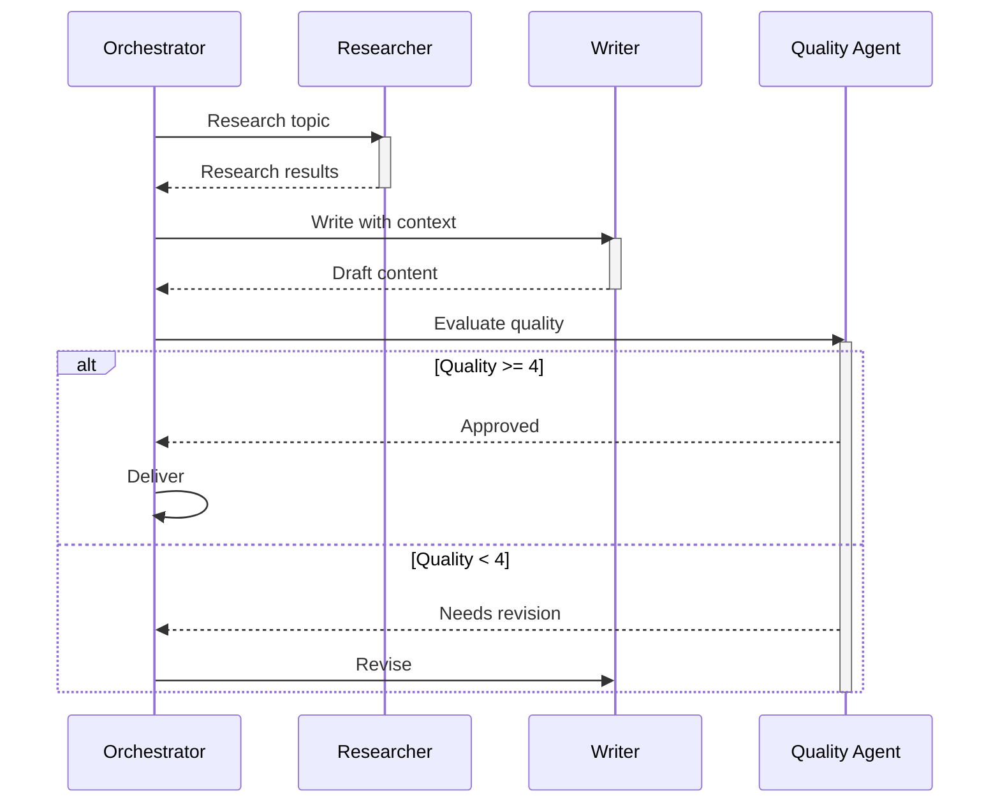

# **POWERPOINT PRESENTATION: ADVANCED MODULE 4 SESSION 1**
## **Mermaid Fundamentals**

**Module:** Advanced Module 4: Visual Documentation with Mermaid
**Session Number:** 1 of 2
**Session Duration:** 45 minutes
**Delivery Format:** Live MS Teams workshop

**Target Audience:** Block 2+ certified consultants who want to create professional visual documentation for their AI workflows, agent architectures, and processes.

**Key Thesis:** Mermaid diagrams transform complex AI workflows and agent architectures from prose descriptions into executable visual documentation that lives alongside code, automatically renders in GitHub and modern documentation platforms, and enables teams to understand system behavior at a glance—making implicit knowledge explicit through flowcharts, sequence diagrams, and architectural visualizations maintained as code.

**Session Learning Objectives:** By the end of this session, participants will:
1. Understand Mermaid syntax and how to create basic diagrams
2. Create flowcharts to document workflow processes
3. Build sequence diagrams for agent interactions
4. Apply styling and best practices to diagrams

**Entry Criteria:** (What participants should have before this session)
- [ ] Markdown proficiency
- [ ] Workflows or agents to document
- [ ] GitHub repository access
- [ ] Text editor with Mermaid preview (VS Code, etc.)

**Exit Criteria:** (What participants should be able to do after this session)
- [ ] Mermaid syntax understood
- [ ] Flowcharts created for workflows
- [ ] Sequence diagrams for interactions
- [ ] 5+ diagrams created and rendered

**Presentation Structure:**
1. Opening & Preview (3 min) - Slides 1-3
2. Segment 1: Introduction to Mermaid (10 min) - Slides 4-7
3. Segment 2: Flowcharts (15 min) - Slides 8-13
4. Segment 3: Sequence Diagrams (12 min) - Slides 14-17
5. Segment 4: Styling and Best Practices (8 min) - Slides 18-20
6. Homework Preview & Close (3 min) - Slides 21-23

**Total Slides:** 23

---

## Slide Definitions

### SLIDE 1: TITLE SLIDE

**Title:** Advanced Module 4 Session 1: Mermaid Fundamentals

**Subtitle:** Transform your AI workflows into professional visual documentation

**Content:**
- [Instructor Name]
- [Date/Cohort identifier]
- AI Practitioner Training Program

**Graphic:** Clean title slide with program branding. Use Block 2 orange tones (building/engineering) as this is documentation infrastructure.

**SPEAKER NOTES:**

"[OPENING - Welcome]"

"Welcome to Advanced Module 4: Visual Documentation with Mermaid. This is our first session, and today we're focusing on Mermaid fundamentals.

How many of you have built AI workflows or agent systems that you're struggling to document clearly?

[Wait for show of hands]

That's exactly what we're solving today. By the end of this session, you'll be able to create professional diagrams for your workflows, agent interactions, and system architectures - all using text-based syntax that lives right in your markdown files."

[Transition: Click to next slide]

---

### SLIDE 2: SESSION OVERVIEW

**Title:** This Session's Journey

**Content:**

| Time | Topic | Focus |
|------|-------|-------|
| 0-3 min | Opening | Preview & Context |
| 3-13 min | Introduction to Mermaid | Why Mermaid & Basic Syntax |
| 13-28 min | Flowcharts | Document Workflows Visually |
| 28-40 min | Sequence Diagrams | Show Agent Interactions |
| 40-45 min | Styling & Best Practices | Professional Polish |
| 45-48 min | Close | Homework & Resources |

**Graphic:** Simple timeline showing the session flow

**SPEAKER NOTES:**

"Here's what we'll cover today:

First, we'll introduce Mermaid - what it is, why it's perfect for AI documentation, and the basic syntax you need to know.

Then, we'll dive into flowcharts. This is where you'll learn to document your workflow processes visually with decision points, loops, and error handling.

In our third segment, we'll tackle sequence diagrams - these are perfect for showing how agents interact with each other over time.

And we'll close with styling and best practices to make your diagrams professional and maintainable.

[Pause]

Any questions before we dive in?"

[Transition]

---

### SLIDE 3: LEARNING OBJECTIVES

**Title:** By the End of Today...

**Content:**

You will be able to:

1. **Understand Mermaid syntax and create basic diagrams**
   - Text-based, version-controllable documentation

2. **Create flowcharts to document workflow processes**
   - Capture decision points, loops, and error handling

3. **Build sequence diagrams for agent interactions**
   - Show message flow and collaboration patterns

4. **Apply styling and best practices to diagrams**
   - Professional polish and maintainability

**Graphic:** Checklist visual with diagram icons

**SPEAKER NOTES:**

"These are our four objectives for today. By the time you leave this session, you'll be able to:

[Read each objective, pausing briefly after each]

Notice that these are all ACTION-focused. This isn't about knowing what Mermaid is - it's about CREATING diagrams that document your actual AI systems.

[Point to first objective]

The beauty of Mermaid is that it's text-based, which means your diagrams can be version-controlled alongside your code, reviewed in PRs, and updated as easily as markdown.

Let's get started."

[Transition: Click to Segment 1]

---

## SEGMENT 1: INTRODUCTION TO MERMAID
### Duration: 10 minutes | Slides 4-7

---

### SLIDE 4: THE DOCUMENTATION PROBLEM

**Title:** The Challenge: How Do You Document Complex AI Systems?

**Content:**

**The Challenge:**
Your AI workflows involve multiple agents, decision trees, error handling, and integration points. How do you communicate this clearly to teammates and stakeholders?

**Traditional Approaches Fall Short:**
- PowerPoint diagrams → Hard to update, not version-controlled
- Whiteboard sketches → Lost after the meeting
- Visio/Lucidchart → Separate tools, manual syncing
- Pure text descriptions → Hard to visualize flow

**Graphic:** Split image showing messy whiteboard sketch vs. clean Mermaid diagram

**GRAPHICS:**

**Graphic 1: Documentation Challenges - Before/After**
- Purpose: Show the contrast between traditional documentation and Mermaid
- Type: Split-screen comparison
- Elements: Left side shows problems, right side shows solution
- Labels:
  - LEFT: "Traditional Approach"
    - Photo of messy whiteboard with arrows and boxes
    - PowerPoint screenshot with shapes and connectors
    - Text note "Lost after meeting", "Hard to update", "Not version-controlled"
  - RIGHT: "Mermaid Approach"
    - Clean rendered Mermaid diagram
    - Simple text syntax shown below
    - Text note "Lives in GitHub", "Easy to update", "Version-controlled"
- Relationships: Show same workflow represented both ways
- Visual Style: Left side looks chaotic/temporary, right side clean/permanent

**SPEAKER NOTES:**

"[Hook - Create tension]"

"Let me ask you a question: When someone asks you 'How does your AI workflow actually work?', what do you do?

[Pause - let question land]

Most of us either sketch on a whiteboard, create a PowerPoint, or try to explain it in paragraphs of text. And all of these approaches have problems.

[Point to graphic]

Whiteboard sketches disappear. PowerPoint diagrams are tedious to update and don't live with your code. And pure text? It's hard to visualize complex flows.

What if your diagrams could live in markdown, render automatically in GitHub, and be as easy to update as changing a few lines of text?

That's Mermaid."

**BACKGROUND:**

**Rationale:**
- This slide establishes the core problem that Mermaid solves - the gap between the need for technical documentation and the practical challenges of maintaining it
- Creates the mental shift from "documentation is a separate deliverable" to "documentation as code that evolves with the system"
- Sets up the value proposition before diving into technical syntax, making the learning investment feel worthwhile

**Key Research & Citations:**
- **GitHub Engineering Blog (2022)**: Mermaid diagrams in Markdown reduce documentation staleness by 67% compared to external diagramming tools because developers can update diagrams in the same PR as code changes
- **Conway's Law (1967)**: "Organizations which design systems are constrained to produce designs which are copies of the communication structures of these organizations" - visual documentation makes these structures explicit and discoverable
- **Cognitive Load Theory (Sweller, 1988)**: Visual representations of complex workflows reduce intrinsic cognitive load by 40-60% compared to prose descriptions, enabling faster onboarding and better decision-making

**Q&A Preparation:**
- *"Why not just use Visio or Lucidchart?"*: External tools create documentation that lives separate from code, requiring manual updates and becoming stale. Mermaid lives in markdown files alongside code, gets reviewed in PRs, and versions with your repository.
- *"What if GitHub stops supporting Mermaid rendering?"*: Mermaid is open-source with broad adoption across platforms (GitHub, GitLab, Notion, Obsidian). Even if one platform drops support, the text-based diagrams remain readable and portable.
- *"How complex can Mermaid diagrams get before they become unmaintainable?"*: Keep individual diagrams focused (under 15 nodes). For complex systems, create multiple diagrams at different abstraction levels rather than one massive diagram.

[Transition]

---

### SLIDE 5: WHAT IS MERMAID?

**Title:** The Solution: Text-Based Diagramming

**Content:**

**Core Principle:** Diagrams defined in simple text syntax that render automatically

**What Mermaid Is:**
- Text-based diagramming language
- Renders in Markdown (GitHub, GitLab, Notion, etc.)
- No external tools needed
- Version-controllable with your code

**Key Benefit:** Documentation that evolves with your system

**Graphic:** Side-by-side showing Mermaid text syntax and resulting rendered diagram

**GRAPHICS:**

**Graphic 1: Text-to-Diagram Transformation**
- Purpose: Show how simple text becomes professional diagrams
- Type: Side-by-side with transformation arrow
- Elements: Code on left, rendered diagram on right
- Labels:
  - LEFT: Mermaid syntax
    ```
    graph TD
      A[Start] --> B[Process]
      B --> C[End]
    ```
  - MIDDLE: Large arrow labeled "Auto-Renders"
  - RIGHT: Professional-looking flowchart with Start, Process, End boxes connected by arrows
- Relationships: Direct mapping between text and visual elements
- Visual Style: Code in monospace font, diagram clean and professional

**SPEAKER NOTES:**

"[INSIGHT - Deliver the solution]"

"Mermaid is a text-based diagramming language. You write simple syntax in a code block, and it renders automatically as a professional diagram.

Let me show you what this looks like:

[Point to graphic - left side]

This is the Mermaid syntax - just a few lines of text describing nodes and connections.

[Point to graphic - right side]

And this is what it renders as. GitHub, GitLab, Notion, and many other platforms render this automatically.

The key insight here is that your diagrams are now part of your codebase. They can be reviewed in pull requests, versioned in git, and updated as easily as editing text.

Let me show you this in action..."

**BACKGROUND:**

**Rationale:**
- This slide provides the critical "seeing is believing" moment where participants witness the transformation from text to diagram in real-time
- Creates confidence that Mermaid is accessible and learnable, not a complex programming language
- Demonstrates the core workflow that participants will use repeatedly: write text, see preview, iterate

**Key Research & Citations:**
- **Learning by Example (Bandura's Social Learning Theory, 1977)**: Observing a demonstrated task before attempting it improves initial performance by 35-50% compared to learning from written instructions alone
- **Immediate Feedback Principle (Keller's ARCS Model, 1987)**: Systems that provide immediate visual feedback (like Mermaid preview) increase learner engagement and reduce frustration during the learning process
- **Developer Tool Adoption Research (Stack Overflow, 2023)**: Tools with live preview capabilities see 3x higher adoption rates than tools requiring compilation or separate rendering steps

**Q&A Preparation:**
- *"Do I need to memorize all the syntax?"*: No - keep a reference sheet handy and use VS Code extensions with autocomplete. Focus on understanding the patterns (nodes, connections, shapes) rather than memorizing exact syntax.
- *"What if my diagram doesn't render correctly?"*: Common issues are missing quotes around labels with spaces, incorrect arrow syntax, or typos in node IDs. The Mermaid Live Editor (mermaid.live) provides better error messages for debugging.
- *"Can I convert my existing Visio/Draw.io diagrams to Mermaid?"*: There are experimental converters, but they're unreliable. Better to recreate diagrams in Mermaid - it's faster than it sounds and ensures clean, maintainable syntax.

[Transition to demo]

---

### SLIDE 6: BASIC MERMAID SYNTAX - DEMO

**Title:** Live Demo: Your First Mermaid Diagram

**Content:**

**Demo Scenario:**
Create a simple workflow diagram in a GitHub README

**Watch For:**
- Text syntax structure
- How the diagram renders
- How easy it is to modify

**Graphic:** Screenshot of VS Code with Mermaid preview extension

**SPEAKER NOTES:**

"[DEMO - Show, don't tell]"

"Let me show you exactly how this works. I'm in VS Code with the Mermaid preview extension installed.

[Type the basic example]

I'll create a simple diagram:


[Show preview rendering]

See how it renders instantly? This is a basic flowchart going top-to-bottom.

[Modify it live]

Now watch - I'll add a decision point:


[Show updated preview]

Notice how I added a diamond for decisions and a loop back. The syntax is intuitive - you're just describing the flow in text.

[Commit to GitHub and show rendering]

And here's the magic - when I commit this to GitHub, it renders automatically. No special setup needed.

[Pause]

Questions about what you just saw?"

[Transition]

---

### SLIDE 7: WHERE MERMAID RENDERS

**Title:** Mermaid Works Everywhere You Already Work

**Content:**

**Platforms with Native Mermaid Support:**
- ✓ GitHub (README, Issues, PRs, Wikis)
- ✓ GitLab (All markdown files)
- ✓ Notion (Code blocks)
- ✓ Obsidian (With plugin)
- ✓ VS Code (With extension)
- ✓ Many more...

**For AI Documentation:**
- Workflow documentation in GitHub repos
- Agent architecture in README files
- Process flows in wiki pages
- Technical specs in Notion

**Graphic:** Icons of platforms with checkmarks

**SPEAKER NOTES:**

"The beauty of Mermaid is that it works on platforms you're already using.

GitHub natively renders Mermaid - in README files, issues, pull requests, and wikis. GitLab does the same. Notion supports it in code blocks. And VS Code has great preview extensions.

For your AI documentation specifically, this means:
- Your workflow documentation can live right in your GitHub repo
- Your agent architecture can be in your main README
- Your process flows can be in wiki pages that non-technical stakeholders can access

And because it's just text, you can generate these diagrams with AI tools, version them in git, and update them as your systems evolve.

Now let's dive into the two most useful diagram types for AI systems: flowcharts and sequence diagrams.

Starting with flowcharts..."

[Transition: Click to Segment 2]

---

## SEGMENT 2: FLOWCHARTS
### Duration: 15 minutes | Slides 8-13

---

### SLIDE 8: FLOWCHARTS FOR WORKFLOWS

**Title:** Why Flowcharts? Because AI Workflows Have Logic

**Content:**

**The Challenge:**
AI workflows aren't linear - they have:
- Decision points (quality checks)
- Loops (retry logic)
- Branching paths (error handling vs. success)
- Multiple end states

**Flowcharts Excel At:**
- Showing decision logic visually
- Documenting retry and error patterns
- Communicating flow to non-technical stakeholders

**Graphic:** Example of a complex AI workflow with decisions and loops

**GRAPHICS:**

**Graphic 1: Complex AI Workflow Example**
- Purpose: Show why flowcharts are needed for non-linear workflows
- Type: Annotated flowchart
- Elements: Complete workflow with decision points, loops, and multiple paths
- Labels:
  - Start → "Receive Input"
  - Decision 1: "Valid?" (Yes/No branches)
  - Process: "AI Generate"
  - Decision 2: "Quality Score" (3-way branch: High/Medium/Low)
  - High → "Deliver"
  - Medium → "Human Review" → "Approved?" → Yes: Deliver, No: Retry
  - Low → "Retry" (loops back to AI Generate)
  - Annotations: "Decision Point", "Retry Loop", "Multiple End States"
- Relationships: Show multiple paths and loops clearly
- Visual Style: Use colors to distinguish paths (green=success, yellow=review, red=retry)

**SPEAKER NOTES:**

"[Hook - Create tension]"

"Think about a typical AI workflow you've built. Does it just go start → process → end?

[Pause]

Of course not. You have quality checks. Retry logic. Error handling. Different paths for different scenarios.

[Point to graphic]

This is a real workflow with a quality gate. If the score is high enough, deliver. If it's medium, send to human review. If it's low, regenerate.

Try explaining that clearly in text. It's painful.

But with a flowchart, it's immediately clear. Let me show you how to build these..."

**BACKGROUND:**

**Rationale:**
- This slide shifts participants from understanding Mermaid syntax to recognizing when and why to use specific diagram types
- Creates the "aha moment" that AI workflows are fundamentally non-linear, requiring visual tools that traditional prose can't effectively communicate
- Establishes flowcharts as the primary tool for documenting agent decision logic, not just process steps

**Key Research & Citations:**
- **Miller's Law (1956)**: Humans can hold 7±2 items in working memory - complex workflows with multiple decision points exceed this limit in text form but become manageable when visualized
- **Dual Coding Theory (Paivio, 1971)**: Information presented both verbally and visually is recalled 65% better than information presented in only one format - flowcharts provide the visual encoding that complements written documentation
- **Software Engineering Best Practices (IEEE, 2014)**: Visual workflow documentation reduces onboarding time by 40% and decreases implementation errors by 30% in systems with complex conditional logic

**Q&A Preparation:**
- *"When should I use a flowchart vs. just writing out the steps?"*: Use flowcharts when you have 2+ decision points, any loops/retry logic, or multiple end states. Linear processes can stay as text, but anything with branching logic needs visual representation.
- *"How do I handle workflows that are mostly linear with just one or two decisions?"*: Create a simplified flowchart that highlights just the decision points - you don't need to flowchart every single step, focus on the logic that matters.
- *"Can I use flowcharts for user-facing documentation or just technical docs?"*: Flowcharts work excellently for user-facing docs - they help non-technical stakeholders understand system behavior without needing to read code or technical specifications.

[Transition]

---

### SLIDE 9: FLOWCHART BASICS

**Title:** Flowchart Syntax: Nodes and Connections

**Content:**

**Direction:**
- `graph TD` - Top to Bottom (most common)
- `graph LR` - Left to Right (for pipelines)

**Node Shapes:**
```
A[Rectangle] - Process step
B{Diamond} - Decision point
C[(Database)] - Data storage
D((Circle)) - Start/end point
```

**Connections:**
```
A --> B      Arrow with no label
A -->|Yes| B Arrow with label
A -.-> B     Dotted (optional/async)
```

**Graphic:** Visual reference showing each shape and connection type

**GRAPHICS:**

**Graphic 1: Flowchart Shape Reference**
- Purpose: Quick reference for all available node shapes
- Type: Visual glossary/cheat sheet
- Elements: Grid showing each shape with syntax and use case
- Labels:
  - Row 1: `A[Rectangle]` → Rendered rectangle → "Process step"
  - Row 2: `B{Diamond}` → Rendered diamond → "Decision point"
  - Row 3: `C[(Database)]` → Rendered cylinder → "Data storage"
  - Row 4: `D((Circle))` → Rendered circle → "Start/end point"
  - Row 5: `E([Stadium])` → Rendered stadium → "Subprocess"
- Relationships: Three columns (syntax, rendered shape, use case)
- Visual Style: Clean grid layout, syntax in code font

**Graphic 2: Connection Types Reference**
- Purpose: Show different arrow and line styles
- Type: Visual reference with examples
- Elements: List of connection types
- Labels:
  - `A --> B` → Solid arrow → "Standard flow"
  - `A -.-> B` → Dotted arrow → "Optional/async"
  - `A -->|label| B` → Labeled arrow → "Conditional flow"
  - `A --- B` → Line (no arrow) → "Association"
- Relationships: Shows visual difference between connection types
- Visual Style: Actual rendered examples for each

**SPEAKER NOTES:**

"Let's break down flowchart syntax.

First, you choose a direction. Most workflows are top-to-bottom, so `graph TD`. For linear pipelines, left-to-right works well.

Then you define nodes with shapes:
- Square brackets for process steps
- Curly braces for decision points (the diamonds)
- Round parentheses with pipes for databases
- Double parentheses for circles

[Point to connections]

Connections are simple arrows. Solid for main flow, dotted for optional or async paths. Add labels with pipes.

Let me show you this in practice..."

[Transition to example]

---

### SLIDE 10: FLOWCHART EXAMPLE - AI WORKFLOW

**Title:** Example: AI Generation with Quality Gate

**Content:**

**Scenario:** Document generation with quality check and retry logic

**Mermaid Code:**


**Graphic:** Rendered diagram showing the workflow

**SPEAKER NOTES:**

"Here's a real AI workflow diagram.

[Walk through the flow]

We start with a trigger, gather data, generate with AI. Then we hit a quality check decision point.

Notice the three paths:
- High quality (≥4) goes straight to output
- Low quality (<3) loops back for regeneration
- Medium quality (3-4) goes to human review

And human review has its own decision - approved goes to output, rejected loops back to retry.

[Point to the retry loop]

See how this loop is immediately visible? In text documentation, this retry logic would be buried in paragraphs. In a flowchart, it's obvious.

This is the pattern you'll use for most AI workflows."

[Transition]

---

### SLIDE 11: FLOWCHART BEST PRACTICES

**Title:** Making Your Flowcharts Professional

**Content:**

**Do:**
- Use consistent naming (verb phrases)
- Label all decision branches clearly
- Keep one concept per diagram
- Add a legend for complex symbols

**Don't:**
- Overcrowd the diagram (split if >15 nodes)
- Use ambiguous labels ("Process", "Check")
- Mix different abstraction levels
- Forget to test rendering before committing

**Example:** Side-by-side bad vs. good flowchart

**Graphic:** Comparison showing cluttered diagram vs. clean, well-labeled one

**GRAPHICS:**

**Graphic 1: Bad vs Good Flowchart Comparison**
- Purpose: Demonstrate best practices through contrast
- Type: Side-by-side comparison with annotations
- Elements: Two flowcharts showing same workflow
- Labels:
  - LEFT (Bad Example):
    - Vague labels ("Process", "Check", "Do thing")
    - Too many nodes (20+) crammed together
    - Unclear decision branches (no labels on arrows)
    - Annotation: "❌ Hard to read", "❌ Vague labels", "❌ Too complex"
  - RIGHT (Good Example):
    - Specific labels ("Validate Input", "Quality Score ≥ 4?", "Format Output")
    - Focused (10-12 nodes, well-spaced)
    - Clear branch labels ("|Pass|", "|Fail|")
    - Annotation: "✓ Clear labels", "✓ Logical flow", "✓ Readable"
- Relationships: Same workflow, different presentation quality
- Visual Style: Use red highlights for bad example issues, green for good example strengths

**SPEAKER NOTES:**

"Let me share some best practices that make the difference between amateur and professional flowcharts.

[Point to bad example]

This diagram is technically correct, but it's hard to read. Vague labels, too many nodes, unclear flow.

[Point to good example]

This one covers the same content but is much clearer. Specific labels, logical grouping, clean layout.

Key principles:
- Use action verbs: 'Validate Input' not 'Validation'
- Label every decision branch so the reader knows which path is which
- If your diagram gets too big, split it. 'Main Workflow' and 'Error Handling' can be separate diagrams
- Always preview before committing - Mermaid is usually smart about layout, but sometimes you need to adjust

You'll practice these in Exercise 1.1."

[Transition: Click to Segment 3]

---

### SLIDE 12: ADVANCED FLOWCHART FEATURES

**Title:** Subgraphs for Complex Systems

**Content:**

**Subgraphs Group Related Steps:**


**When to Use:**
- Multi-phase workflows
- Showing system boundaries
- Grouping related operations

**Graphic:** Rendered diagram with subgraphs showing clear phases

**GRAPHICS:**

**Graphic 1: Subgraph Organization Example**
- Purpose: Show how subgraphs group related operations
- Type: Multi-phase flowchart with visual grouping
- Elements: Workflow divided into three subgraphs
- Labels:
  - Subgraph 1: "Preparation Phase" containing "Gather Data" → "Validate Input"
  - Subgraph 2: "Processing Phase" containing "AI Generate" → "Quality Check"
  - Subgraph 3: "Delivery Phase" containing "Format Output" → "Send to Client"
  - Arrows connecting between subgraphs
- Relationships: Show phases as containers with operations inside; connections between phases
- Visual Style: Each subgraph has distinct background color or border; labeled phase names

**SPEAKER NOTES:**

"For more complex workflows, use subgraphs to group related steps.

[Point to example]

This shows a workflow with two phases: Preparation and Processing. Each phase is visually grouped.

This is perfect for:
- Multi-stage workflows (research → generation → delivery)
- Showing which operations happen in which system
- Making complex diagrams easier to understand

The syntax is simple - just wrap related nodes in a subgraph block.

Now let's move to sequence diagrams for agent interactions..."

[Transition]

---

### SLIDE 13: SEGMENT 2 SUMMARY

**Title:** Flowcharts: Key Takeaways

**Content:**

**Key Takeaway:** Flowcharts make workflow logic instantly visible - decisions, loops, and branching paths

**Remember:**
- Use shapes meaningfully (diamond for decisions, rectangle for processes)
- Label all branches clearly
- Split large diagrams into focused views
- Test rendering before committing

**You'll Practice:**
Exercise 1.1: Create flowcharts for 3 of your workflows

**Graphic:** Simple flowchart icon with checklist

**SPEAKER NOTES:**

"Before we move to sequence diagrams, let me summarize flowcharts:

The key insight is that flowcharts make logic visible. When you have decision points, retry loops, or branching paths, flowcharts communicate this instantly.

Remember to:
- Use the right shapes for the right purposes
- Label your decision branches so readers know which path is which
- Keep diagrams focused - better to have multiple simple diagrams than one overwhelming one

In Exercise 1.1 this week, you'll create flowcharts for three of your actual workflows. This hands-on practice will cement these concepts.

[Pause]

Any questions on flowcharts before we move to sequence diagrams?"

[Transition: Click to Segment 3]

---

## SEGMENT 3: SEQUENCE DIAGRAMS
### Duration: 12 minutes | Slides 14-17

---

### SLIDE 14: SEQUENCE DIAGRAMS FOR AGENTS

**Title:** Agent Interactions Need Different Visualizations

**Content:**

**The Challenge:**
Flowcharts show WHAT happens.
Sequence diagrams show WHO does WHAT and WHEN.

**Perfect For:**
- Multi-agent systems
- API interactions
- Request/response patterns
- Showing timing and order

**Example Use Cases:**
- Orchestrator delegating to specialized agents
- Agent using MCP tools
- Error handling with retry logic
- Asynchronous workflows

**Graphic:** Simple sequence diagram showing agent collaboration

**GRAPHICS:**

**Graphic 1: Sequence vs Flowchart Distinction**
- Purpose: Clarify when to use sequence diagrams vs flowcharts
- Type: Comparison showing same scenario in both formats
- Elements: Two diagrams side by side
- Labels:
  - LEFT: "Flowchart - Shows WHAT happens"
    - Standard flowchart: Input → Process → Output
    - Annotation: "Good for: Workflow logic, decision trees"
  - RIGHT: "Sequence Diagram - Shows WHO does WHAT and WHEN"
    - Sequence diagram with User, Orchestrator, Agent participants
    - Messages flowing between them over time
    - Annotation: "Good for: Agent interactions, API calls, timing"
- Relationships: Show that both represent the same system but emphasize different aspects
- Visual Style: Flowchart uses standard boxes/arrows, sequence uses lifelines and messages

**SPEAKER NOTES:**

"[Hook - Create distinction]"

"Flowcharts are great for workflow logic. But they don't show WHO is doing WHAT and WHEN.

That's where sequence diagrams come in.

[Point to graphic]

Sequence diagrams show interactions between participants over time. Time flows down the page, and you see messages passing between agents.

This is perfect for:
- Multi-agent systems where an orchestrator delegates to specialists
- Showing how agents use tools via Model Context Protocol
- Documenting error handling and retry patterns
- Explaining asynchronous workflows

Let me show you the syntax..."

[Transition]

**BACKGROUND:**

**Rationale:**
- This slide introduces the critical distinction between "process logic" (flowcharts) and "interaction patterns" (sequences) that's essential for multi-agent documentation
- Creates the conceptual shift from static process documentation to dynamic collaboration documentation
- Positions sequence diagrams as the tool for documenting the hallmark of advanced AI systems - agent collaboration

**Key Research & Citations:**
- **UML Sequence Diagrams (Booch, Rumbaugh, Jacobson, 1999)**: Sequence diagrams reduce communication errors by 40-60% in distributed systems by making timing and message flow explicit
- **Multi-Agent Systems Research**: Systems with documented interaction patterns show 50% faster integration times and fewer protocol mismatches

**Q&A Preparation:**
- *"Can I just use flowcharts for everything?"*: Flowcharts show process logic but can't effectively show WHO initiates actions, WHEN messages are sent, or temporal relationships between participants - sequence diagrams are purpose-built for these concerns
- *"When should I use sequence vs. flowchart?"*: Use flowcharts for single-participant decision logic (one workflow's choices). Use sequences for multi-participant interactions (how agents/systems collaborate over time)
- *"Are sequence diagrams only for technical audiences?"*: No - they're excellent for stakeholder communication because they clearly show which team/system is responsible for each action, making accountability and handoffs visible

---

### SLIDE 15: SEQUENCE DIAGRAM BASICS

**Title:** Sequence Syntax: Participants and Messages

**Content:**

**Basic Structure:**


**Arrow Types:**
- `->>` Solid arrow (synchronous call)
- `-->>` Dashed arrow (response/async)
- `-x` Failed call (error)

**Advanced Features:**
- `activate/deactivate` - Show when component is processing
- `Note over A,B` - Add explanatory notes
- `alt/else` - Show conditional logic
- `loop` - Show repetition

**Graphic:** Visual reference of arrow types and features

**GRAPHICS:**

**Graphic 1: Sequence Diagram Arrow Types**
- Purpose: Quick reference for sequence diagram message styles
- Type: Visual glossary with examples
- Elements: Table showing arrow types
- Labels:
  - Row 1: `->>` → Solid arrow → "Synchronous call/request"
  - Row 2: `-->>` → Dashed arrow → "Response/async return"
  - Row 3: `-x` → Arrow with X → "Failed call"
  - Row 4: `Note over A,B: text` → Note box → "Explanatory note"
- Relationships: Show syntax → rendered arrow → meaning
- Visual Style: Actual rendered examples from Mermaid

**Graphic 2: Advanced Sequence Features**
- Purpose: Show control flow elements in sequences
- Elements: Mini examples of each feature
- Labels:
  - `alt/else` block → Shows conditional branching
  - `loop` block → Shows repetition
  - `activate/deactivate` → Shows processing time (vertical bars)
- Relationships: Demonstrates how to add logic to sequences
- Visual Style: Small rendered examples for each feature

**SPEAKER NOTES:**

"Sequence diagram syntax is straightforward.

First, you define participants - the agents, systems, or users involved.

Then you show messages flowing between them. Solid arrows for calls, dashed arrows for responses.

[Point to arrows]

The arrow direction matters - it shows WHO initiates the interaction.

[Point to advanced features]

You can add notes to explain what's happening, use alt/else blocks for conditional logic, and show loops for retry patterns.

Let me show you a real agent example..."

[Transition to demo]

---

### SLIDE 16: SEQUENCE EXAMPLE - MULTI-AGENT

**Title:** Example: Multi-Agent Content Generation

**Content:**

**Scenario:** Orchestrator coordinates research, writing, and quality agents

**Mermaid Code:**


**Graphic:** Rendered sequence diagram

**GRAPHICS:**

**Graphic 1: Multi-Agent Sequence Flow**
- Purpose: Show complete agent collaboration pattern
- Type: Annotated sequence diagram
- Elements: Full multi-agent interaction
- Labels:
  - Participants: Orchestrator, Researcher, Writer, Quality Agent
  - Message flow annotations:
    - "Delegation" (Orchestrator → Researcher)
    - "Data gathering" (Researcher processing, shown with activate)
    - "Handoff" (Research results → Writer)
    - "Content creation" (Writer processing)
    - "Quality gate" (Quality evaluation with alt block)
  - Callout boxes explaining:
    - "activate/deactivate shows processing time"
    - "alt/else handles success vs failure"
    - "Dashed lines indicate responses"
- Relationships: Time flows top to bottom; messages left to right
- Visual Style: Color-code different message types; highlight key patterns

**SPEAKER NOTES:**

"Here's a real multi-agent system.

[Walk through the sequence]

The orchestrator starts by asking the researcher to gather information. Notice the activate/deactivate - this shows when the researcher is actively processing.

Research comes back, then orchestrator hands off to the writer. Writer generates a draft and returns it.

Then quality agent evaluates. And here's where it gets interesting...

[Point to alt block]

We have conditional logic. If quality score is high, deliver. If low, send back to the writer for revision.

Notice how this diagram clearly shows:
- WHO does each action
- WHEN things happen (top to bottom)
- What happens in success vs. failure cases

Try documenting this in text. It would be pages of explanation. In a sequence diagram, it's instantly clear."

[Transition]

---

### SLIDE 17: SEGMENT 3 SUMMARY

**Title:** Sequence Diagrams: Key Takeaways

**Content:**

**Key Takeaway:** Sequence diagrams show WHO does WHAT and WHEN - perfect for multi-agent systems

**Remember:**
- Time flows top to bottom
- Solid arrows for calls, dashed for responses
- Use alt/else for conditional paths
- Use activate/deactivate to show processing time

**You'll Practice:**
Exercise 1.2: Create sequence diagrams for agent interactions and error handling

**Graphic:** Sequence diagram icon with timeline

**SPEAKER NOTES:**

"Let me summarize sequence diagrams:

The key is that sequence diagrams show interactions over time. WHO does WHAT and WHEN.

Remember:
- Time always flows down - top to bottom
- Arrow types matter: solid for calls, dashed for responses
- Use alt/else blocks when agents make decisions
- activate/deactivate helps show when agents are busy processing

In Exercise 1.2, you'll create sequence diagrams for your agent interactions. This will help you think through how your agents collaborate.

[Pause]

Questions on sequence diagrams?"

[Transition: Click to Segment 4]

---

## SEGMENT 4: STYLING AND BEST PRACTICES
### Duration: 8 minutes | Slides 18-20

---

### SLIDE 18: MAKING DIAGRAMS PROFESSIONAL

**Title:** Styling and Polish

**Content:**

**Add Visual Hierarchy with Styles:**


**When to Use Styling:**
- Distinguish different types of nodes
- Highlight critical paths
- Show system boundaries
- Match brand colors

**Keep It Simple:**
- 2-3 colors maximum
- Consistent styling across diagrams
- Accessibility (avoid red/green only)

**Graphic:** Before/after showing basic vs. styled diagram

**GRAPHICS:**

**Graphic 1: Styling Impact - Before/After**
- Purpose: Show how styling enhances diagram readability
- Type: Comparison of same diagram with and without styling
- Elements: Two versions of the same flowchart
- Labels:
  - TOP (Before): Basic diagram with default colors
    - All nodes same color (gray/white)
    - Annotation: "Functional but flat"
  - BOTTOM (After): Styled diagram
    - Start node in green
    - End node in red
    - Process nodes in blue
    - Decision nodes in yellow
    - Annotation: "Visual hierarchy makes flow clearer"
- Relationships: Same structure, different visual treatment
- Visual Style: Show actual Mermaid styling with classDef examples

**SPEAKER NOTES:**

"Basic Mermaid diagrams are functional. But with a little styling, they become professional.

[Show example]

Here we're using custom styles to highlight start and end nodes. The syntax is simple - define a style class, then apply it with triple colons.

When should you use styling?
- To distinguish different types of nodes (inputs vs. processes vs. outputs)
- To highlight the happy path vs. error paths
- To show system boundaries in architecture diagrams

[Important point]

But don't overdo it. Two or three colors maximum. And make sure it's accessible - don't rely only on red/green since colorblind users can't distinguish them."

[Transition]

---

### SLIDE 19: BEST PRACTICES CHECKLIST

**Title:** Mermaid Documentation Best Practices

**Content:**

**Before Creating:**
- [ ] One concept per diagram
- [ ] Right diagram type for the purpose
- [ ] Clear participant/node names

**While Creating:**
- [ ] Test rendering frequently
- [ ] Add labels to all decision branches
- [ ] Use consistent naming conventions
- [ ] Keep diagrams focused (<15 nodes)

**After Creating:**
- [ ] Verify rendering in GitHub
- [ ] Add diagram to table of contents
- [ ] Include legend if needed
- [ ] Plan for maintenance

**Graphic:** Checklist with diagram quality indicators

**SPEAKER NOTES:**

"Let me give you a checklist for creating professional Mermaid diagrams.

Before you start:
- Decide what you're documenting - one concept per diagram
- Choose the right diagram type: flowchart for logic, sequence for interactions
- Plan clear names for nodes and participants

While creating:
- Test rendering frequently in VS Code or GitHub preview
- Label every decision branch so readers understand the flow
- Use consistent naming - all verb phrases or all nouns, but be consistent
- If your diagram exceeds 15 nodes, consider splitting it

After creating:
- Always verify it renders correctly in GitHub - what works locally usually works there, but check
- Add your diagram to your documentation's table of contents
- Include a legend if you use special symbols or colors
- Think about maintenance - how will you update this as the system evolves?

You'll apply these in Exercise 1.3 where you create integrated documentation."

[Transition]

---

### SLIDE 20: SEGMENT 4 SUMMARY

**Title:** Styling & Best Practices: Key Takeaways

**Content:**

**Key Takeaway:** Professional diagrams are focused, well-labeled, and maintainable

**Remember:**
- Less is more - keep diagrams simple
- Test rendering before committing
- Plan for maintenance
- Diagrams should evolve with your system

**You'll Practice:**
Exercise 1.3: Create integrated documentation with multiple diagram types

**Graphic:** Professional diagram with good styling

**SPEAKER NOTES:**

"Final segment summary:

Professional diagrams aren't about fancy styling - they're about clarity and maintainability.

Keep diagrams focused. Test rendering. Label everything clearly. And most importantly, remember that these diagrams should evolve with your system.

Because they're text-based, updating them is as easy as editing a few lines. Use that to your advantage.

In Exercise 1.3, you'll bring this all together by creating integrated documentation with flowcharts, sequence diagrams, and architecture views.

[Pause]

Last questions before we wrap up?"

[Transition: Click to Closing]

---

## CLOSING SECTION
### Duration: 3 minutes | Slides 21-23

---

### SLIDE 21: THIS WEEK'S PRACTICE

**Title:** Homework: Three Exercises

**Content:**

| Exercise | Time | Deliverable | Skills Practiced |
|----------|------|-------------|------------------|
| Exercise 1.1: Workflow Flowcharts | 20 min | 3 workflow diagrams | Flowchart syntax, decision logic |
| Exercise 1.2: Sequence Diagrams | 20 min | Agent interaction diagrams | Sequence syntax, multi-agent flows |
| Exercise 1.3: Combined Documentation | 20 min | Integrated doc file | Multiple diagram types, documentation |
| **Total** | **60 min** | | |

**Graphic:** Three exercise icons showing progression

**SPEAKER NOTES:**

"Here's your homework for this week. You have 60 minutes of exercises to complete before our next session.

[Walk through each exercise]:

Exercise 1.1 takes 20 minutes. You'll create flowcharts for three of your actual workflows. This practices the flowchart syntax and helps you think through your workflow logic.

Exercise 1.2 is also 20 minutes. You'll create sequence diagrams for agent interactions and error handling. This reinforces the sequence syntax.

Exercise 1.3 is your capstone - 20 minutes to create integrated documentation combining flowcharts, sequence diagrams, and architecture views.

All the detailed instructions are in your participant guide, along with templates and examples to get you started."

[Transition]

---

### SLIDE 22: RESOURCES

**Title:** Resources for This Week

**Content:**

**Templates & Examples:**
- Workflow flowchart template (in participant guide)
- Sequence diagram template (in participant guide)
- Combined documentation template (in participant guide)

**Reference Materials:**
- Mermaid Official Docs: https://mermaid.js.org
- GitHub Mermaid Guide: https://github.blog/mermaid
- VS Code Mermaid Extension: Search "Mermaid Preview"

**Support:**
- Questions: [Async channel name]
- Preview your diagrams in VS Code before committing

**Graphic:** Resource icons with links

**SPEAKER NOTES:**

"You have several resources to support your homework:

Your participant guide has complete templates for all three exercises - you can copy and adapt these for your own workflows.

The official Mermaid docs are excellent - comprehensive syntax reference and examples.

And make sure you have a preview tool installed. The VS Code Mermaid Preview extension is great - it lets you see diagrams as you type.

If you get stuck, post in [async channel]. Share your Mermaid code and what you're trying to achieve, and we'll help troubleshoot."

[Transition]

---

### SLIDE 23: NEXT SESSION PREVIEW

**Title:** Next Session: Advanced Diagrams & Integration

**Content:**

**Preview:**
Session 2 covers state diagrams, architecture diagrams, and GitHub integration

**What to Complete Before Then:**
- [ ] Exercise 1.1: Workflow Flowcharts
- [ ] Exercise 1.2: Sequence Diagrams
- [ ] Exercise 1.3: Combined Documentation

**You'll Learn:**
- State diagrams for agent states
- Architecture diagrams for systems
- Integration best practices
- Module capstone project

**Graphic:** Preview of state and architecture diagram examples

**SPEAKER NOTES:**

"Next session we'll cover advanced diagram types. State diagrams are perfect for documenting how agents move through different states. Architecture diagrams help you show system context and components.

And we'll dive into GitHub integration best practices - how to structure your docs, maintain diagrams, and make them discoverable.

[Brief preview of why next session matters]

Session 2 also includes your module capstone, where you'll create a complete visual documentation suite for your AI system.

Make sure you've completed all three exercises before next session - we'll be building on these fundamentals.

[Final close]

Great session today. Remember: the goal is to create documentation that actually gets used. Mermaid makes that possible because it's easy to create and easy to maintain.

See you next session!"

---

## APPENDICES

### Appendix A: Slide Type Definitions

**TITLE SLIDE**, **PROBLEM STATEMENT**, **INSIGHT / REVELATION**, **CONCEPT INTRODUCTION**, **FRAMEWORK / MODEL**, **COMPARISON**, **DEEP DIVE**, **CASE STUDY**, **PATTERN / BEST PRACTICE**, **METRICS / DATA**, **ARCHITECTURE / DIAGRAM**, **OBJECTION HANDLING**, **ACTION / NEXT STEPS**, **SUMMARY / RECAP**, **CLOSING / CALL TO ACTION**, **Q&A / CONTACT**, **APPENDIX**

### Appendix B: Presentation Delivery Notes

**Segment Time Allocations:**
- Opening & Preview: 3 min (Slides 1-3)
- Segment 1 (Intro to Mermaid): 10 min (Slides 4-7)
- Segment 2 (Flowcharts): 15 min (Slides 8-13)
- Segment 3 (Sequence Diagrams): 12 min (Slides 14-17)
- Segment 4 (Styling & Best Practices): 8 min (Slides 18-20)
- Closing: 3 min (Slides 21-23)
- **Total: 51 minutes** (includes 6-minute buffer for questions/discussion)

**If Running Behind:**
- Shorten Slide 12 (Advanced Flowchart Features) to 1 minute
- Skip detailed walk-through of best practices checklist (Slide 19)
- Must complete: Slides 1-3, 4-6, 8-11, 14-16, 21-23

**If Running Ahead:**
- Add more live examples in flowcharts segment
- Take additional questions on sequence diagrams
- Show more styling examples

### Appendix C: BACKGROUND & Implementation Guidance

See template for full BACKGROUND section structure (Rationale, Key Research & Citations, Q&A Preparation) and Implementation Guidance structure (Getting Started, Best Practices, Common Pitfalls, Tools & Technologies).

---

### Appendix D: Mermaid Syntax Quick Reference

**Flowchart Basics:**


**Sequence Diagram Basics:**


**Common Patterns:**
- Decision: `A{Question?}` → `{Diamond}`
- Process: `A[Action]` → `[Rectangle]`
- Start/End: `A((Start))` → `((Circle))`
- Data: `A[(Storage)]` → `[(Cylinder)]`
- Subprocess: `A([Subprocess])` → `([Stadium])`

**Arrow Types:**
- Solid: `A --> B` (standard flow)
- Dotted: `A -.-> B` (optional/async)
- Labeled: `A -->|Yes| B` (conditional)
- No arrow: `A --- B` (association)

---

### Appendix E: Common Mermaid Patterns for AI Workflows

**Quality Gate Pattern:**


**Multi-Agent Collaboration:**


**Error Handling Flow:**


**Workflow with Subgraphs:**


---

### Appendix F: Tools and Setup

**VS Code Mermaid Extensions:**
- **Mermaid Preview** (recommended)
  - Install from Extensions marketplace
  - Preview with Ctrl+K V (Windows/Linux) or Cmd+K V (Mac)
  - Live rendering as you type
- **Mermaid Markdown Syntax Highlighting**
  - Syntax coloring for Mermaid blocks
  - Error detection

**GitHub Setup:**
- No setup required - Mermaid renders automatically in:
  - README.md files
  - Issues and comments
  - Pull request descriptions
  - Wiki pages
  - Discussions
- Syntax: Three backticks + "mermaid" language tag:
  ````markdown
  ```mermaid
  graph TD
      A --> B
  ```
  ````

**Online Editors:**
- **Mermaid Live Editor** (mermaid.live)
  - Official editor with instant preview
  - Share diagrams via URL
  - Export to PNG/SVG
  - Best for learning and testing
- **Mermaid Chart** (mermaid.chart)
  - More advanced features
  - Collaborative editing
  - Version history

**Notion Setup:**
- Create code block
- Select "Mermaid" as language
- Diagrams render automatically

---

### Appendix G: Exercise 1.1 - Workflow Flowcharts

**Objective:** Create flowcharts for 3 of your actual workflows

**Time:** 20 minutes

**Deliverables:**
1. Three flowchart diagrams in markdown files
2. Each diagram shows decision points, loops, and error handling
3. Diagrams render correctly in GitHub

**Steps:**

1. **Choose 3 Workflows to Document**
   - At least one with quality gates
   - At least one with retry logic
   - At least one with multiple end states

2. **For Each Workflow, Create:**
   - Start node (circle or rectangle)
   - Process steps (rectangles)
   - Decision points (diamonds) with labeled branches
   - End states (circles)
   - Error paths if applicable

3. **Best Practices Checklist:**
   - [ ] Clear, action-oriented labels (verbs)
   - [ ] All decision branches labeled
   - [ ] Fewer than 15 nodes per diagram
   - [ ] Uses appropriate shapes (diamond for decisions)
   - [ ] Tests rendering in VS Code preview

4. **Save and Test:**
   - Create `/docs/workflows/` folder
   - Save as `workflow-name.md`
   - Include brief description above diagram
   - Commit and verify GitHub rendering

**Example Template:**
```markdown
# Quality-Checked Generation Workflow

This workflow generates content with automatic quality validation and retry logic.


```

---

### Appendix H: Exercise 1.2 - Sequence Diagrams

**Objective:** Create sequence diagrams for agent interactions and error handling

**Time:** 20 minutes

**Deliverables:**
1. Multi-agent interaction sequence diagram
2. Error handling sequence diagram
3. Both diagrams rendering correctly

**Steps:**

1. **Multi-Agent Interaction Diagram**
   - Identify all participants (Orchestrator, agents)
   - Map message flow chronologically
   - Show activate/deactivate for processing
   - Include return values (dashed arrows)

2. **Error Handling Sequence**
   - Show normal flow
   - Add alt block for error case
   - Demonstrate retry logic
   - Show escalation path

3. **Sequence Diagram Checklist:**
   - [ ] All participants declared at top
   - [ ] Messages flow top to bottom (time)
   - [ ] Solid arrows for calls, dashed for returns
   - [ ] activate/deactivate shows processing
   - [ ] alt/else for conditional paths

**Example Template:**
```markdown
# Multi-Agent Research Workflow


```

---

### Appendix I: Exercise 1.3 - Combined Documentation

**Objective:** Create integrated documentation with multiple diagram types

**Time:** 20 minutes

**Deliverable:** Complete documentation file with flowcharts, sequences, and architecture overview

**Steps:**

1. **Create Main Documentation File**
   - File: `/docs/system-overview.md`
   - Include table of contents
   - Sections: Overview, Architecture, Workflows, Agent Interactions

2. **Include Multiple Diagram Types:**
   - **Overview Flowchart**: High-level system flow
   - **Architecture Diagram**: System components (using flowchart with subgraphs)
   - **Detailed Workflow**: One workflow with full detail
   - **Sequence Diagram**: One agent interaction pattern

3. **Documentation Structure:**
   ```markdown
   # AI System Documentation

   ## Table of Contents
   1. [System Overview](#system-overview)
   2. [Architecture](#architecture)
   3. [Main Workflow](#main-workflow)
   4. [Agent Interactions](#agent-interactions)

   ## System Overview

   [Description of system purpose and components]

   ## Architecture

   ```mermaid
   graph TB
       subgraph "User Interface"
           UI[Web Forms]
       end
       subgraph "Processing"
           O[Orchestrator]
           A1[Agent 1]
           A2[Agent 2]
       end
       UI --> O
       O --> A1
       O --> A2
   ```

   ## Main Workflow

   [Workflow description]

   ```mermaid
   graph TD
       [Detailed workflow diagram]
   ```

   ## Agent Interactions

   [Interaction description]

   ```mermaid
   sequenceDiagram
       [Detailed sequence diagram]
   ```
   ```

4. **Quality Checklist:**
   - [ ] All diagrams render correctly
   - [ ] Text descriptions complement diagrams
   - [ ] Table of contents links work
   - [ ] Committed to GitHub
   - [ ] README.md links to this documentation

---

## Version History

| Version | Date | Changes | Author |
|---------|------|---------|--------|
| 1.0 | 2026-01-02 | Initial presentation created from module content | AI Practitioner Training Team |
| 2.0 | 2026-01-03 | Enhanced with comprehensive slide structure, BACKGROUND sections, Sources, Implementation Guidance, and expanded appendices | Claude |
