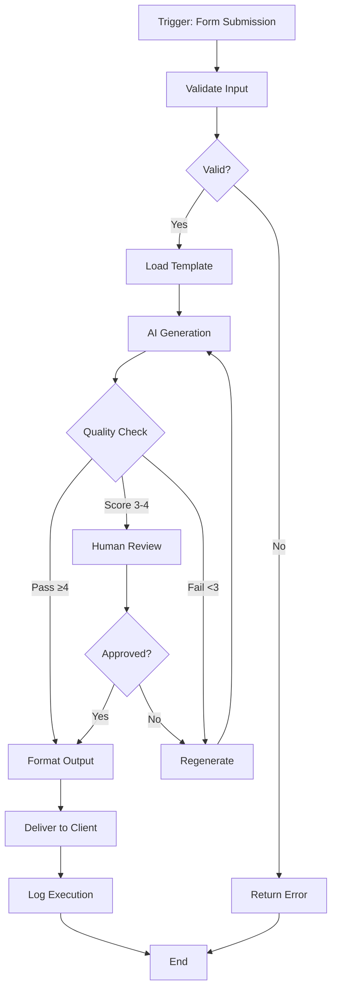
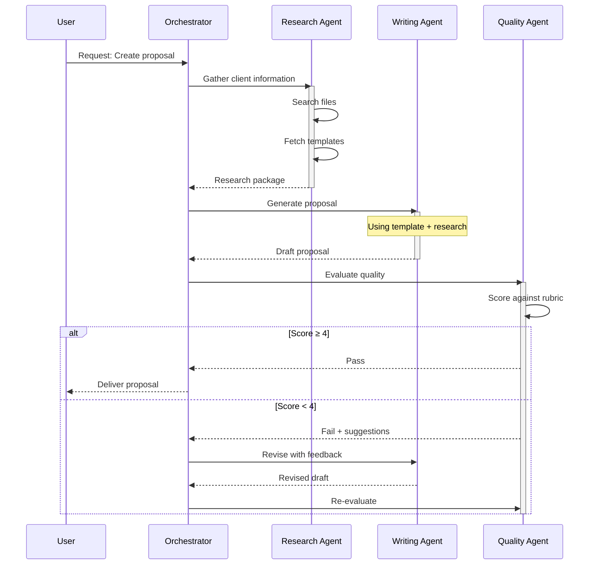
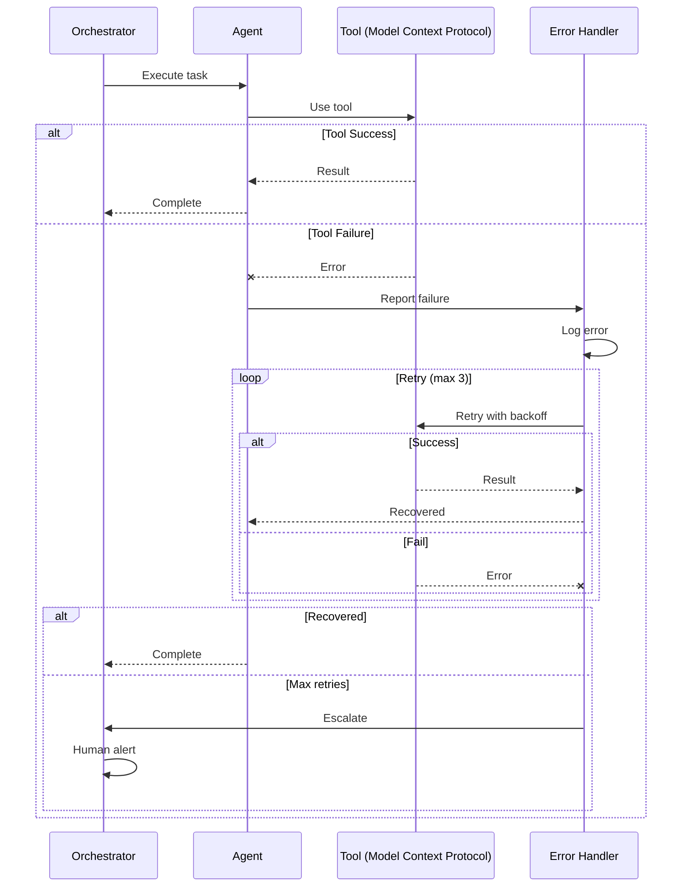
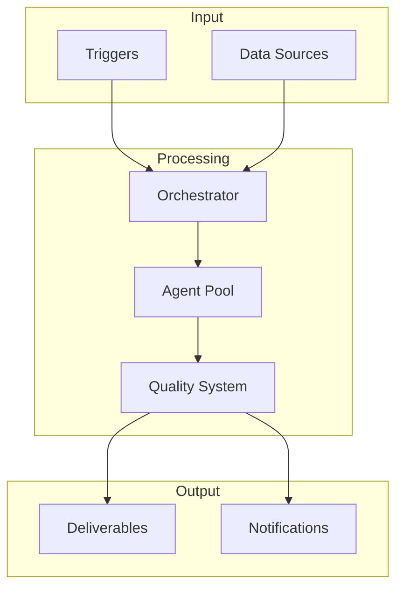

# **Advanced Module 4: Visual Documentation with Mermaid**
## **Session 1: Mermaid Fundamentals**

**Duration:** 45 min live + 60 min homework

---

## **Entry Criteria**

- [ ] Markdown proficiency
- [ ] Workflows or agents to document
- [ ] GitHub repository access
- [ ] Text editor with Mermaid preview (VS Code, etc.)

---

## **Exit Criteria**

- [ ] Mermaid syntax understood
- [ ] Flowcharts created for workflows
- [ ] Sequence diagrams for interactions
- [ ] 5+ diagrams created and rendered

---

## **Workshop Content (45 minutes)**

### **Segment 1: Introduction to Mermaid (10 min)**

- **What is Mermaid?**
  - Text-based diagramming language
  - Renders in Markdown (GitHub, GitLab, etc.)
  - No external tools needed
  - Version-controllable diagrams

- **Why Mermaid for AI documentation?**
  - Describe workflows visually
  - Show agent interactions
  - Document system architecture
  - Easy to update as systems evolve

- **Where Mermaid renders:**
  - GitHub README files
  - GitLab documentation
  - Notion, Obsidian, many others
  - VS Code with extensions

- **Basic syntax:**
  ```
  ```mermaid
  graph TD
    A[Start] --> B[Process]
    B --> C[End]
  ```
  ```

### **Segment 2: Flowcharts (15 min)**

- **Basic flowchart:**
  ```mermaid
  graph TD
      A[Start] --> B{Decision?}
      B -->|Yes| C[Action 1]
      B -->|No| D[Action 2]
      C --> E[End]
      D --> E
  ```

- **Direction options:**
  - `TD` or `TB` - Top to Bottom
  - `BT` - Bottom to Top
  - `LR` - Left to Right
  - `RL` - Right to Left

- **Node shapes:**
  ```
  A[Rectangle]
  B(Rounded)
  C([Stadium])
  D[[Subroutine]]
  E[(Database)]
  F((Circle))
  G{Diamond/Decision}
  H{{Hexagon}}
  I[/Parallelogram/]
  ```

- **Link styles:**
  ```
  A --> B        (Arrow)
  A --- B        (Line)
  A -.-> B       (Dotted arrow)
  A ==> B        (Thick arrow)
  A --text--> B  (Arrow with text)
  A -->|text| B  (Arrow with text)
  ```

- **Workflow example:**
  ```mermaid
  graph LR
      A[Trigger] --> B[Gather Data]
      B --> C[AI Generate]
      C --> D{Quality Check}
      D -->|Pass| E[Output]
      D -->|Fail| F[Retry]
      F --> C
  ```

### **Segment 3: Sequence Diagrams (12 min)**

- **Basic sequence diagram:**
  ```mermaid
  sequenceDiagram
      participant U as User
      participant O as Orchestrator
      participant A as Agent

      U->>O: Submit request
      O->>A: Delegate task
      A->>A: Process
      A-->>O: Return result
      O-->>U: Deliver output
  ```

- **Arrow types:**
  ```
  ->>   Solid line with arrow
  -->>  Dotted line with arrow
  -x    Solid line with cross
  --x   Dotted line with cross
  -)    Solid line with open arrow
  --)   Dotted line with open arrow
  ```

- **Advanced features:**
  ```mermaid
  sequenceDiagram
      participant U as User
      participant S as System

      U->>S: Request

      alt Success
          S-->>U: Response
      else Failure
          S-->>U: Error
      end

      loop Retry
          S->>S: Attempt
      end

      Note over U,S: Important note
  ```

- **Agent interaction example:**
  ```mermaid
  sequenceDiagram
      participant O as Orchestrator
      participant R as Researcher
      participant W as Writer
      participant E as Editor

      O->>R: Gather information
      R-->>O: Research results
      O->>W: Generate draft
      W-->>O: Draft content
      O->>E: Review and edit
      E-->>O: Edited content
      O->>O: Final assembly
  ```

### **Segment 4: Styling and Best Practices (8 min)**

- **Adding styles:**
  ```mermaid
  graph TD
      A[Start]:::startStyle --> B[Process]
      B --> C[End]:::endStyle

      classDef startStyle fill:#9f9,stroke:#333
      classDef endStyle fill:#f99,stroke:#333
  ```

- **Subgraphs (grouping):**
  ```mermaid
  graph TD
      subgraph Phase1[Research Phase]
          A[Gather] --> B[Analyze]
      end
      subgraph Phase2[Creation Phase]
          C[Draft] --> D[Edit]
      end
      B --> C
  ```

- **Best practices:**
  - Keep diagrams focused (one concept per diagram)
  - Use consistent naming
  - Add labels to arrows
  - Use subgraphs for complex systems
  - Test rendering before committing

---

## **Self-Paced Exercises (60 minutes total)**

### **Exercise 1.1: Workflow Flowcharts (20 minutes)**

*Create flowcharts for your workflows*

1. **Document your main workflow:**

```markdown
# Workflow Diagram: [Your Workflow Name]

## Overview
[Brief description of what this workflow does]

## Flowchart



## Step Descriptions

| Step | Description |
|------|-------------|
| A | Workflow triggered by form submission |
| B | Validate required fields present |
| ... | ... |
```

2. **Create flowcharts for 2 more workflows**

3. **Add to your documentation**

**Deliverable:** 3 workflow flowcharts in markdown files

---

### **Exercise 1.2: Sequence Diagrams (20 minutes)**

*Document agent interactions*

1. **Create agent sequence diagram:**

```markdown
# Agent Interaction: [Scenario Name]

## Scenario
[What interaction this documents]

## Sequence Diagram



## Interaction Notes

1. **Research Phase:** Agent gathers all necessary context
2. **Generation Phase:** Writing agent produces draft
3. **Quality Phase:** Evaluation with potential iteration
```

2. **Create sequence diagram for error handling:**

```markdown
# Error Handling Flow


```

**Deliverable:** 2 sequence diagrams in documentation

---

### **Exercise 1.3: Combined Documentation (20 minutes)**

*Create integrated visual documentation*

```markdown
# [System Name] - Visual Documentation

## System Overview

This document provides visual documentation for [system description].

## High-Level Architecture



## Workflow Details

### Main Workflow

```mermaid
graph LR
    [Your flowchart here]
```

### Quality Workflow

```mermaid
graph TD
    [Quality process flowchart]
```

## Agent Interactions

### Standard Execution

```mermaid
sequenceDiagram
    [Standard flow sequence]
```

### Error Recovery

```mermaid
sequenceDiagram
    [Error handling sequence]
```

## Legend

| Symbol | Meaning |
|--------|---------|
| Rectangle | Process step |
| Diamond | Decision point |
| Database shape | Data storage |
| Dotted line | Optional/async |
```

**Deliverable:** Integrated visual documentation file

---
