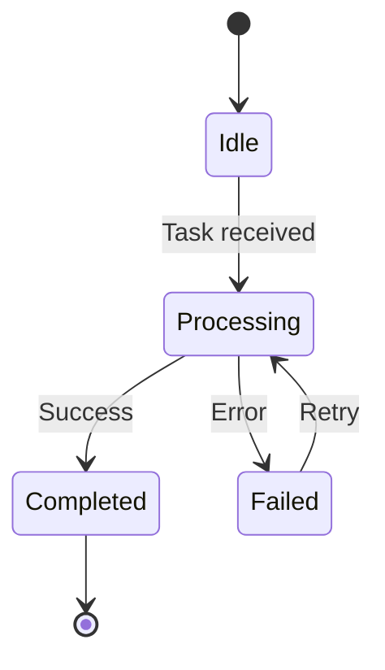
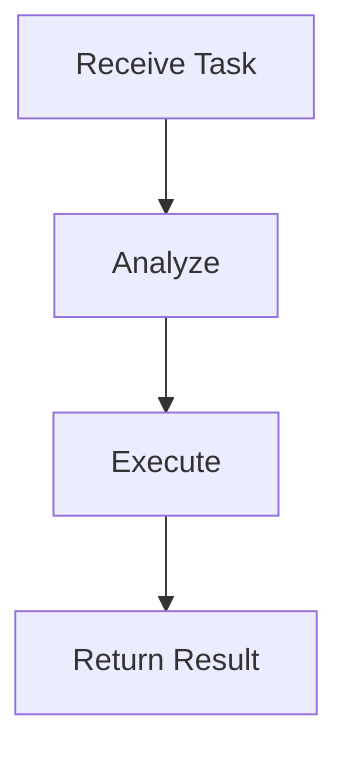
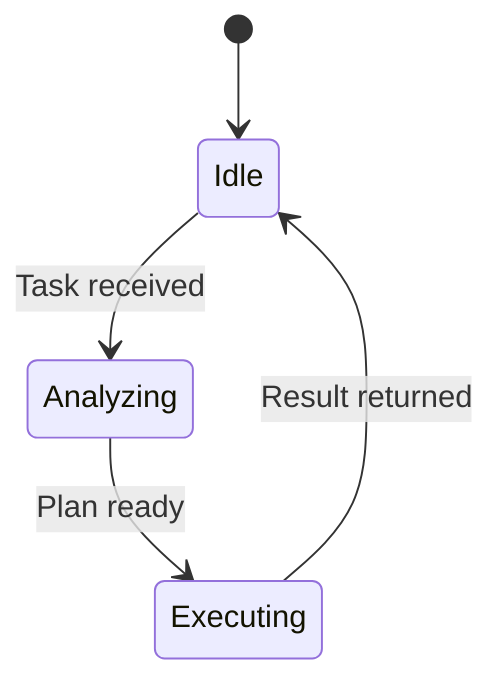
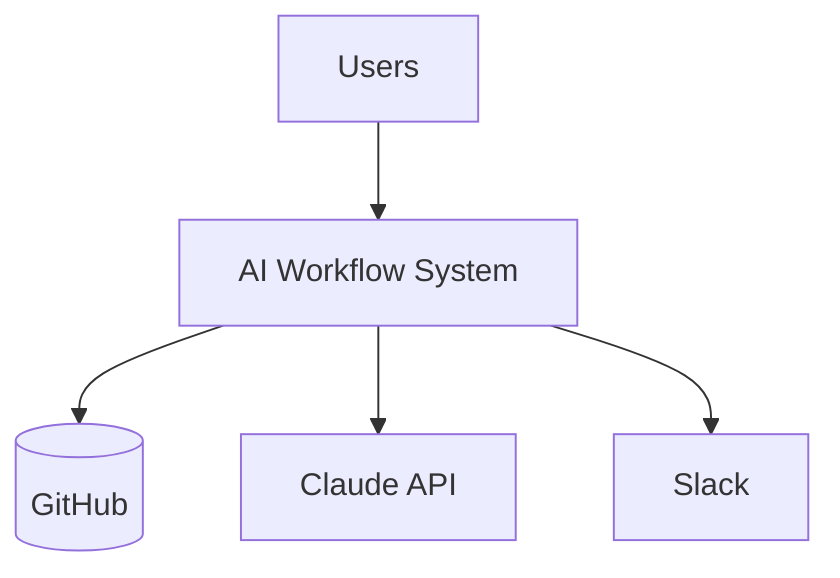
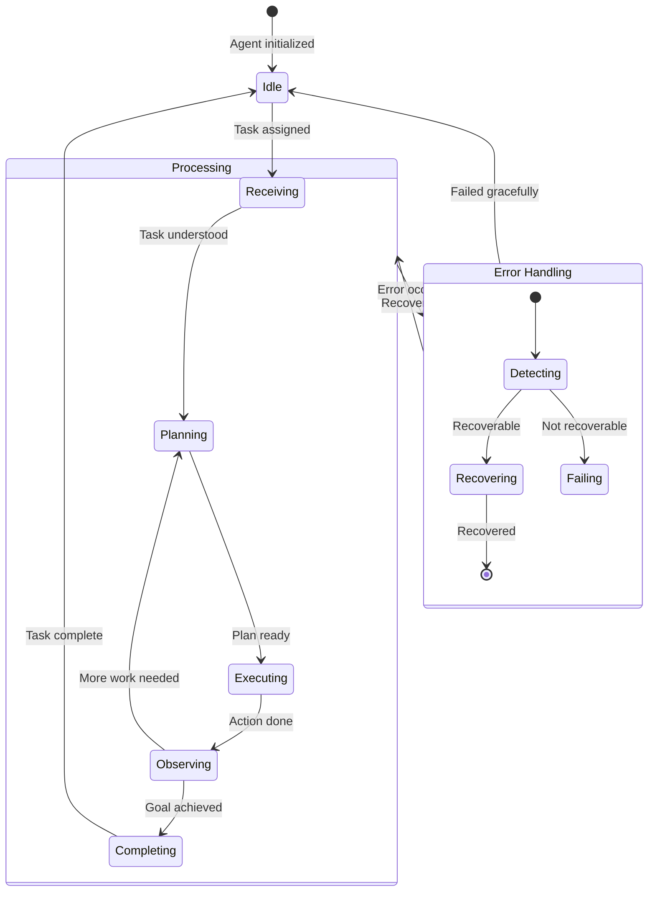
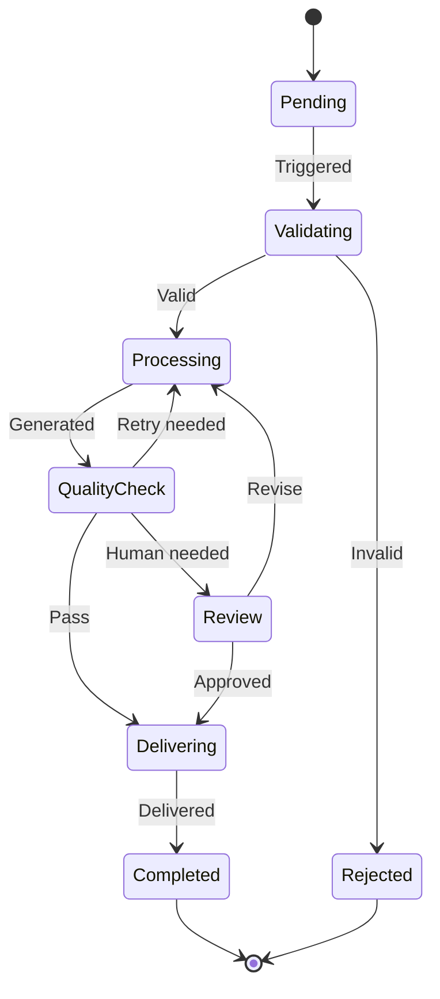
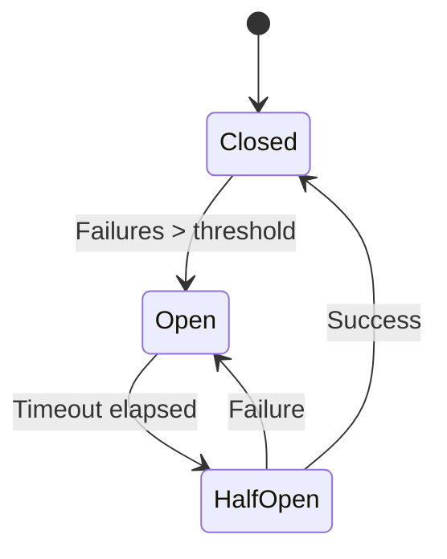
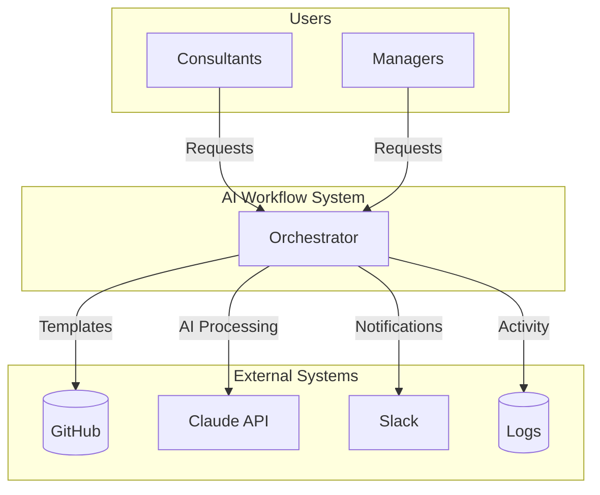
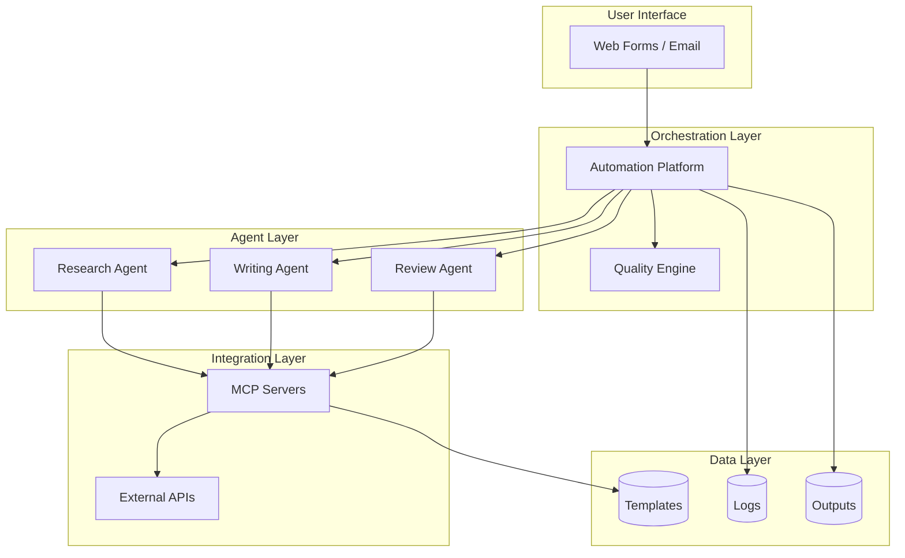
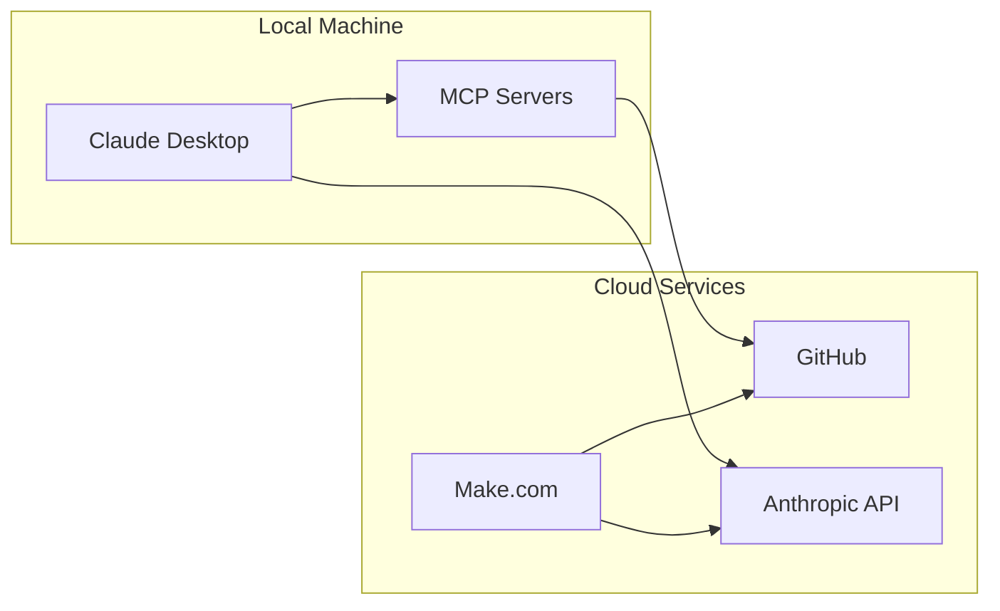

# **ADVANCED MODULE 4 SESSION 2: ADVANCED DIAGRAMS & INTEGRATION**

**Module:** Advanced Module 4: Visual Documentation with Mermaid
**Session:** 2 of 2
**Estimated Self-Paced Time:** 60 minutes (includes capstone)

---

## Navigation

**Session Navigation:** [← Session 1](../session-1/participant-guide.md) | **Session 2**

**In This Guide:**
- [Learning Objectives](#learning-objectives)
- [Key Concepts](#key-concepts)
- [Workshop Recap](#workshop-recap)
- [Self-Paced Exercises](#self-paced-exercises)
- [Templates & Resources](#templates--resources)
- [Self-Assessment](#self-assessment)
- [Module Completion](#module-completion)

---

## Learning Objectives

By the end of this session, you will be able to:

| # | Objective | Practiced In |
|---|-----------|--------------|
| 1 | Create state diagrams to document agent and workflow states | Exercise 2.1 |
| 2 | Build architecture diagrams using flowchart patterns | Exercise 2.2 |
| 3 | Integrate diagrams into GitHub documentation effectively | Exercise 2.3 |
| 4 | Complete a comprehensive visual documentation suite | Exercise 2.3 (Capstone) |

---

## Entry Criteria

Before starting this session, confirm you have completed:

- [ ] Session 1 exercises (flowcharts and sequence diagrams)
- [ ] 5+ basic diagrams created and rendering in GitHub
- [ ] Understanding of Mermaid code fence syntax

**Not ready?** Review [Session 1](../session-1/participant-guide.md) materials first.

---

## Key Concepts

### Concept 1: State Diagrams - Documenting State Transitions

**Definition:**
State diagrams show what states a system can be in and how it transitions between them, different from flowcharts which show process steps.

**Why It Matters:**
Your agents don't just "process" - they move through states: idle, analyzing, executing, observing, responding. State diagrams document this lifecycle clearly.

**Core Principle:**
> States are conditions of being; transitions are triggers that change states

**Example:**


**Common Mistake:**
Using `stateDiagram` instead of `stateDiagram-v2` (the v2 is required for modern features)

**When to Use:**
- Agent execution states
- Workflow lifecycle (pending → processing → completed)
- Circuit breaker patterns
- Connection/session states

---

### Concept 2: Flowcharts vs. State Diagrams

**Definition:**
Different diagram types serve different purposes - understanding when to use each is critical.

**The Distinction:**

| Aspect | Flowchart | State Diagram |
|--------|-----------|---------------|
| **Shows** | Process steps and logic | States and transitions |
| **Answers** | "What steps happen?" | "What states exist?" |
| **Nodes** | Actions to perform | Conditions of being |
| **Arrows** | Flow from step to step | Transitions between states |
| **Example Use** | Workflow process | Agent lifecycle |

**Visual Reference:**

**Same scenario as flowchart:**


**Same scenario as state diagram:**


**Decision Rule:**
- Ask "what STEPS does this go through?" → Flowchart
- Ask "what STATES can this be in?" → State diagram

---

### Concept 3: Architecture Diagrams - System Views

**Definition:**
Architecture diagrams show system structure at different abstraction levels: context (boundary), container (components), and deployment (where things run).

**Why It Matters:**
Stakeholders need to understand "what is our system and how does it connect to the world?" Architecture diagrams answer this.

**Key Types:**

| Diagram Type | Purpose | Shows |
|--------------|---------|-------|
| **Context** | System boundary | System + external actors/systems |
| **Container** | Major components | Components inside the system |
| **Deployment** | Where things run | Local vs. cloud, hosting |

**Core Principle:**
> Architecture diagrams use flowchart syntax applied to structural views

**Example - Context Diagram:**


---

### Concept 4: Documentation Organization

**Definition:**
How you structure and maintain diagrams determines whether they're useful or ignored.

**The Pattern:**
```
/docs
  /architecture    (system-level diagrams)
  /workflows       (process flowcharts)
  /agents          (agent interactions, states)
/README.md         (overview with key diagrams)
```

**Why It Matters:**
- **Discoverability:** New team members find diagrams in README, drill into /docs for details
- **Maintainability:** One concept per file makes updates easy
- **Ownership:** Clear structure helps assign maintenance responsibility

**Best Practices:**
- Main diagrams in README (architecture context, key workflow)
- Detailed diagrams in /docs subfolders
- One concept per file
- Maintenance notes in each file

---

### Quick Reference: Session 2 Syntax Essentials

**State Diagrams:**

| Syntax | Meaning |
|---------|---------|
| `stateDiagram-v2` | Start state diagram (v2 required) |
| `[*]` | Start or end state |
| `State1 --> State2: Event` | Transition with trigger label |
| `state Name { ... }` | Composite state (states within states) |

**Architecture Diagrams (using flowchart syntax):**

| Pattern | Use For |
|---------|---------|
| `subgraph "Name"` | Group related components |
| `A[(Database)]` | Data storage |
| `A[Component]` | System component |
| Direction: `TB` or `LR` | Vertical or horizontal layout |

---

## Workshop Recap

### Session Summary

**Today's Focus:** Advanced diagram types (state, architecture) and integration into production documentation

**Key Points from Each Segment:**

**Segment 1: State Diagrams**
- State diagrams show states and transitions, not process steps
- Use `stateDiagram-v2` syntax (v2 is required)
- `[*]` represents start and end states
- Composite states group related sub-states
- Perfect for agent execution lifecycles

**Segment 2: Class & Entity Diagrams**
- Class diagrams show system components with properties and methods
- Relationship lines show cardinality (1 to *, etc.)
- Less commonly used than flowcharts for AI workflow docs
- Best for technical specifications

**Segment 3: Architecture Diagrams**
- Context: System boundary and external connections
- Container: Major components inside the system
- Deployment: Where things run (local vs. cloud)
- All use flowchart syntax with subgraphs

**Segment 4: GitHub Integration**
- Organize diagrams in /docs with subfolders by type
- Main diagrams in README for discoverability
- Document update triggers for maintenance
- One concept per file for clarity

### Demo Recap

**What Was Demonstrated:**
Creating a state diagram showing agent execution states with transitions

**Key Steps:**
1. Started with `stateDiagram-v2`
2. Defined start state `[*] --> Idle`
3. Added transitions with trigger labels
4. Showed composite state for complex internal states

**Result:**
Clear visualization of agent lifecycle that would be difficult to explain in text

---

## Self-Paced Exercises

**Total Time:** 60 minutes

| Exercise | Duration | Deliverable | Focus |
|----------|----------|-------------|-------|
| 2.1 | 20 min | State diagrams | Agent & workflow states |
| 2.2 | 20 min | Architecture diagrams | Context, container, deployment |
| 2.3 | 20 min | **CAPSTONE** | Complete documentation suite |

---

### Exercise 2.1: State Diagrams

**Duration:** 20 minutes

**Purpose:**
Practice creating state diagrams to document agent execution states and workflow lifecycle

**You Will Create:**
State diagrams for agent states, workflow states, and circuit breaker pattern

---

#### Instructions

**Step 1: Create Agent Execution States**

Create file: `agent-states.md`

Document how your agents move through execution states:

```markdown
# Agent Execution States

## Overview
This diagram shows the states an agent moves through during task execution.

## Agent State Diagram



## State Descriptions

| State | Description |
|-------|-------------|
| Idle | Agent waiting for task assignment |
| Receiving | Processing incoming task details |
| Planning | Determining approach and tool selection |
| Executing | Running actions/using tools |
| Observing | Analyzing results of execution |
| Completing | Finalizing response |
| Error Handling | Managing failures and recovery |
```

**Step 2: Adapt to Your Agent**
- Replace states with your actual agent states
- Add or remove states as needed
- Ensure all transitions are labeled with trigger events
- Consider composite states for complex internal states

**Step 3: Create Workflow Lifecycle States**

In the same file or new file `workflow-states.md`:

```markdown
## Workflow Lifecycle States


```

**Step 4: Create Circuit Breaker State Diagram (Optional)**

```markdown
## Circuit Breaker States



**Description:**
- **Closed:** Normal operation, requests flow through
- **Open:** Too many failures, requests rejected immediately
- **Half-Open:** Testing if system recovered
```

**Step 5: Review Your Work**
Check that deliverables include:
- [ ] `stateDiagram-v2` syntax (v2 is critical)
- [ ] `[*]` for start and end states
- [ ] All transitions labeled with trigger events
- [ ] Composite states used if applicable
- [ ] Diagrams render correctly

---

#### Deliverable Specification

**File Names:**
- `agent-states.md`
- `workflow-states.md` (or combine in one file)

**Location:** Your GitHub repository `/docs/states/` or `/docs/agents/`

**Quality Criteria:**
- [ ] Uses `stateDiagram-v2` (not v1)
- [ ] Start and end states marked with `[*]`
- [ ] Transitions labeled with triggering events
- [ ] States represent conditions, not actions
- [ ] Diagrams render without syntax errors

---

### Exercise 2.2: Architecture Documentation

**Duration:** 20 minutes

**Purpose:**
Create architecture diagrams showing system context, components, and deployment

**You Will Create:**
Context, container, and deployment diagrams for your AI system

---

#### Instructions

**Step 1: Create Documentation File**

Create file: `architecture.md` in `/docs/architecture/`

**Step 2: Create Context Diagram**

Show system boundary and external connections:

```markdown
# System Architecture

## Context Diagram

Who/what interacts with the system:



## Context Description

**Users:**
- Consultants submit workflow requests
- Managers receive reports and notifications

**AI Workflow System:**
- Central orchestrator coordinating all activities

**External Systems:**
- GitHub: Templates and knowledge base
- Claude API: AI processing
- Slack: Notifications
- Logs: Activity tracking
```

**Step 3: Adapt Context Diagram**
- Replace Users with your actual user types
- Update AI Workflow System components (may have multiple)
- List your actual external systems
- Ensure arrows show direction of interaction

**Step 4: Create Container Diagram**

Show major components inside your system:

```markdown
## Container Diagram

Major components of the system:



## Component Descriptions

**Orchestration Layer:**
- Automation Platform: Coordinates workflow execution
- Quality Engine: Evaluates outputs against rubrics

**Agent Layer:**
- Research Agent: Gathers context and data
- Writing Agent: Generates content
- Review Agent: Quality checks and edits

[Continue with other layers...]
```

**Step 5: Adapt Container Diagram**
- Organize your components into logical layers
- Use subgraphs to group related components
- Show data flow with arrows
- Keep to major components (don't show every function)

**Step 6: Create Deployment Diagram**

Show where components run:

```markdown
## Deployment Diagram

Where components run:



## Deployment Notes

**Local:**
- Claude Desktop: User interface
- MCP Servers: Tool integrations

**Cloud:**
- GitHub: Repository hosting
- Make.com: Workflow automation
- Anthropic API: Claude models

**Dependencies:**
- Local machine requires internet for cloud services
- GitHub outage impacts template access
- Anthropic API rate limits may affect throughput
```

**Step 7: Adapt Deployment Diagram**
- Show your actual deployment (local vs. cloud, on-premise, etc.)
- List dependencies and failure modes
- Note any critical infrastructure

**Step 8: Review Your Work**
Check that deliverable includes:
- [ ] Context diagram shows system boundary
- [ ] Container diagram shows major components in layers
- [ ] Deployment diagram shows where things run
- [ ] Subgraphs used for logical grouping
- [ ] All diagrams render correctly

---

#### Deliverable Specification

**File Name:** `architecture.md`

**Location:** `/docs/architecture/`

**Quality Criteria:**
- [ ] All three diagram types created (context, container, deployment)
- [ ] Subgraphs used to organize components
- [ ] Descriptions explain each component
- [ ] Dependencies and connections shown clearly
- [ ] Professional presentation suitable for stakeholders

---

### Exercise 2.3: Module Capstone - Complete Visual Documentation Suite

**Duration:** 20 minutes

**Purpose:**
Integrate all diagrams from Sessions 1 and 2 into a comprehensive, production-ready visual documentation suite

**You Will Create:**
Complete documentation with architecture, workflows, agents, states, and maintenance plan

---

#### Instructions

**Step 1: Create Master Documentation File**

Create file: `README.md` in your repository root (or `visual-documentation.md` in `/docs/`)

This is your portfolio piece - make it comprehensive and professional.

Use this template:

```markdown
# [Your System Name] - Visual Documentation

> Complete visual documentation for [brief system description]

**Last Updated:** [Date]
**Maintained By:** [Your Name]

---

## Table of Contents

1. [Overview](#overview)
2. [Architecture](#architecture)
3. [Workflows](#workflows)
4. [Agent Interactions](#agent-interactions)
5. [States](#states)
6. [Maintenance](#maintenance)

---

## Overview

### System Purpose

[2-3 sentences describing what your AI system does and why it exists]

### Key Capabilities

- [Capability 1]
- [Capability 2]
- [Capability 3]

### This Documentation

This visual documentation suite includes:
- **Architecture Diagrams:** System context, components, deployment
- **Workflow Diagrams:** Process flows with decision logic
- **Agent Interactions:** Sequence diagrams showing collaboration
- **State Diagrams:** Agent and workflow lifecycle states

---

## Architecture

### System Context

Who/what interacts with this system:

```mermaid
[Your context diagram from Exercise 2.2]
```

### Major Components

```mermaid
[Your container diagram from Exercise 2.2]
```

### Deployment

```mermaid
[Your deployment diagram from Exercise 2.2]
```

**See:** [Detailed Architecture Documentation](docs/architecture/architecture.md)

---

## Workflows

### Main Workflow

```mermaid
[Your best workflow flowchart from Session 1, Exercise 1.1]
```

**Description:**
[Brief explanation of what this workflow does]

### Quality Assurance Workflow

```mermaid
[Your quality workflow flowchart - create new or use from Session 1]
```

**Description:**
[Explanation of quality checks and gates]

### Error Handling

```mermaid
[Your error handling flowchart from Session 1]
```

**See:** [Detailed Workflow Documentation](docs/workflows/)

---

## Agent Interactions

### Standard Execution Flow

```mermaid
[Your multi-agent sequence diagram from Session 1, Exercise 1.2]
```

**Description:**
[How agents collaborate in normal operation]

### Error Recovery

```mermaid
[Your error handling sequence from Session 1, Exercise 1.2]
```

**Description:**
[How the system handles and recovers from failures]

**See:** [Detailed Agent Documentation](docs/agents/)

---

## States

### Agent Execution States

```mermaid
[Your agent state diagram from Exercise 2.1]
```

**Description:**
[How agents move through states during execution]

### Workflow Lifecycle

```mermaid
[Your workflow state diagram from Exercise 2.1]
```

**Description:**
[States a workflow instance moves through]

**See:** [Detailed State Documentation](docs/states/)

---

## Maintenance

### Diagram Inventory

| Diagram | Type | Location | Last Updated |
|---------|------|----------|--------------|
| System Context | Architecture | README (this file) | [Date] |
| Container | Architecture | README (this file) | [Date] |
| Deployment | Architecture | docs/architecture/ | [Date] |
| Main Workflow | Flowchart | README (this file) | [Date] |
| [List all diagrams...] | | | |

### Update Triggers

**Update diagrams when:**
- **New agent added** → Update architecture container, agent interactions
- **Workflow logic changes** → Update relevant workflow flowcharts
- **Integration added/removed** → Update architecture context and deployment
- **Agent state changes** → Update agent state diagrams
- **Quality thresholds change** → Update quality workflow

### Maintenance Workflow

1. **Edit:** Make changes to Mermaid code in markdown source
2. **Preview:** Test locally with VS Code Mermaid Preview extension
3. **Commit:** Commit changes with descriptive message
4. **Verify:** Check rendering in GitHub
5. **Update:** Update "Last Updated" date in diagram inventory

### Review Schedule

- **Weekly:** Spot-check critical diagrams (architecture, main workflow)
- **Per PR:** Review diagrams affected by code changes
- **Monthly:** Full documentation review for accuracy

---

## Legend

| Symbol | Meaning |
|--------|---------|
| Rectangle | Process step or system component |
| Diamond | Decision point |
| Database cylinder | Data storage |
| Dotted line | Optional or asynchronous flow |
| Subgraph | Logical grouping of related components |
| [*] | Start or end state (state diagrams) |
| Solid arrow | Call, request, or transition |
| Dashed arrow | Response or return |

---

## How to Use This Documentation

**New Team Members:**
1. Start with [Overview](#overview) and [Architecture](#architecture)
2. Read workflow diagrams to understand processes
3. Review agent interactions to see how components collaborate
4. Refer to state diagrams for detailed behavior

**Stakeholders:**
- Focus on [Architecture](#architecture) section
- Review [Overview](#overview) for system capabilities
- Main workflow shows value delivery

**Developers:**
- All sections relevant
- Cross-reference diagrams when debugging
- Update diagrams when making changes

---

## Document History

| Version | Date | Changes | Author |
|---------|------|---------|--------|
| 1.0 | [Date] | Initial visual documentation suite created | [Your Name] |

---

## Additional Resources

- [Session 1 Materials](docs/session-1-materials.md)
- [Session 2 Materials](docs/session-2-materials.md)
- [Mermaid Documentation](https://mermaid.js.org)

```

**Step 2: Populate the Template**

- Copy your best diagrams from Sessions 1 and 2
- Write descriptions explaining each diagram
- Complete the maintenance section
- Update the diagram inventory table
- Ensure all internal links work

**Step 3: Organize Supporting Files**

Ensure you have this folder structure:

```
/docs
  /architecture
    architecture.md (from Exercise 2.2)
  /workflows
    [Your workflow files from Session 1]
  /agents
    [Your agent interaction files from Session 1]
  /states
    agent-states.md (from Exercise 2.1)
    workflow-states.md (from Exercise 2.1)
/README.md (your capstone file)
```

**Step 4: Add Maintenance Plan**

In each detailed diagram file (in /docs subfolders), add:

```markdown
## Maintenance Notes

**Update Triggers:**
- [When to update this specific diagram]

**Last Updated:** [Date]
**Owner:** [Name]
```

**Step 5: Review Your Work**

Check that your capstone includes:
- [ ] Master documentation file with overview and key diagrams
- [ ] All diagram types: architecture, flowcharts, sequences, states
- [ ] Descriptions explaining each diagram
- [ ] Organized folder structure
- [ ] Maintenance plan with update triggers
- [ ] Diagram inventory table
- [ ] Legend explaining symbols
- [ ] Professional presentation
- [ ] All diagrams render correctly

---

#### Deliverable Specification

**File Name:** `README.md` (main repo) or `visual-documentation.md` (in /docs)

**Supporting Structure:**
```
/docs
  /architecture
  /workflows
  /agents
  /states
```

**Quality Criteria:**
- [ ] Integrates diagrams from both sessions
- [ ] Professional presentation suitable for stakeholders
- [ ] Organized structure (not just a list of diagrams)
- [ ] Maintenance plan in place
- [ ] Descriptions explain what each diagram shows
- [ ] Internal navigation works
- [ ] Can be used as actual documentation for real system

---

## Templates & Resources

### Templates Provided This Session

| Template | Purpose | Location |
|----------|---------|----------|
| Agent State Diagram | Document agent execution lifecycle | Exercise 2.1 |
| Workflow State Diagram | Document workflow states | Exercise 2.1 |
| Architecture Documentation | Context, container, deployment | Exercise 2.2 |
| Complete Documentation Suite | Master capstone template | Exercise 2.3 |

---

### External Resources

| Resource | Type | Link | When to Use |
|----------|------|------|-------------|
| Mermaid State Diagrams | Documentation | https://mermaid.js.org/syntax/stateDiagram.html | State diagram syntax reference |
| C4 Model | Architecture Pattern | https://c4model.com | Understanding architecture views |
| Mermaid Live Editor | Online Tool | https://mermaid.live | Test diagrams without local setup |

---

### Reference: State Diagram Syntax

**Basic State:**
```mermaid
stateDiagram-v2
    [*] --> State1
    State1 --> State2: Event
    State2 --> [*]
```

**Composite State:**
```mermaid
stateDiagram-v2
    state ParentState {
        [*] --> ChildState1
        ChildState1 --> ChildState2
        ChildState2 --> [*]
    }
```

---

## Self-Assessment

### Exit Criteria Checklist

Before considering this module complete, confirm you can:

| # | Skill | Demonstrated By | Done? |
|---|-------|-----------------|-------|
| 1 | Create state diagrams with proper syntax | Exercise 2.1 uses stateDiagram-v2 | ☐ |
| 2 | Build architecture diagrams showing context and components | Exercise 2.2 has context, container, deployment | ☐ |
| 3 | Organize diagrams into maintainable documentation | Exercise 2.3 has proper structure | ☐ |
| 4 | Create production-ready visual documentation | Exercise 2.3 is portfolio-quality | ☐ |

---

### Deliverables Checklist

| Deliverable | File Name | Location | Complete? |
|-------------|-----------|----------|-----------|
| Agent state diagrams | `agent-states.md` | `/docs/states/` | ☐ |
| Workflow state diagrams | `workflow-states.md` | `/docs/states/` | ☐ |
| Architecture documentation | `architecture.md` | `/docs/architecture/` | ☐ |
| **Capstone documentation** | `README.md` or `visual-documentation.md` | Root or `/docs/` | ☐ |

---

### Reflection Questions

Take 5 minutes to consider:

1. **What clicked this session?**
   - Which diagram type (state vs. architecture) makes your system clearer?
   - What aspect of your system became more understandable when visualized?

2. **What's still fuzzy?**
   - Any diagram types you need more practice with?
   - Documentation organization questions?

3. **How will you apply this?**
   - Which existing project needs visual documentation?
   - How will you keep diagrams updated as the system evolves?

4. **Portfolio piece:**
   - Is your capstone something you'd show to stakeholders?
   - Does it clearly explain your AI system?

---

## Module Completion

### Module 4 Complete!

Congratulations - you've completed Advanced Module 4: Visual Documentation with Mermaid.

**What You've Learned:**
- **Session 1:** Flowcharts for workflows, sequence diagrams for interactions
- **Session 2:** State diagrams for states, architecture diagrams for structure
- **Integration:** Production-ready documentation with maintenance

**Your Capstone:**
You now have a complete visual documentation suite that:
- Shows system architecture (context, container, deployment)
- Documents workflows with decision logic
- Illustrates agent interactions
- Tracks state transitions
- Is organized for discoverability
- Includes maintenance planning

### Next Steps

**Immediate:**
1. Commit your capstone to GitHub
2. Verify all diagrams render correctly
3. Share link in support channel (optional showcase)

**Ongoing:**
1. Apply to your actual AI systems
2. Update diagrams when systems change
3. Use as template for new projects

### Feedback

Help improve this module:
- What diagram type was most useful?
- What was unclear or confusing?
- What additional examples would help?

Share feedback in [support channel]

---

## Getting Help

### Common Questions This Session

**Q: My state diagram isn't rendering. What's wrong?**
A: Check: (1) Using `stateDiagram-v2` not `stateDiagram`, (2) Code fence has "mermaid" language tag, (3) Start/end states use `[*]` not `[start]` or `[end]`.

**Q: My architecture diagram has too many boxes. How do I simplify?**
A: Focus on major components. Context diagram: 5-10 boxes max. Container diagram: 8-15 boxes. If you have more, you're showing too much detail - create separate component diagrams for complex parts.

**Q: Where should the capstone file go - README or /docs?**
A: README if this is your main documentation. /docs/visual-documentation.md if you have extensive README already. Either works - choose based on what makes it most discoverable.

**Q: How much time should I spend on maintenance planning?**
A: 5 minutes for simple "Update when X changes" notes. The key is documenting WHEN to update each diagram. Don't overthink it.

---

## Glossary

| Term | Definition |
|------|------------|
| State Diagram | Diagram showing states and transitions (different from flowchart) |
| Composite State | State that contains sub-states |
| Context Diagram | Architecture view showing system boundary and external connections |
| Container Diagram | Architecture view showing major components inside system |
| Deployment Diagram | Diagram showing where components run (local vs. cloud) |
| C4 Model | Architecture documentation pattern (Context, Container, Component, Code) |

---

## Version History

| Version | Date | Changes |
|---------|------|---------|
| 1.0 | 2026-01-02 | Initial participant guide created |

---

**Navigation:** [← Session 1](../session-1/participant-guide.md) | **Session 2**

---
