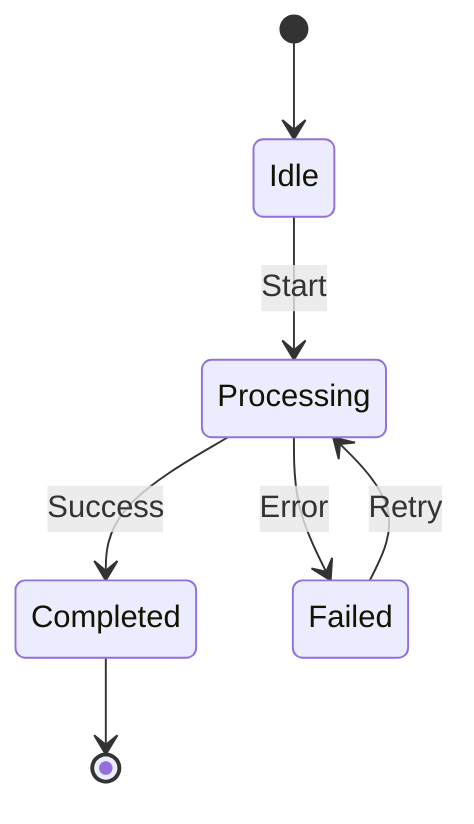
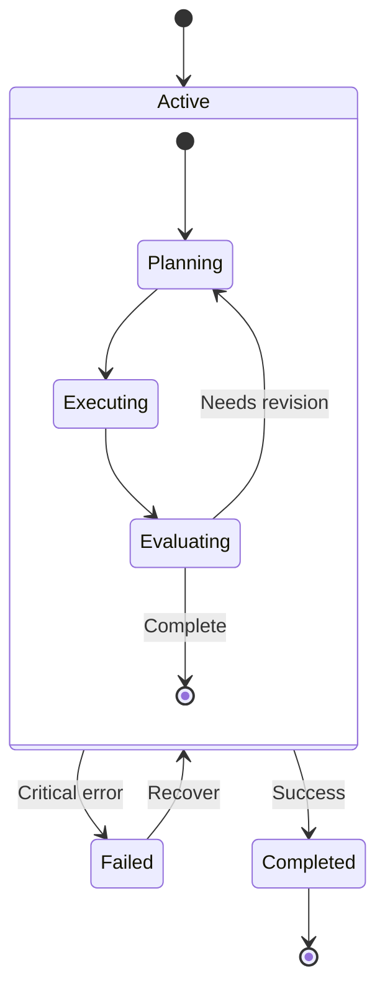
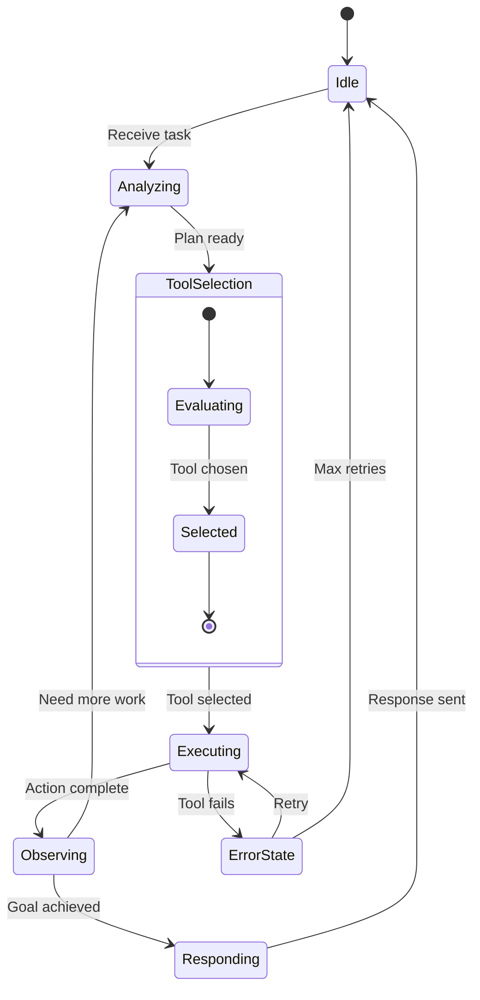
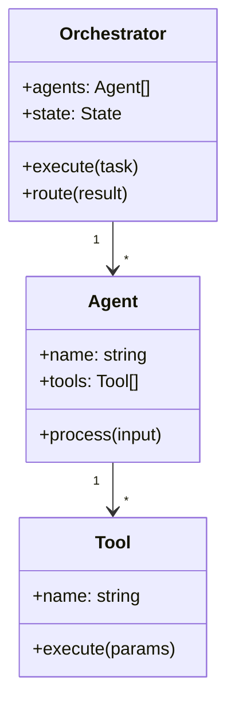
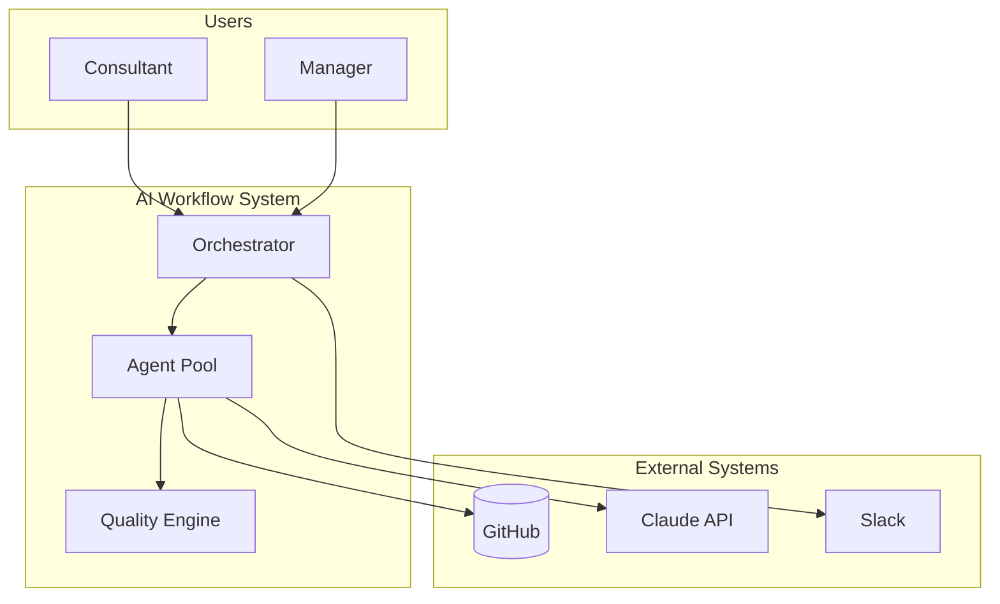
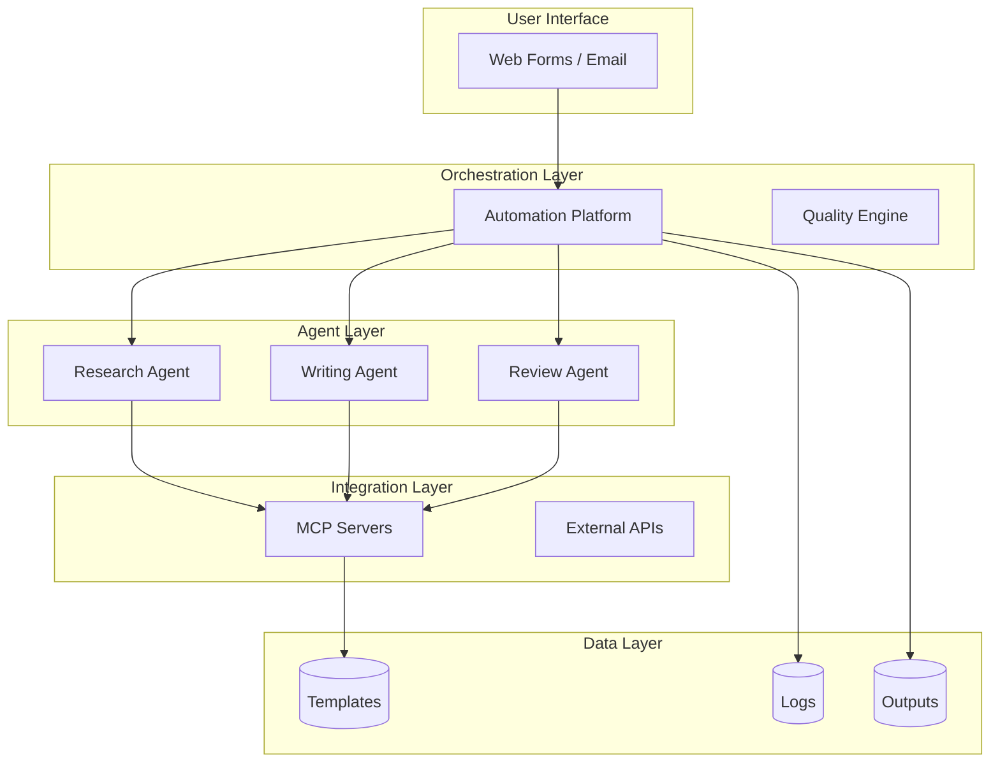
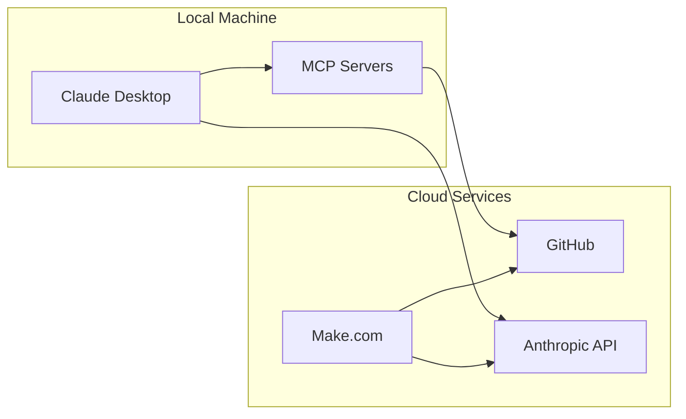

# **POWERPOINT PRESENTATION: ADVANCED MODULE 4 SESSION 2**
## **Advanced Diagrams & Integration**

**Module:** Advanced Module 4: Visual Documentation with Mermaid
**Session Number:** 2 of 2
**Session Duration:** 45 minutes
**Delivery Format:** Live MS Teams workshop

**Target Audience:** Block 2+ certified consultants who completed Session 1 and have created basic Mermaid diagrams

**Session Learning Objectives:** By the end of this session, participants will:
1. Create state diagrams to document agent and workflow states
2. Build architecture diagrams using flowchart patterns
3. Integrate diagrams into GitHub documentation effectively
4. Complete a comprehensive visual documentation suite (capstone)

**Entry Criteria:** (What participants should have before this session)
- [ ] 5+ basic diagrams created (from Session 1)
- [ ] Flowcharts and sequence diagrams working
- [ ] Diagrams rendering in GitHub

**Exit Criteria:** (What participants should be able to do after this session)
- [ ] State diagrams for agent states
- [ ] Architecture diagrams for systems
- [ ] Diagrams integrated into README files
- [ ] Module capstone completed

**Presentation Structure:**
1. Opening & Session 1 Recap (3 min) - Slides 1-3
2. Segment 1: State Diagrams (12 min) - Slides 4-8
3. Segment 2: Class & Entity Diagrams (10 min) - Slides 9-11
4. Segment 3: Architecture Diagrams (12 min) - Slides 12-16
5. Segment 4: GitHub Integration (11 min) - Slides 17-20
6. Capstone Preview & Close (3 min) - Slides 21-23

**Total Slides:** 23

---

## Slide Definitions

### SLIDE 1: TITLE SLIDE

**Title:** Advanced Module 4 Session 2: Advanced Diagrams & Integration

**Subtitle:** State diagrams, architecture views, and production-ready documentation

**Content:**
- [Instructor Name]
- [Date/Cohort identifier]
- AI Practitioner Training Program

**Graphic:** Clean title slide with program branding. Use Block 2 orange tones.

**SPEAKER NOTES:**

"[OPENING - Welcome]"

"Welcome back to Module 4, Session 2. Last session you learned flowcharts and sequence diagrams. Today we're adding advanced diagram types and integrating everything into production-ready documentation.

How many of you completed the three exercises from Session 1?

[Wait for show of hands]

Excellent. Today we're building on those fundamentals with state diagrams - perfect for documenting how agents move through different states - and architecture diagrams to show system context and components.

And your capstone today is to create a complete visual documentation suite that you can actually use for your AI systems."

[Transition: Click to next slide]

---

### SLIDE 2: SESSION OVERVIEW

**Title:** This Session's Journey

**Content:**

| Time | Topic | Focus |
|------|-------|-------|
| 0-3 min | Opening | Session 1 Recap & Preview |
| 3-15 min | State Diagrams | Agent & Workflow States |
| 15-25 min | Class & Entity Diagrams | System Components & Data |
| 25-37 min | Architecture Diagrams | Context, Containers, Deployment |
| 37-48 min | GitHub Integration | Documentation Structure |
| 48-51 min | Close | Capstone & Resources |

**Graphic:** Timeline showing the session flow

**SPEAKER NOTES:**

"Here's what we'll cover today:

First, state diagrams. These are perfect for documenting how your agents move through different states - idle, processing, completed, error handling.

Then class and entity diagrams for showing system components and data models.

In segment 3, we'll tackle architecture diagrams - how to show your system's context, major components, and deployment.

And we'll close with GitHub integration best practices - how to structure your documentation so it's actually useful.

Your capstone exercise brings all of this together into a comprehensive visual documentation suite.

[Pause]

Questions before we dive in?"

[Transition]

---

### SLIDE 3: LEARNING OBJECTIVES

**Title:** By the End of Today...

**Content:**

You will be able to:

1. **Create state diagrams to document agent and workflow states**
   - Show state transitions and error handling

2. **Build architecture diagrams using flowchart patterns**
   - Context, container, and deployment views

3. **Integrate diagrams into GitHub documentation effectively**
   - Structure, maintenance, and discoverability

4. **Complete a comprehensive visual documentation suite**
   - Module capstone: production-ready documentation

**Graphic:** Checklist with advanced diagram icons

**SPEAKER NOTES:**

"These are our four objectives for today. By the time you leave this session, you'll be able to:

[Read each objective, pausing briefly after each]

Notice that today is about completion and integration. Session 1 was foundations - flowcharts and sequences. Today we're adding the final pieces and putting it all together into documentation you can actually ship.

[Point to fourth objective]

Your capstone project creates a complete visual documentation suite - architecture diagrams, workflow diagrams, agent interactions, and state diagrams all integrated into a coherent documentation package.

Let's get started with state diagrams..."

[Transition: Click to Segment 1]

---

## SEGMENT 1: STATE DIAGRAMS
### Duration: 12 minutes | Slides 4-8

---

### SLIDE 4: WHY STATE DIAGRAMS?

**Title:** State Diagrams: Document How Things Change

**Content:**

**The Challenge:**
Your agents don't just process tasks linearly - they move through states: idle, analyzing, executing, observing, responding. How do you document these state transitions?

**Flowcharts vs. State Diagrams:**
- Flowcharts: Show process flow (what steps happen)
- State Diagrams: Show state transitions (what states exist and how you move between them)

**Perfect For:**
- Agent execution states
- Workflow lifecycle states
- Circuit breaker patterns
- Connection/session states

**Graphic:** Side-by-side flowchart vs. state diagram showing the difference

**SPEAKER NOTES:**

"[Hook - Create distinction]"

"Session 1 we focused on flowcharts and sequences. Those show WHAT happens and WHO does WHAT. But what about documenting the STATES your system can be in?

Think about an agent. It's not just 'processing' - it's idle, then analyzing a task, then executing an action, then observing the result, then responding. These are distinct states with transitions between them.

[Point to graphic]

Flowcharts show steps in a process. State diagrams show the states a component can be in and how it transitions between them.

This is perfect for:
- Documenting agent execution states
- Showing workflow lifecycle (pending → processing → completed → failed)
- Circuit breaker patterns (closed → open → half-open)

Let me show you the syntax..."

[Transition]

---

### SLIDE 5: STATE DIAGRAM BASICS

**Title:** State Diagram Syntax

**Content:**

**Basic Structure:**


**Key Elements:**
- `[*]` - Start/end states
- `State1 --> State2: Event` - Transition with trigger
- Simple state names (avoid spaces)

**Rendering:** Clean state boxes with labeled transitions

**Graphic:** Rendered state diagram showing agent states

**SPEAKER NOTES:**

"State diagram syntax is straightforward.

[Point to syntax]

You start with `stateDiagram-v2` - the v2 is important, it's the newer syntax.

`[*]` represents start and end states - the beginning and ending of the lifecycle.

Then you define transitions: `State1 --> State2: Event`

The event label after the colon explains what triggers the transition. 'Start', 'Success', 'Error' - these tell the story.

[Point to rendered diagram]

This renders as clean state boxes with labeled arrows showing transitions.

Now let me show you a more complex example with composite states..."

[Transition]

---

### SLIDE 6: COMPOSITE STATES

**Title:** Composite States: States Within States

**Content:**

**Use Case:** Group related states together

**Example: Agent Processing State**


**Benefit:** Shows that "Active" has multiple sub-states

**Graphic:** Rendered composite state diagram

**SPEAKER NOTES:**

"Sometimes a state is actually a group of sub-states. That's where composite states come in.

[Point to example]

Here, 'Active' is a composite state that contains Planning, Executing, and Evaluating.

An agent enters the Active state, then cycles through planning, executing, and evaluating until the task is complete or fails.

[Point to transitions]

Notice how the agent can exit Active in two ways: critical error goes to Failed, or successful completion goes to Completed.

This pattern is perfect for documenting agent behavior because agents often have complex internal states while appearing to be in a single 'active' state externally.

Let me show you a complete agent state example..."

[Transition to demo/example]

---

### SLIDE 7: AGENT STATE EXAMPLE

**Title:** Example: Full Agent Execution States

**Content:**

**Scenario:** Agent with tool selection and error handling



**Graphic:** Rendered state diagram with highlights on key paths

**SPEAKER NOTES:**

"Here's a complete agent state diagram.

[Walk through the flow]

Agent starts Idle. When it receives a task, it moves to Analyzing. Once it has a plan, it enters ToolSelection - a composite state where it evaluates options and selects a tool.

Then Executing the action, Observing the result. Based on observation, either more work is needed (loop back to Analyzing) or goal is achieved (move to Responding).

[Point to error handling]

And here's error handling. If tool execution fails, go to ErrorState. ErrorState can retry the execution or, after max retries, return to Idle.

This diagram tells the complete story of agent behavior. Try writing this in text - it would be pages of explanation. In a state diagram, it's immediately clear.

You'll create diagrams like this in Exercise 2.1."

[Transition]

---

### SLIDE 8: SEGMENT 1 SUMMARY

**Title:** State Diagrams: Key Takeaways

**Content:**

**Key Takeaway:** State diagrams show what states exist and how transitions happen - perfect for agents and workflows

**Remember:**
- Use `stateDiagram-v2` (the v2 matters)
- Label transitions with triggering events
- Use composite states to group related sub-states
- `[*]` represents start/end

**You'll Practice:**
Exercise 2.1: Create state diagrams for agent execution, workflow lifecycle, and circuit breaker patterns

**Graphic:** State diagram icon with transition arrows

**SPEAKER NOTES:**

"Before we move to class diagrams, let me summarize state diagrams:

The key insight is that state diagrams document STATES and TRANSITIONS, not process flows.

Remember:
- Always use stateDiagram-v2 - the v2 syntax is better
- Label your transitions with what triggers them
- Use composite states when a state has internal complexity
- Start and end states are represented by [*]

In Exercise 2.1, you'll create state diagrams for your agent execution states and workflow lifecycles.

[Pause]

Questions on state diagrams before we move to class diagrams?"

[Transition: Click to Segment 2]

---

## SEGMENT 2: CLASS & ENTITY DIAGRAMS
### Duration: 10 minutes | Slides 9-11

---

### SLIDE 9: CLASS DIAGRAMS FOR SYSTEM COMPONENTS

**Title:** Document System Structure with Class Diagrams

**Content:**

**The Challenge:**
How do you show the structure of your system - what components exist and how they relate?

**Class Diagrams Show:**
- System components (Orchestrator, Agents, Tools)
- Their properties and methods
- Relationships between components

**Use Cases:**
- Document agent architecture
- Show orchestrator structure
- Explain component relationships
- Technical specification

**Graphic:** Example class diagram showing Orchestrator, Agent, Tool relationships

**SPEAKER NOTES:**

"[Hook - New diagram type]"

"State diagrams show how things change over time. But what about showing the STRUCTURE of your system - what components you have and how they relate?

That's where class diagrams come in.

[Point to graphic]

Class diagrams show your components as boxes with their properties and methods, and relationships between them.

This is perfect for:
- Documenting your agent architecture
- Showing how your orchestrator manages agents
- Explaining that agents use tools
- Creating technical specifications

Let me show you the syntax..."

[Transition]

---

### SLIDE 10: CLASS DIAGRAM EXAMPLE

**Title:** Example: Orchestrator-Agent-Tool Architecture

**Content:**

**Mermaid Code:**


**What This Shows:**
- Orchestrator has many Agents
- Agent has many Tools
- Properties (+) and methods listed

**Graphic:** Rendered class diagram

**SPEAKER NOTES:**

"Here's a class diagram for a multi-agent architecture.

[Point to classes]

We have three classes: Orchestrator, Agent, and Tool.

Each class shows:
- Properties: `+agents: Agent[]`, `+name: string`
- Methods: `+execute(task)`, `+process(input)`

[Point to relationships]

The relationship lines show cardinality:
- One Orchestrator has many Agents (1 to *)
- One Agent has many Tools (1 to *)

This diagram immediately communicates your system's structure.

[Pause]

For most AI workflow documentation, you won't need class diagrams often - architecture flowcharts are usually clearer. But for technical specs or showing component relationships, class diagrams are perfect.

There's also entity-relationship diagrams for data models - similar syntax. See participant guide for examples.

Let's move to architecture diagrams..."

[Transition]

---

### SLIDE 11: SEGMENT 2 SUMMARY

**Title:** Class Diagrams: Key Takeaways

**Content:**

**Key Takeaway:** Class diagrams document system structure - components, properties, methods, and relationships

**Remember:**
- Use `classDiagram` syntax
- Show properties and methods with `+` prefix
- Relationships show cardinality (1 to *, etc.)
- Best for technical specs, not workflow docs

**You'll Practice:**
Exercise 2.2 includes component diagrams (can use class diagram syntax if appropriate)

**Graphic:** Class diagram icon with relationship arrows

**SPEAKER NOTES:**

"Quick summary on class diagrams:

They document structure, not behavior. Perfect for showing what components you have and how they relate.

For most AI workflow documentation, architecture flowcharts (which we're covering next) are more useful. But when you need to show technical structure, class diagrams are the tool.

Now let's dive into architecture diagrams - these are the ones you'll use most often..."

[Transition: Click to Segment 3]

---

## SEGMENT 3: ARCHITECTURE DIAGRAMS
### Duration: 12 minutes | Slides 12-16

---

### SLIDE 12: ARCHITECTURE DIAGRAMS - THE BIG PICTURE

**Title:** Show System Context and Components

**Content:**

**The Challenge:**
Stakeholders ask "What does your system look like?" and "How does it connect to other systems?"

**Architecture Diagram Types:**
- **Context:** Who/what interacts with the system
- **Container:** Major components of the system
- **Component:** Details within a component
- **Deployment:** Where things run (local vs. cloud)

**Good News:** All use flowchart syntax you already know

**Graphic:** C4 model pyramid showing context → containers → components

**SPEAKER NOTES:**

"[Hook - Stakeholder question]"

"Imagine your manager asks: 'Can you show me what our AI system looks like and how it connects to GitHub, Slack, and Claude API?'

You need an architecture diagram.

[Point to diagram types]

There are four types, based on the C4 model:
- Context diagram shows the system and its external connections
- Container diagram shows major components inside the system
- Component diagram shows details within one component
- Deployment diagram shows where things run

[Key point]

Here's the good news: you already know the syntax. These all use flowchart syntax with subgraphs for grouping. We're just applying flowcharts to architecture views.

Let me show you..."

[Transition]

---

### SLIDE 13: CONTEXT DIAGRAM

**Title:** Context: What Interacts With Your System?

**Content:**

**Purpose:** Show system and external actors/systems

**Example:**


**What This Shows:** System boundary and external dependencies

**Graphic:** Rendered context diagram

**SPEAKER NOTES:**

"A context diagram answers: 'What's inside our system and what's outside?'

[Point to diagram]

We use subgraphs to create clear groupings:
- Users who interact with the system
- The AI Workflow System itself (our components)
- External Systems we integrate with

[Point to connections]

Arrows show interactions. Consultants and managers send requests to the orchestrator. The system uses GitHub for templates, Claude API for AI processing, and Slack for notifications.

One diagram, complete system context. This is perfect for stakeholder presentations.

The syntax is just flowcharts with subgraphs - you already know this from Session 1."

[Transition]

---

### SLIDE 14: CONTAINER DIAGRAM

**Title:** Container: What's Inside Your System?

**Content:**

**Purpose:** Show major components and their interactions

**Example:**


**Graphic:** Rendered container diagram showing layers

**SPEAKER NOTES:**

"Container diagrams show the major components inside your system.

[Point to layers]

We organize components into logical layers:
- User interface (how users interact)
- Orchestration (coordination logic)
- Agents (the workers)
- Integration (how we connect to external services)
- Data (where we store things)

[Point to flows]

Arrows show data flow. User interface sends to orchestrator, orchestrator delegates to agents, agents use MCP servers to access templates.

This diagram helps new team members understand your architecture. It's also great for identifying bottlenecks or overly complex integration points.

Again, same flowchart syntax with subgraphs for layering."

[Transition]

---

### SLIDE 15: DEPLOYMENT DIAGRAM

**Title:** Deployment: Where Does It Run?

**Content:**

**Purpose:** Show physical/logical deployment

**Example:**


**What This Shows:** Local vs. cloud, service dependencies

**Graphic:** Rendered deployment diagram

**SPEAKER NOTES:**

"Deployment diagrams answer: 'Where does each component run?'

[Point to subgraphs]

Local machine has Claude Desktop and MCP Servers. Cloud services include GitHub, Make.com automation, and Anthropic API.

[Point to connections]

Claude Desktop talks to MCP Servers locally, then to Anthropic API in the cloud. Make.com orchestrates cloud-based workflows between GitHub and Claude API.

This is critical for:
- Understanding dependencies
- Planning for failures (what if GitHub is down?)
- Onboarding new team members (what do they need to install locally?)

You'll create these diagrams in Exercise 2.2."

[Transition]

---

### SLIDE 16: SEGMENT 3 SUMMARY

**Title:** Architecture Diagrams: Key Takeaways

**Content:**

**Key Takeaway:** Architecture diagrams use flowchart syntax with subgraphs to show system context, components, and deployment

**Remember:**
- Context: System boundary and external actors
- Container: Major components and layers
- Deployment: Where things run (local vs. cloud)
- Use subgraphs to group related elements

**You'll Practice:**
Exercise 2.2: Create context, container, and deployment diagrams for your system

**Graphic:** Three architecture diagram types side by side

**SPEAKER NOTES:**

"Let me summarize architecture diagrams:

The key insight is that you already know the syntax - it's flowcharts with subgraphs. We're just applying it to architectural views.

Remember:
- Context diagrams show system boundary - what's inside, what's outside
- Container diagrams show major components and how they connect
- Deployment diagrams show where things run

Use subgraphs to create clear groupings.

In Exercise 2.2, you'll create all three diagram types for your AI system.

[Pause]

Questions on architecture diagrams?"

[Transition: Click to Segment 4]

---

## SEGMENT 4: GITHUB INTEGRATION
### Duration: 11 minutes | Slides 17-20

---

### SLIDE 17: INTEGRATING DIAGRAMS INTO DOCUMENTATION

**Title:** Make Your Diagrams Discoverable and Maintainable

**Content:**

**The Challenge:**
You've created great diagrams. Now what? Where do they go? How do people find them? How do you keep them updated?

**Best Practices:**
- Organize in logical folder structure
- Include in README files
- Link from table of contents
- Plan for maintenance

**Anti-Pattern:**
Creating diagrams that sit in random files and are never found or updated

**Graphic:** Good vs. bad documentation structure

**SPEAKER NOTES:**

"[Hook - Reality check]"

"You've learned how to create amazing diagrams. But here's the reality: if people can't find them, they're useless. And if they're hard to update, they'll become outdated and misleading.

[Point to anti-pattern]

I've seen countless repos with great diagrams buried in `/misc` folders or scattered across random markdown files. Nobody finds them, nobody updates them.

[Point to best practices]

Today we're fixing that. Your diagrams need to be:
- Organized logically
- Discoverable (in README and table of contents)
- Maintainable (easy to update)

Let me show you how..."

[Transition]

---

### SLIDE 18: DOCUMENTATION STRUCTURE

**Title:** Organize Your Visual Documentation

**Content:**

**Recommended Structure:**
```
/docs
  /architecture
    overview.md          (context, container diagrams)
    deployment.md        (deployment diagram)
  /workflows
    main-workflow.md     (flowchart)
    quality-workflow.md  (flowchart)
    error-handling.md    (flowchart)
  /agents
    agent-states.md      (state diagrams)
    interactions.md      (sequence diagrams)
/README.md              (overview with key diagrams)
```

**Key Principles:**
- Group by type (architecture, workflows, agents)
- One concept per file
- Main diagrams in README
- Details in /docs

**Graphic:** Folder structure visualization

**SPEAKER NOTES:**

"Here's a documentation structure that works.

[Point to structure]

Organize by type: architecture diagrams together, workflow diagrams together, agent diagrams together.

Keep one concept per file. Don't put all workflows in one giant file - split them. main-workflow.md, quality-workflow.md, error-handling.md.

[Point to README]

Your main README should have:
- System overview
- Architecture context diagram
- Link to detailed docs

The detailed diagrams live in /docs subfolders.

[Key point]

This makes diagrams discoverable. New team members start with README, then drill into /docs for details.

It also makes them maintainable. When your quality workflow changes, you know exactly which file to update."

[Transition]

---

### SLIDE 19: MAINTENANCE STRATEGY

**Title:** Keep Diagrams Current

**Content:**

**When to Update Diagrams:**
- System architecture changes → Update architecture diagrams
- New workflow added → Create new workflow diagram
- Agent behavior changes → Update state diagrams
- Integration added/removed → Update deployment diagram

**Make It Easy:**
- Document where each diagram lives
- Include maintenance notes in files
- Review diagrams in code reviews
- Use PR comments to flag outdated diagrams

**Template Section:**
```markdown
## Maintenance Notes

**Update Triggers:**
- Adding new agents → Update architecture diagram
- Changing quality thresholds → Update quality workflow

**Last Updated:** 2026-01-02 by [Name]
```

**Graphic:** Maintenance checklist

**SPEAKER NOTES:**

"Diagrams are documentation. And documentation rots if you don't maintain it.

[Point to update triggers]

Define clear triggers for updates:
- Architecture changes → update architecture diagrams
- New workflows → create new workflow diagrams

[Point to template]

Include maintenance notes in your files. This tells future you (and teammates) when to update.

[Key practice]

Review diagrams in PRs. When someone adds a new agent, the PR reviewer should ask: 'Did you update the architecture diagram?'

This keeps diagrams current. Current diagrams are useful. Outdated diagrams are dangerous."

[Transition]

---

### SLIDE 20: SEGMENT 4 SUMMARY

**Title:** GitHub Integration: Key Takeaways

**Content:**

**Key Takeaway:** Organize diagrams logically, make them discoverable, and plan for maintenance

**Remember:**
- Structure: /docs with subfolders by type
- Discoverability: Main diagrams in README, details in /docs
- Maintenance: Document update triggers, review in PRs
- One concept per file

**You'll Practice:**
Exercise 2.3 (Capstone): Create complete documentation suite with proper structure

**Graphic:** Well-organized documentation structure icon

**SPEAKER NOTES:**

"Final segment summary:

Great diagrams that nobody finds are useless. Great diagrams that become outdated are dangerous.

Remember:
- Organize in logical folders (/architecture, /workflows, /agents)
- Put key diagrams in README for discoverability
- Document when to update each diagram
- Keep one concept per file for maintainability

Your capstone exercise (Exercise 2.3) brings all of this together. You'll create a complete visual documentation suite with proper organization and maintenance planning.

[Pause]

Questions on documentation structure or maintenance?"

[Transition: Click to Closing]

---

## CLOSING SECTION
### Duration: 3 minutes | Slides 21-23

---

### SLIDE 21: THIS WEEK'S CAPSTONE

**Title:** Module Capstone: Complete Visual Documentation Suite

**Content:**

| Exercise | Time | Deliverable | Skills Practiced |
|----------|------|-------------|------------------|
| Exercise 2.1: State Diagrams | 20 min | Agent & workflow state diagrams | State diagram syntax, transitions |
| Exercise 2.2: Architecture Docs | 20 min | Context, container, deployment diagrams | Architecture patterns |
| Exercise 2.3: Capstone | 20 min | Complete documentation suite | Integration, organization, maintenance |
| **Total** | **60 min** | | |

**Capstone Deliverable:**
Comprehensive visual documentation integrating all diagram types from both sessions

**Graphic:** Capstone project visualization showing all diagram types

**SPEAKER NOTES:**

"Here's your homework for this session. You have 60 minutes total, split into three exercises.

[Walk through exercises]:

Exercise 2.1 takes 20 minutes. You'll create state diagrams for your agent execution states and workflow lifecycle. This practices the state diagram syntax we just learned.

Exercise 2.2 is also 20 minutes. You'll create architecture diagrams: context, container, and deployment views of your system.

Exercise 2.3 is your capstone - 20 minutes to integrate everything into a complete visual documentation suite. This includes:
- All diagrams from Sessions 1 and 2
- Proper folder structure
- Maintenance planning
- Professional presentation

This is portfolio-quality documentation you can use for your actual AI systems.

All templates and detailed instructions are in your participant guide."

[Transition]

---

### SLIDE 22: RESOURCES

**Title:** Resources for This Session

**Content:**

**Templates & Examples:**
- State diagram templates (participant guide)
- Architecture diagram patterns (participant guide)
- Complete documentation suite template (Exercise 2.3)

**Reference Materials:**
- Mermaid State Diagram Docs: https://mermaid.js.org/syntax/stateDiagram.html
- C4 Model: https://c4model.com (architecture patterns)

**Module Resources:**
- Session 1 materials (flowcharts, sequences)
- Mermaid cheat sheet (Appendix A)
- Common patterns (Appendix B)

**Support:**
- Questions: [Async channel name]

**Graphic:** Resource icons with links

**SPEAKER NOTES:**

"You have several resources to support your capstone:

Your participant guide has complete templates for all exercises - state diagrams, architecture patterns, and the full documentation suite structure.

The official Mermaid docs have excellent state diagram examples. And the C4 model website explains architecture diagram patterns in detail.

You also have all your Session 1 materials - bring forward your best flowcharts and sequence diagrams for the capstone.

If you get stuck, post in [async channel] with your specific question."

[Transition]

---

### SLIDE 23: MODULE COMPLETE

**Title:** Congratulations - Module 4 Complete!

**Content:**

**What You've Learned:**
- Session 1: Flowcharts & sequence diagrams
- Session 2: State diagrams & architecture diagrams
- Integration: Production-ready documentation

**Your Capstone:**
Complete visual documentation suite with:
- Architecture diagrams (context, container, deployment)
- Workflow diagrams (flowcharts with decision logic)
- Agent interactions (sequence diagrams)
- State diagrams (agent and workflow states)
- Maintenance plan

**Next Steps:**
- Complete the capstone
- Apply to your actual AI systems
- Keep diagrams updated as systems evolve

**Graphic:** Module completion badge with visual documentation icon

**SPEAKER NOTES:**

"Congratulations - you've completed Advanced Module 4: Visual Documentation with Mermaid!

[Recap]

Over two sessions, you learned:
- Flowcharts for workflow logic
- Sequence diagrams for agent interactions
- State diagrams for state transitions
- Architecture diagrams for system views
- How to integrate and maintain them

[Point to capstone]

Your capstone creates a complete visual documentation suite. This isn't just an exercise - it's production-ready documentation you can use for your actual AI systems.

[Final thoughts]

Remember: diagrams are living documentation. They should evolve with your system. Because they're text-based in Mermaid, updating them is as easy as editing a few lines.

Great work over these two sessions. Now go create amazing documentation!"

[End]

---

## Appendix: Timing Notes

**Segment Time Allocations:**
- Opening & Recap: 3 min (Slides 1-3)
- Segment 1 (State Diagrams): 12 min (Slides 4-8)
- Segment 2 (Class & Entity Diagrams): 10 min (Slides 9-11)
- Segment 3 (Architecture Diagrams): 12 min (Slides 12-16)
- Segment 4 (GitHub Integration): 11 min (Slides 17-20)
- Closing: 3 min (Slides 21-23)
- **Total: 51 minutes** (includes 6-minute buffer for questions/discussion)

**If Running Behind:**
- Segment 2: Reduce to 5 minutes - show one class diagram example, reference participant guide for details
- Segment 4: Compress maintenance section to 3 minutes
- Must complete: Slides 1-3, 4-8, 12-16, 21-23

**If Running Ahead:**
- Show additional state diagram examples (circuit breaker, connection states)
- Live demo of creating architecture diagram
- Extended Q&A on documentation organization

---

## Version History

| Version | Date | Changes | Author |
|---------|------|---------|--------|
| 1.0 | 2026-01-02 | Initial presentation created from module content | AI Training Team |

---
