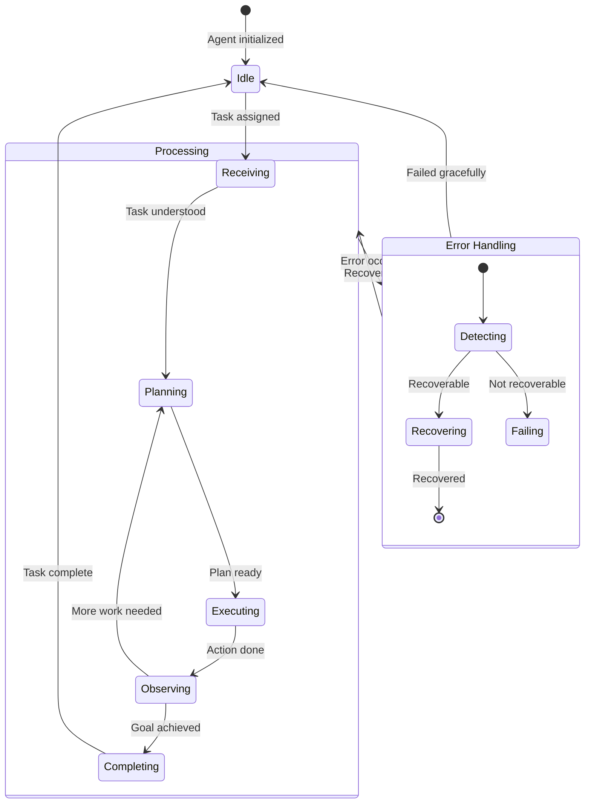
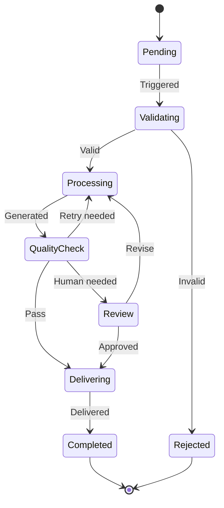
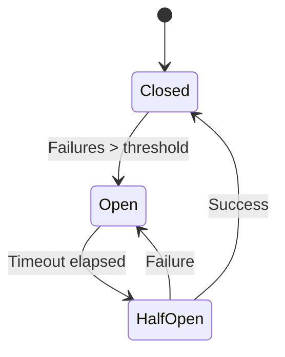
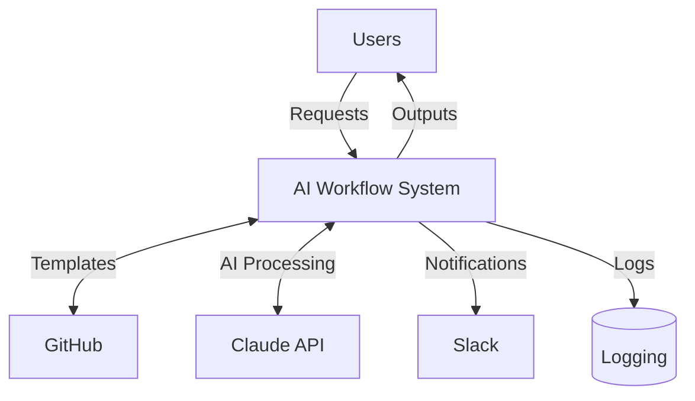
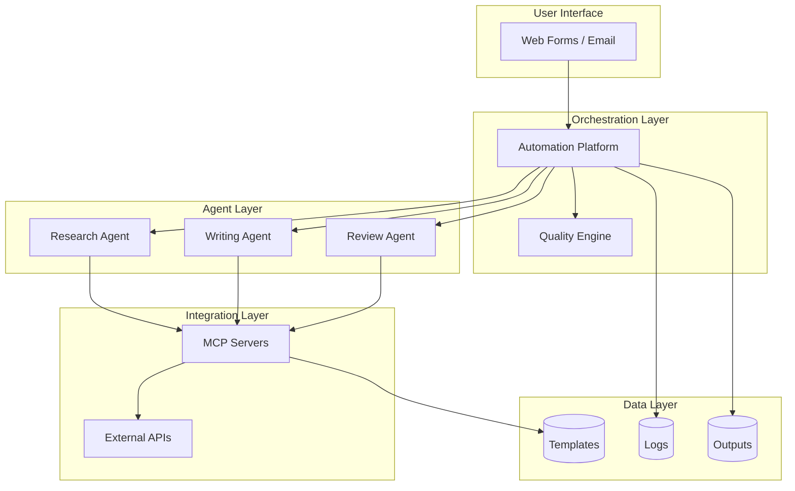
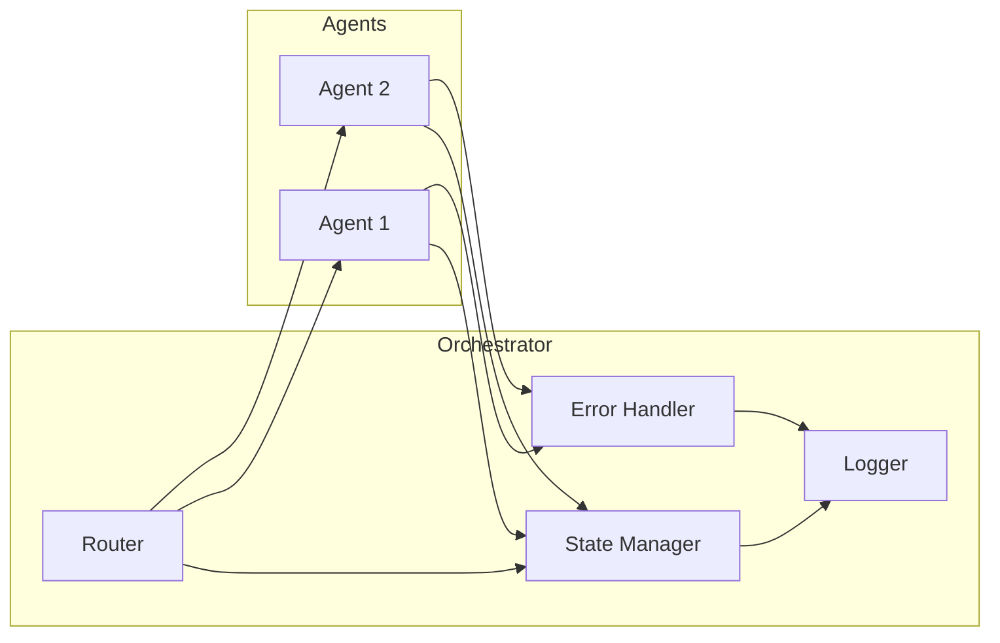
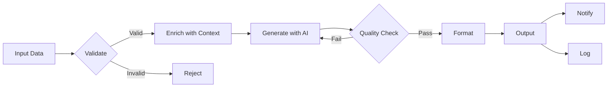

# **Advanced Module 4: Visual Documentation with Mermaid**
## **Session 2: Advanced Diagrams & Integration**

**Duration:** 45 min live + 60 min homework

---

## **Entry Criteria**

- [ ] 5+ basic diagrams created
- [ ] Flowcharts and sequence diagrams working
- [ ] Diagrams rendering in GitHub

---

## **Exit Criteria**

- [ ] State diagrams for agent states
- [ ] Architecture diagrams for systems
- [ ] Diagrams integrated into README files
- [ ] Module capstone completed

---

## **Workshop Content (45 minutes)**

### **Segment 1: State Diagrams (12 min)**

- **Use case:** Document agent/workflow states

- **Basic syntax:**
  ```mermaid
  stateDiagram-v2
      [*] --> Idle
      Idle --> Processing: Start
      Processing --> Completed: Success
      Processing --> Failed: Error
      Failed --> Processing: Retry
      Completed --> [*]
  ```

- **Composite states:**
  ```mermaid
  stateDiagram-v2
      [*] --> Active

      state Active {
          [*] --> Planning
          Planning --> Executing
          Executing --> Evaluating
          Evaluating --> Planning: Needs revision
          Evaluating --> [*]: Complete
      }

      Active --> Failed: Critical error
      Active --> Completed: Success
      Failed --> Active: Recover
      Completed --> [*]
  ```

- **Agent state example:**
  ```mermaid
  stateDiagram-v2
      [*] --> Idle

      Idle --> Analyzing: Receive task
      Analyzing --> ToolSelection: Plan ready

      state ToolSelection {
          [*] --> Evaluating
          Evaluating --> Selected: Tool chosen
          Selected --> [*]
      }

      ToolSelection --> Executing: Tool selected
      Executing --> Observing: Action complete
      Observing --> Analyzing: Need more work
      Observing --> Responding: Goal achieved
      Responding --> Idle: Response sent

      Executing --> ErrorState: Tool fails
      ErrorState --> Executing: Retry
      ErrorState --> Idle: Max retries
  ```

### **Segment 2: Class & Entity Diagrams (10 min)**

- **System component diagram:**
  ```mermaid
  classDiagram
      class Orchestrator {
          +agents: Agent[]
          +state: State
          +execute(task)
          +route(result)
      }

      class Agent {
          +name: string
          +tools: Tool[]
          +process(input)
      }

      class Tool {
          +name: string
          +execute(params)
      }

      Orchestrator "1" --> "*" Agent
      Agent "1" --> "*" Tool
  ```

- **Data model documentation:**
  ```mermaid
  erDiagram
      WORKFLOW ||--o{ EXECUTION : has
      EXECUTION ||--o{ STEP : contains
      EXECUTION ||--|| RESULT : produces
      STEP ||--o| AGENT : uses

      WORKFLOW {
          string id PK
          string name
          string config
      }
      EXECUTION {
          string id PK
          datetime started
          string status
      }
  ```

### **Segment 3: Architecture Diagrams (12 min)**

- **C4-style context diagram:**
  ```mermaid
  graph TB
      subgraph Users
          U1[Consultant]
          U2[Manager]
      end

      subgraph "AI Workflow System"
          A[Orchestrator]
          B[Agent Pool]
          C[Quality Engine]
      end

      subgraph "External Systems"
          D[(GitHub)]
          E[Claude API]
          F[Slack]
      end

      U1 --> A
      U2 --> A
      A --> B
      B --> C
      B --> D
      B --> E
      A --> F
  ```

- **Deployment diagram:**
  ```mermaid
  graph LR
      subgraph "Local Machine"
          A[Claude Desktop]
          B[MCP Servers]
      end

      subgraph "Cloud Services"
          C[GitHub]
          D[Make.com]
          E[Anthropic API]
      end

      A --> B
      A --> E
      B --> C
      D --> E
      D --> C
  ```

- **Integration architecture:**
  ```mermaid
  graph TD
      subgraph "Triggers"
          T1[Email]
          T2[Form]
          T3[Schedule]
      end

      subgraph "Automation Platform"
          P[Make/n8n]
      end

      subgraph "AI Layer"
          AI[Claude + MCP]
      end

      subgraph "Data Layer"
          D1[(Templates)]
          D2[(Logs)]
          D3[(Outputs)]
      end

      subgraph "Outputs"
          O1[Documents]
          O2[Notifications]
          O3[Reports]
      end

      T1 & T2 & T3 --> P
      P <--> AI
      AI <--> D1
      P --> D2
      P --> O1 & O2 & O3
      P --> D3
  ```

### **Segment 4: GitHub Integration (11 min)**

- **README with diagrams:**
  ```markdown
  # My AI Workflow System

  ## Architecture

  ```mermaid
  graph TD
      [Your diagram here]
  ```

  ## How It Works

  ```mermaid
  sequenceDiagram
      [Your sequence here]
  ```
  ```

- **Documentation structure:**
  ```
  /docs
    /architecture
      overview.md (with diagrams)
      components.md
    /workflows
      workflow-1.md (with flowchart)
      workflow-2.md
    /agents
      agent-interactions.md (with sequence)
  ```

- **Maintaining diagrams:**
  - Update when system changes
  - Version diagrams with code
  - Review in PRs

---

## **Self-Paced Exercises (60 minutes total)**

### **Exercise 2.1: State Diagrams (20 minutes)**

*Document agent and workflow states*

```markdown
# State Diagrams

## Agent Execution States



## Workflow States



## Circuit Breaker States


```

**Deliverable:** State diagrams for agents and workflows

---

### **Exercise 2.2: Architecture Documentation (20 minutes)**

*Create system architecture diagrams*

```markdown
# System Architecture Documentation

## Context Diagram

Who/what interacts with the system:



## Container Diagram

Major components of the system:



## Component Diagram

Detailed view of orchestration:



## Data Flow Diagram

How data moves through the system:


```

**Deliverable:** Complete architecture documentation

---

### **Exercise 2.3: Module Capstone (20 minutes)**

*Create comprehensive visual documentation suite*

```markdown
# Visual Documentation Suite

## Project: [Your System Name]

## Documentation Index

### Architecture
- [Context Diagram](#context-diagram)
- [Container Diagram](#container-diagram)
- [Deployment Diagram](#deployment-diagram)

### Workflows
- [Main Workflow](#main-workflow)
- [Quality Workflow](#quality-workflow)
- [Error Handling](#error-handling)

### Agent Interactions
- [Standard Flow](#standard-flow)
- [Multi-Agent Collaboration](#multi-agent)
- [Error Recovery](#error-recovery)

### States
- [Agent States](#agent-states)
- [Workflow States](#workflow-states)

---

## Architecture

### Context Diagram
```mermaid
[Your context diagram]
```

### Container Diagram
```mermaid
[Your container diagram]
```

### Deployment Diagram
```mermaid
[Your deployment diagram]
```

---

## Workflows

### Main Workflow
```mermaid
[Your main workflow flowchart]
```

### Quality Workflow
```mermaid
[Quality check flowchart]
```

### Error Handling
```mermaid
[Error handling flowchart]
```

---

## Agent Interactions

### Standard Flow
```mermaid
[Standard sequence diagram]
```

### Multi-Agent Collaboration
```mermaid
[Multi-agent sequence]
```

### Error Recovery
```mermaid
[Error recovery sequence]
```

---

## States

### Agent States
```mermaid
[Agent state diagram]
```

### Workflow States
```mermaid
[Workflow state diagram]
```

---

## Diagram Maintenance

| Diagram | Last Updated | Owner |
|---------|--------------|-------|
| Context | [Date] | [Name] |
| Workflow | [Date] | [Name] |
| ... | ... | ... |

## How to Update

1. Edit the markdown source
2. Preview locally (VS Code Mermaid extension)
3. Commit changes
4. Verify rendering in GitHub
```

**Deliverable:** Complete visual documentation suite

---
