# AI Practitioner Training Curriculum
## Implementation Plan for Recommended Improvements

**Document Version:** 1.0
**Created:** 2025-12-31
**Author:** Implementation Planning Session
**Status:** Ready for Execution

---

## Executive Summary

This implementation plan addresses 23 specific improvements across three phases, organized by dependency and impact. Total estimated effort: 12-16 hours of focused work.

**Phase 1 (Critical Fixes):** 4-6 hours — Must complete before first cohort
**Phase 2 (Content Enhancement):** 5-7 hours — Complete during/after first cohort
**Phase 3 (Polish & Optimization):** 3-4 hours — Ongoing refinement

---

## Phase 1: Critical Fixes (Pre-Launch)

**Timeline:** Complete before first participant begins
**Effort:** 4-6 hours
**Dependencies:** None — can begin immediately

---

### Task 1.1: Fix Appendix Numbering Collision

**Problem:** Block 1 Appendix I (QUICK-START.md Template) collides with Block 2 Appendix I (Block 2 Capstone Rubric)

**File:** `block-2.md`

**Action:** Renumber all Block 2 appendices from I-M to J-N

**Step-by-Step Instructions:**

1. Open `block-2.md` in your editor

2. Use find-and-replace to update appendix references throughout the document:

| Find | Replace With |
|------|--------------|
| `Appendix I` | `Appendix J` |
| `Appendix J` | `Appendix K` |
| `Appendix K` | `Appendix L` |
| `Appendix L` | `Appendix M` |
| `Appendix M` | `Appendix N` |

3. Update the appendix headers in the APPENDICES section:

**Current:**
```markdown
## **Appendix I: Block 2 Capstone Rubric**
## **Appendix J: Platform Decision Matrix Template**
## **Appendix K: Workflow Documentation Template**
## **Appendix L: MCP Configuration Reference**
## **Appendix M: Quality Evaluation Prompt Template**
```

**Change to:**
```markdown
## **Appendix J: Block 2 Capstone Rubric**
## **Appendix K: Platform Decision Matrix Template**
## **Appendix L: Workflow Documentation Template**
## **Appendix M: MCP Configuration Reference**
## **Appendix N: Quality Evaluation Prompt Template**
```

4. Update the README.md appendices reference section:

**File:** `README.md`

**Find this section:**
```markdown
### Block 2 Appendices (J-M)
- I: Block 2 Capstone Rubric
- J: Platform Decision Matrix Template
- K: Workflow Documentation Template
- L: MCP Configuration Reference
- M: Quality Evaluation Prompt Template
```

**Replace with:**
```markdown
### Block 2 Appendices (J-N)
- J: Block 2 Capstone Rubric
- K: Platform Decision Matrix Template
- L: Workflow Documentation Template
- M: MCP Configuration Reference
- N: Quality Evaluation Prompt Template
```

**Verification:** Search both files for "Appendix I" — should only appear in block-1.md

---

### Task 1.2: Remove MCP Teasers from Block 1

**Problem:** MCP previews in Block 1 Weeks 3 and 6 create confusion without providing actionable knowledge

**File:** `block-1.md`

**Action:** Remove MCP teaser content from two locations

**Location 1: Week 3, Segment 4**

**Find this content (approximately lines containing "MCP Teaser"):**
```markdown
- **MCP Teaser (2 min):**
  - "In Block 2, you'll learn MCP - Model Context Protocol"
  - **"USB-C for AI" analogy:** Universal connector for AI tools
  - "Imagine AI automatically accessing your GitHub prompts - that's MCP"
  - "Don't worry about it now, just planting the seed"
```

**Replace with:**
```markdown
- **Looking Ahead (2 min):**
  - "In Block 2, you'll connect these templates to automated workflows"
  - "Your organized GitHub library becomes the foundation for automation"
  - "The structure you build now pays dividends later"
```

**Location 2: Week 6, Segment 4**

**Find this section header and content:**
```markdown
**Segment 4: MCP Preview - Looking Ahead (10 min)**

- **Recap from Week 3:** "USB-C for AI" concept
- **What you'll learn in Block 2:**
  - Connecting AI to your GitHub library directly
  - Agents that can read your templates automatically
  - No more copying/pasting - AI fetches what it needs
- **Quick demo or video:** Show MCP in action (if available)
- **Why organize now:** Well-structured library makes MCP setup easier
- **Teaser:** "Imagine your agent automatically using the latest template version from GitHub"
```

**Replace with:**
```markdown
**Segment 4: Block 2 Preview - Looking Ahead (10 min)**

- **What you've built:**
  - Organized template library with version control
  - Quality rubrics for consistent evaluation
  - Documentation standards for reusability
- **What's next in Block 2:**
  - Automating your templates into multi-step workflows
  - Adding quality gates that run automatically
  - Connecting workflows to external tools and data sources
  - Building systems that execute without manual prompting
- **Why your Block 1 work matters:**
  - Well-documented templates become workflow components
  - Quality rubrics become automated quality checks
  - GitHub organization enables team collaboration
- **The progression:** "You've learned to write excellent prompts. Next, you'll learn to orchestrate them."
```

**Verification:** Search block-1.md for "MCP" — should return zero results after changes

---

### Task 1.3: Add "When NOT to Automate" Framework

**Problem:** Curriculum assumes all templates should become workflows without decision criteria

**File:** `block-2.md`

**Action:** Insert new content in Week 1 Workshop, creating a new Segment 2.5

**Location:** After Segment 2 (Automation Platform Landscape), before Segment 3 (Decision Matrix)

**Find:**
```markdown
**Segment 3: Decision Matrix for Platform Selection (12 min)**
```

**Insert this new section BEFORE Segment 3:**
```markdown
**Segment 2.5: When to Automate vs. When to Stay Manual (8 min)**

- **Critical question:** Not everything SHOULD be automated
- **The Automation Decision Matrix:**

  | Factor | Automate | Keep Manual |
  |--------|----------|-------------|
  | **Frequency** | >10x/month | <5x/month |
  | **Stake Level** | Low-medium stakes | High-stakes client situations |
  | **Error Tolerance** | Errors are recoverable | Zero-tolerance for mistakes |
  | **Variability** | Predictable patterns | Highly variable inputs |
  | **Relationship** | Transactional interactions | Relationship-critical communications |
  | **Judgment Required** | Rule-based decisions | Nuanced professional judgment |
  | **Time Investment** | Setup time < 10x manual time | Setup exceeds reasonable payback |

- **Red flags - Keep manual when:**
  - Client is in crisis mode (emotional intelligence needed)
  - Legal/compliance review required
  - Executive-level communications
  - First interaction with new client
  - Ambiguous requirements that need clarification
  - Deliverable requires original creative thinking

- **Green flags - Good automation candidates:**
  - Status reports and updates
  - Initial draft generation (with human review)
  - Data gathering and synthesis
  - Template-based documents
  - Internal communications
  - Repetitive research tasks

- **The hybrid approach:**
  - Automate the 80% that's predictable
  - Reserve human attention for the 20% that matters most
  - Quality gates ensure human review at critical points

- **Exercise prompt:** Review your Block 1 task priority list—which items should NOT be automated?
```

**Then adjust Segment 3 timing:**

**Find:**
```markdown
**Segment 3: Decision Matrix for Platform Selection (12 min)**
```

**Change to:**
```markdown
**Segment 3: Decision Matrix for Platform Selection (10 min)**
```

**Also adjust Segment 4 timing to maintain 45-minute total:**

**Find:**
```markdown
**Segment 4: MCP Introduction + Registry Preview (13 min)**
```

**Change to:**
```markdown
**Segment 4: MCP Introduction + Registry Preview (10 min)**
```

**Add corresponding exercise to Week 1 Self-Paced section:**

**Find the end of Exercise 1.1 in Week 1:**
```markdown
**Deliverable:** `platform-decision-matrix.md` + platform account created
```

**Insert new exercise after Exercise 1.1:**
```markdown
-----

**Exercise 1.1b: Automation Candidate Validation (10 minutes)**

*Validate which Block 1 templates should become workflows*

1. Review your Block 1 task priority matrix
2. For each of your top 5 tasks, complete this validation:

```markdown
# Automation Candidate Validation

## Task: [Name]

### Automation Criteria Check

| Criterion | Assessment | Score (1-5) |
|-----------|------------|-------------|
| Frequency (>10x/month = 5) | | |
| Stakes (Low = 5, High = 1) | | |
| Error tolerance (High = 5) | | |
| Predictability (High = 5) | | |
| Relationship factor (Transactional = 5) | | |
| **Total** | | /25 |

### Decision
- Score 20-25: Strong automation candidate
- Score 15-19: Automate with human review gates
- Score 10-14: Partial automation only
- Score <10: Keep manual

### Recommendation
- [ ] Full automation
- [ ] Automation with review gates
- [ ] Partial automation (specify which parts)
- [ ] Keep manual

### Rationale
[1-2 sentences explaining decision]
```

3. Identify your top 3 validated automation candidates for Block 2

**Deliverable:** `automation-validation.md` with assessments for top 5 tasks

-----
```

**Verification:** Read through Week 1 to confirm flow makes sense and timing adds to 45 minutes

---

### Task 1.4: Create Prerequisite Self-Assessment

**Problem:** No baseline skills check before Block 1; participants may struggle with basic technical tasks

**File:** Create new file `prerequisites.md` in repository root

**Action:** Create comprehensive prerequisites document

**Create new file with this content:**

```markdown
# AI Practitioner Training Prerequisites

**Complete this self-assessment before beginning Block 1**

---

## Technical Requirements

### Required Access
- [ ] Computer with internet access (Windows, Mac, or Linux)
- [ ] Modern web browser (Chrome, Firefox, Safari, or Edge)
- [ ] Email account for platform registrations
- [ ] Ability to install desktop applications (for Claude Desktop in Block 2)

### AI Tool Access (at least one)
- [ ] Claude (claude.ai) - Recommended
- [ ] ChatGPT (chat.openai.com)
- [ ] Microsoft Copilot

---

## Skills Self-Assessment

Rate your comfort level with each skill: 
**1** = Never done this | **3** = Can do with some effort | **5** = Very comfortable

### Basic Computer Skills

| Skill | Rating (1-5) |
|-------|--------------|
| Creating and saving text files | |
| Organizing files into folders | |
| Copy and paste operations | |
| Using keyboard shortcuts | |
| Installing applications | |

**Minimum recommended:** Average of 3 or higher

### Web & Browser Skills

| Skill | Rating (1-5) |
|-------|--------------|
| Creating accounts on websites | |
| Managing passwords | |
| Using multiple browser tabs | |
| Downloading files | |
| Uploading files to websites | |

**Minimum recommended:** Average of 3 or higher

### AI Tool Experience

| Skill | Rating (1-5) |
|-------|--------------|
| Have used an AI chatbot at least once | |
| Comfortable typing questions to AI | |
| Understand AI can make mistakes | |
| Have tried to get AI to write something | |

**Minimum recommended:** Average of 2 or higher (Block 1 teaches the rest)

---

## Pre-Work Checklist

Complete these tasks before Week 1:

### 1. AI Tool Setup (15 minutes)
- [ ] Create account on Claude (claude.ai) - **Recommended primary tool**
- [ ] Send at least 3 test messages to verify access
- [ ] Bookmark the AI tool for easy access

### 2. GitHub Account (10 minutes)
- [ ] Create free account at github.com
- [ ] Verify email address
- [ ] Complete basic profile (name, photo optional)

### 3. Identify Your Use Cases (20 minutes)
- [ ] List 5-10 recurring tasks in your consulting work
- [ ] Identify one deliverable you'd like to improve with AI
- [ ] Bring this list to Week 1

### 4. Technical Environment Check (5 minutes)
- [ ] Verify you can access all required websites from your work network
- [ ] Test that you can install applications (or identify IT support contact)
- [ ] Confirm you have a text editor (Notepad, TextEdit, or VS Code)

---

## Troubleshooting Common Issues

### "I can't access Claude/ChatGPT from my work network"
Contact IT to request access, explaining this is for professional development in AI skills. If blocked, you may need to complete exercises from a personal device or network.

### "I've never used GitHub"
That's okay! Block 1 Week 3 teaches GitHub basics. Just create the account beforehand.

### "I'm not technical"
This curriculum is designed for consultants, not developers. The technical concepts are introduced gradually with clear explanations. Focus on the business applications.

### "I don't have time for homework"
Weekly commitment is approximately 2 hours (45 min live + 60-75 min self-paced). Consider blocking this time on your calendar. The skills compound—skipping exercises makes later weeks harder.

---

## Readiness Checklist

Complete this final checklist to confirm you're ready for Block 1:

- [ ] All skills self-assessments average 2+ (or you've identified areas to improve)
- [ ] AI tool account created and tested
- [ ] GitHub account created
- [ ] 5-10 recurring tasks identified
- [ ] One deliverable improvement target identified
- [ ] Weekly time blocked on calendar (2 hours/week for 8 weeks)
- [ ] Manager/team aware of your participation (if applicable)

---

## Questions?

Contact [training coordinator] before Week 1 if you have concerns about prerequisites or technical access.

---

**Ready to begin? Proceed to [Block 1: AI Prompting Mastery](block-1.md)**
```

**Update README.md to reference prerequisites:**

**Find in README.md:**
```markdown
## Getting Started

1. **Review this README** to understand the program structure
2. **Start with [Block 1](block-1.md)** - no prerequisites required
```

**Replace with:**
```markdown
## Getting Started

1. **Review this README** to understand the program structure
2. **Complete the [Prerequisites Self-Assessment](prerequisites.md)** to verify readiness
3. **Start with [Block 1](block-1.md)** after completing prerequisites
```

**Update Repository Contents in README.md:**

**Find:**
```markdown
ai-basics-training/
├── README.md                    # This file - program overview
├── block-1.md                   # Block 1: AI Prompting Mastery (8 weeks)
```

**Replace with:**
```markdown
ai-basics-training/
├── README.md                    # This file - program overview
├── prerequisites.md             # Pre-program self-assessment and setup
├── block-1.md                   # Block 1: AI Prompting Mastery (8 weeks)
```

**Verification:** New file exists, README references it, links work

---

### Task 1.5: Restructure MCP Introduction in Block 2

**Problem:** Week 4 (optimization) → Week 5 (full MCP deep dive) is too steep a jump

**File:** `block-2.md`

**Action:** Split MCP content across Weeks 5 and 6, moving advanced content later

**This is a significant restructure. Follow these steps carefully:**

#### Step 1: Revise Week 5 to focus on MCP fundamentals only

**Find the Week 5 Workshop Content section and replace entirely:**

**Current Week 5 Workshop header:**
```markdown
### **Workshop Content (45 minutes)**

**Segment 1: MCP Architecture Deep Dive (12 min)**
```

**Replace the entire Workshop Content section for Week 5 with:**

```markdown
### **Workshop Content (45 minutes)**

**Segment 1: What is MCP and Why It Matters (10 min)**

- **The problem MCP solves:**
  - AI tools are isolated from your data and systems
  - Copy-paste workflows are slow and error-prone
  - No standardized way to connect AI to tools
  
- **MCP in one sentence:** 
  - "A universal protocol that lets AI assistants use external tools and access data"
  
- **The USB-C analogy:**
  - Before USB-C: Every device had different connectors
  - After USB-C: One standard works everywhere
  - Before MCP: Every AI integration was custom
  - After MCP: Standard protocol for any tool connection

- **What MCP enables for your workflows:**
  - AI reads your templates directly from GitHub
  - AI accesses files without copy-paste
  - AI uses external APIs and databases
  - All through a consistent interface

**Segment 2: MCP Architecture Basics (10 min)**

- **The three components:**
  ```
  Host (Claude Desktop) ←→ MCP Protocol ←→ Server (provides capabilities)
                                               ↓
                                          External Tool/Data
  ```

- **Hosts:** Applications that use MCP (Claude Desktop, IDEs)
- **Servers:** Programs that provide capabilities to hosts
- **Protocol:** The standardized communication method

- **Key insight:** Servers run on YOUR computer
  - Your data stays local
  - You control what's accessible
  - No third-party data exposure (unless server sends it)

**Segment 3: Setting Up Your First MCP Server (18 min)**

- **Prerequisites check:**
  - Claude Desktop installed
  - Comfortable editing text files
  - Know your operating system (Mac/Windows)

- **Configuration file location:**
  - **Mac:** `~/Library/Application Support/Claude/claude_desktop_config.json`
  - **Windows:** `%APPDATA%\Claude\claude_desktop_config.json`

- **Live demonstration: Filesystem server setup**

  1. Open/create configuration file
  2. Add filesystem server:
  ```json
  {
    "mcpServers": {
      "filesystem": {
        "command": "npx",
        "args": [
          "-y", 
          "@modelcontextprotocol/server-filesystem",
          "/Users/yourname/Documents/ai-prompts"
        ]
      }
    }
  }
  ```
  3. Save file
  4. Completely quit Claude Desktop (not just close window)
  5. Relaunch Claude Desktop
  6. Verify: Ask Claude "What MCP tools do you have access to?"

- **Common first-time issues:**
  - JSON syntax errors (missing comma, extra comma)
  - Wrong file path
  - Didn't fully restart Claude
  - Node.js not installed

- **Testing filesystem access:**
  - "List the files in my prompts directory"
  - "Read the contents of style.json"
  - "What templates do I have?"

**Segment 4: Troubleshooting & Next Steps (7 min)**

- **If it's not working:**
  1. Validate JSON at jsonlint.com
  2. Verify the directory path exists
  3. Check Claude Desktop logs for errors
  4. Ensure Node.js is installed (`node --version` in terminal)

- **This week's goal:** Get ONE server working reliably
- **Next week:** Add GitHub server and learn multi-server patterns
- **Don't rush:** A working filesystem server is the foundation

- **Preview of Week 6:**
  - Adding GitHub integration
  - Connecting multiple servers
  - Tool chaining patterns
```

#### Step 2: Revise Week 5 Exercises to match simplified scope

**Find Week 5 Self-Paced Exercises section and replace:**

**Replace the entire Self-Paced Exercises section for Week 5 with:**

```markdown
### **Self-Paced Exercises (60 minutes total)**

**Exercise 5.1: Configure Filesystem MCP Server (30 minutes)**

*Get your first MCP server running*

1. **Verify prerequisites:**
   - [ ] Claude Desktop installed
   - [ ] Node.js installed (download from nodejs.org if needed)
   - [ ] Know your config file location

2. **Locate or create configuration file:**
   
   **Mac:**
   ```bash
   # Open terminal and run:
   open ~/Library/Application\ Support/Claude/
   # Create claude_desktop_config.json if it doesn't exist
   ```
   
   **Windows:**
   ```
   # Open File Explorer and navigate to:
   %APPDATA%\Claude\
   # Create claude_desktop_config.json if it doesn't exist
   ```

3. **Add filesystem server configuration:**

   ```json
   {
     "mcpServers": {
       "filesystem": {
         "command": "npx",
         "args": [
           "-y",
           "@modelcontextprotocol/server-filesystem",
           "/full/path/to/your/ai-prompts/folder"
         ]
       }
     }
   }
   ```
   
   **Important:** Replace the path with your actual prompt library location

4. **Validate your JSON:**
   - Copy your configuration
   - Paste into jsonlint.com
   - Fix any errors before proceeding

5. **Restart Claude Desktop:**
   - Fully quit (not just close window)
   - Mac: Claude menu → Quit Claude
   - Windows: Right-click system tray → Exit
   - Relaunch application

6. **Test the connection:**
   
   Ask Claude these questions and document the responses:
   - "What MCP servers do you have access to?"
   - "Can you list the files in my prompts directory?"
   - "Read my style.json file and summarize what's in it"

7. **Document your setup:**

```markdown
# MCP Filesystem Server Setup

## Configuration
- Config file location: [path]
- Allowed directory: [path]
- JSON validated: Yes/No

## Test Results

### Test 1: Server Recognition
- Question: "What MCP servers do you have access to?"
- Response: [What Claude said]
- Status: ✓ Working / ✗ Not working

### Test 2: Directory Listing
- Question: "List the files in my prompts directory"
- Response: [What Claude said]
- Status: ✓ Working / ✗ Not working

### Test 3: File Reading
- Question: "Read my style.json file"
- Response: [Summary of what Claude read]
- Status: ✓ Working / ✗ Not working

## Issues Encountered
[Document any problems and how you solved them]
```

**Deliverable:** Working filesystem MCP server + `mcp-filesystem-setup.md`

-----

**Exercise 5.2: MCP Troubleshooting Practice (15 minutes)**

*Build debugging skills for common issues*

1. **Deliberately break your configuration** (one at a time, fix before next):

   **Test A: JSON Syntax Error**
   - Remove a comma from your config
   - Restart Claude Desktop
   - Observe the behavior
   - Check Claude logs if possible
   - Fix and verify working again

   **Test B: Invalid Path**
   - Change directory path to non-existent folder
   - Restart Claude Desktop
   - Ask Claude to list files
   - Observe error message
   - Fix and verify working again

2. **Document troubleshooting patterns:**

```markdown
# MCP Troubleshooting Guide (Personal Reference)

## Issue: JSON Syntax Error
- Symptom: [What I observed]
- Solution: [How I fixed it]

## Issue: Invalid Path
- Symptom: [What I observed]
- Solution: [How I fixed it]

## General Debugging Steps
1. [Step I'll take first]
2. [Step I'll take second]
3. [Step I'll take third]
```

**Deliverable:** Personal troubleshooting guide

-----

**Exercise 5.3: Plan Your MCP Server Needs (15 minutes)**

*Prepare for Week 6 multi-server setup*

1. **Review MCP Server Registry:** https://github.com/modelcontextprotocol/servers

2. **Identify servers relevant to your workflows:**

```markdown
# MCP Server Planning

## Currently Working
- [x] Filesystem - Access local prompt library

## Need for My Workflows

### High Priority
| Server | Why I Need It | Which Workflow |
|--------|---------------|----------------|
| github | Access version-controlled templates | All workflows |
| [other] | [reason] | [workflow] |

### Medium Priority
| Server | Why I Need It | Which Workflow |
|--------|---------------|----------------|
| | | |

### Explore Later
| Server | Potential Use Case |
|--------|-------------------|
| | |

## Prerequisites to Research
- GitHub Personal Access Token (needed for GitHub server)
- [Other prerequisites noted]
```

**Deliverable:** `mcp-server-plan.md`

**Resources:**
- [MCP Server Registry](https://github.com/modelcontextprotocol/servers)
- [Claude Desktop Download](https://claude.ai/download)
- [Node.js Download](https://nodejs.org/)
- [JSON Validator](https://jsonlint.com/)
```

#### Step 3: Revise Week 6 to include advanced MCP content

**Find Week 6 title and Entry/Exit Criteria:**

```markdown
## **Week 6: Integration Patterns**

### **Entry Criteria**

- [ ] MCP configured and working
- [ ] GitHub MCP connected to prompt library
```

**Replace with:**

```markdown
## **Week 6: Advanced MCP & Integration Patterns**

### **Entry Criteria**

- [ ] Filesystem MCP server working reliably
- [ ] MCP troubleshooting skills developed
- [ ] MCP server plan completed
- [ ] GitHub account with Personal Access Token ready
```

**Find Week 6 Exit Criteria:**

```markdown
### **Exit Criteria**

- [ ] Workflow integrated with MCP capabilities
- [ ] Multi-step integration pattern implemented
- [ ] Human-in-the-loop integration designed
- [ ] Third workflow created with full integration
- [ ] Integration architecture documented
```

**Replace with:**

```markdown
### **Exit Criteria**

- [ ] GitHub MCP server configured and working
- [ ] Multiple MCP servers running together
- [ ] Tool chaining pattern implemented
- [ ] Workflow integrated with MCP capabilities
- [ ] Third workflow created with full integration
- [ ] Integration architecture documented
```

**Replace Week 6 Workshop Content entirely:**

```markdown
### **Workshop Content (45 minutes)**

**Segment 1: Adding GitHub MCP Server (12 min)**

- **Why GitHub MCP:**
  - Direct access to your version-controlled templates
  - AI reads latest template versions automatically
  - Can create/update files in repositories
  - Full integration with your Block 1 prompt library

- **Prerequisites:**
  - GitHub account (from Block 1)
  - Personal Access Token with appropriate scopes

- **Creating Personal Access Token:**
  1. GitHub → Settings → Developer Settings
  2. Personal Access Tokens → Tokens (classic)
  3. Generate new token
  4. Select scopes: `repo`, `read:user`
  5. Copy token immediately (shown only once!)

- **Adding to configuration:**
  ```json
  {
    "mcpServers": {
      "filesystem": {
        // ... existing config
      },
      "github": {
        "command": "npx",
        "args": ["-y", "@modelcontextprotocol/server-github"],
        "env": {
          "GITHUB_PERSONAL_ACCESS_TOKEN": "ghp_your_token_here"
        }
      }
    }
  }
  ```

- **Live demo:** Add GitHub server, restart, test access

**Segment 2: Multi-Server Patterns (10 min)**

- **Running multiple servers:**
  - Each server provides different capabilities
  - Claude sees all tools from all servers
  - You choose which to use for each task

- **Server selection strategy:**
  | Need | Server |
  |------|--------|
  | Local file access | filesystem |
  | GitHub repositories | github |
  | Database queries | postgres/sqlite |
  | Slack messages | slack |
  | Web browsing | puppeteer |

- **Configuration management:**
  - Keep config file in version control (without tokens!)
  - Use environment variables for sensitive values
  - Document which servers each workflow needs

**Segment 3: Tool Chaining Patterns (13 min)**

- **What is tool chaining:**
  - Using output from one tool as input to another
  - Building multi-step operations
  - Combining capabilities for complex tasks

- **Pattern 1: Sequential Chain**
  ```
  Read template (filesystem) → Generate content (AI) → Save to repo (github)
  ```

- **Pattern 2: Gather and Synthesize**
  ```
  Read file A (filesystem) ─┐
  Read file B (filesystem) ─┼→ Combine and analyze (AI) → Output
  Read from GitHub ─────────┘
  ```

- **Pattern 3: Validate and Route**
  ```
  Generate content (AI) → Read rubric (filesystem) → Evaluate (AI) → 
    → If pass: Save to GitHub
    → If fail: Log error, request revision
  ```

- **Key implementation tips:**
  - Plan the chain before building
  - Validate outputs before passing to next step
  - Handle partial failures gracefully
  - Log each step for debugging

**Segment 4: Integrating MCP with Workflows (10 min)**

- **Connecting the pieces:**
  - Automation platform triggers the process
  - Claude with MCP provides AI + tool access
  - Quality systems verify outputs
  - Results flow to destinations

- **Integration architecture:**
  ```
  [Trigger] → [Automation Platform] → [Claude API + MCP Context]
                                              ↓
                                      [Tool Operations]
                                              ↓
                                      [Quality Check]
                                              ↓
                                      [Output Destination]
  ```

- **MCP in automation workflows:**
  - Pre-fetch context via MCP before workflow
  - Or: Include MCP instructions in Claude API calls
  - Validate MCP tool availability at workflow start

- **Building your third workflow:**
  - Will integrate MCP capabilities
  - Exercises guide you through the build
```

**Verification:** Read through Weeks 5-6 to ensure logical flow and no content gaps

---

### Task 1.6: Add MCP Troubleshooting Appendix

**Problem:** MCP setup is where many participants will struggle; no dedicated troubleshooting resource exists

**File:** `block-2.md`

**Action:** Add new Appendix O (after renumbering) with comprehensive troubleshooting guide

**Location:** After Appendix N (Quality Evaluation Prompt Template), before the certification section

**Add this new appendix:**

```markdown
---

## **Appendix O: MCP Troubleshooting Guide**

```markdown
# MCP Troubleshooting Guide

## Quick Diagnostic Checklist

When MCP isn't working, check these in order:

- [ ] JSON syntax is valid (test at jsonlint.com)
- [ ] Config file is in correct location for your OS
- [ ] Claude Desktop was fully quit and relaunched
- [ ] Node.js is installed (`node --version` in terminal)
- [ ] File paths in config actually exist
- [ ] No trailing commas in JSON

---

## Common Issues and Solutions

### Issue: "Server Not Appearing in Claude"

**Symptoms:**
- Asked Claude about MCP tools, says it has none
- No server-related options visible

**Solutions:**

1. **Verify config file location:**
   - Mac: `~/Library/Application Support/Claude/claude_desktop_config.json`
   - Windows: `%APPDATA%\Claude\claude_desktop_config.json`
   - File must be named exactly `claude_desktop_config.json`

2. **Validate JSON syntax:**
   ```json
   // WRONG - trailing comma
   {
     "mcpServers": {
       "filesystem": { ... },  // ← comma here causes failure if last item
     }
   }
   
   // CORRECT - no trailing comma
   {
     "mcpServers": {
       "filesystem": { ... }
     }
   }
   ```

3. **Fully restart Claude Desktop:**
   - Mac: Menu bar → Claude → Quit Claude (not just close window)
   - Windows: System tray → Right-click Claude icon → Exit
   - Then relaunch

4. **Check Claude Desktop version:**
   - MCP requires recent Claude Desktop versions
   - Update if available: Help → Check for Updates

---

### Issue: "npx Command Not Found"

**Symptoms:**
- Server fails to start
- Error mentions npx or npm not found

**Solutions:**

1. **Install Node.js:**
   - Download from https://nodejs.org/ (LTS version)
   - Run installer with default options
   - Restart terminal/command prompt after install

2. **Verify installation:**
   ```bash
   node --version    # Should show version number
   npm --version     # Should show version number
   npx --version     # Should show version number
   ```

3. **If still not working (Mac):**
   ```bash
   # May need to add to PATH - add to ~/.zshrc:
   export PATH="/usr/local/bin:$PATH"
   ```

4. **If still not working (Windows):**
   - Restart computer after Node.js install
   - Or manually add Node.js to system PATH

---

### Issue: "Permission Denied" Errors

**Symptoms:**
- Server starts but can't access files
- Error mentions permissions

**Solutions:**

1. **Filesystem server - verify path access:**
   - Path in config must be readable by your user
   - Try a simple path first: your Documents folder
   - Avoid system directories

2. **GitHub server - verify token:**
   - Token may have expired
   - Token may lack required scopes
   - Generate new token with `repo` and `read:user` scopes

3. **Mac-specific:**
   - Claude Desktop may need Full Disk Access
   - System Preferences → Security & Privacy → Privacy → Full Disk Access
   - Add Claude if prompted

---

### Issue: "GitHub Server Can't Access Repository"

**Symptoms:**
- GitHub MCP configured but can't read repos
- Authentication errors

**Solutions:**

1. **Verify token is correct:**
   - No extra spaces when copying
   - Token starts with `ghp_`
   - Token hasn't expired

2. **Check token scopes:**
   - Go to GitHub → Settings → Developer Settings → Personal Access Tokens
   - Verify token has `repo` scope (for private repos)
   - Verify token has `read:user` scope

3. **Token in config correctly:**
   ```json
   {
     "mcpServers": {
       "github": {
         "command": "npx",
         "args": ["-y", "@modelcontextprotocol/server-github"],
         "env": {
           "GITHUB_PERSONAL_ACCESS_TOKEN": "ghp_xxxxxxxxxxxx"
         }
       }
     }
   }
   ```
   - Note: Token is in `env` object, not `args`

4. **Alternative - use environment variable:**
   
   Instead of putting token in config file:
   
   **Mac (~/.zshrc):**
   ```bash
   export GITHUB_PERSONAL_ACCESS_TOKEN="ghp_xxxxxxxxxxxx"
   ```
   
   **Windows (System Environment Variables):**
   - Search "Environment Variables" in Start menu
   - Add new User variable: GITHUB_PERSONAL_ACCESS_TOKEN
   
   Then config can omit the env section:
   ```json
   {
     "mcpServers": {
       "github": {
         "command": "npx",
         "args": ["-y", "@modelcontextprotocol/server-github"]
       }
     }
   }
   ```

---

### Issue: "Server Starts Then Immediately Stops"

**Symptoms:**
- Brief activity then nothing
- Server shows then disappears

**Solutions:**

1. **Check for conflicting servers:**
   - Two servers can't use same name
   - Each server needs unique key in mcpServers object

2. **Test server manually in terminal:**
   ```bash
   npx -y @modelcontextprotocol/server-filesystem /your/path
   ```
   - Watch for error messages
   - Ctrl+C to stop when done testing

3. **Check Claude Desktop logs:**
   - Mac: `~/Library/Logs/Claude/`
   - Windows: `%APPDATA%\Claude\logs\`
   - Look for recent error messages

---

### Issue: "Everything Was Working, Now It's Not"

**Symptoms:**
- MCP worked before, stopped working
- No config changes made

**Solutions:**

1. **Node.js/npm update broke things:**
   ```bash
   # Clear npm cache
   npm cache clean --force
   
   # Try running server manually to see errors
   npx -y @modelcontextprotocol/server-filesystem /your/path
   ```

2. **Claude Desktop update:**
   - Config format may have changed
   - Check Anthropic's MCP documentation for updates

3. **Token expired:**
   - GitHub tokens can expire
   - Generate new token and update config

4. **Simple restart:**
   - Fully quit Claude Desktop
   - Close all terminal windows
   - Restart computer if needed
   - Relaunch Claude Desktop

---

## Validation Commands

Run these to verify your setup:

```bash
# Check Node.js installation
node --version

# Check npm installation  
npm --version

# Test filesystem server manually
npx -y @modelcontextprotocol/server-filesystem ~/Documents

# Test GitHub server manually (needs token in environment)
export GITHUB_PERSONAL_ACCESS_TOKEN="ghp_xxx"
npx -y @modelcontextprotocol/server-github

# Validate JSON config
# Copy your config and paste at: https://jsonlint.com/
```

---

## Getting Help

If these solutions don't work:

1. **Check MCP documentation:** https://modelcontextprotocol.io/
2. **Search GitHub issues:** https://github.com/modelcontextprotocol/servers/issues
3. **Ask in training support channel** with:
   - Your operating system
   - Node.js version (`node --version`)
   - Your config file (remove any tokens first!)
   - Exact error message
   - Steps you've already tried
```

**Update README.md appendices list:**

**Find:**
```markdown
### Block 2 Appendices (J-N)
```

**Replace with:**
```markdown
### Block 2 Appendices (J-O)
- J: Block 2 Capstone Rubric
- K: Platform Decision Matrix Template
- L: Workflow Documentation Template
- M: MCP Configuration Reference
- N: Quality Evaluation Prompt Template
- O: MCP Troubleshooting Guide
```

**Verification:** New appendix renders correctly, troubleshooting steps are accurate

---

### Task 1.7: Add Consulting-Specific Agent Example to Block 3

**Problem:** Generic agent patterns don't connect to actual consulting workflows

**File:** `block-3.md`

**Action:** Add detailed consulting-domain example in Week 1

**Location:** Week 1, Segment 3, after the Two-Agent Architecture Pattern explanation

**Find:**
```markdown
- **For your capstone:** Consider this pattern for complex multi-step tasks

**Segment 4: Planning Your Capstone Agent (8 min)**
```

**Insert this content between those sections:**

```markdown
- **Consulting Domain Example: RFP Response Agent**

  Let's see the Two-Agent Pattern applied to a real consulting task:

  **The Problem:**
  - RFP arrives with 47 requirements across 8 sections
  - Manual response takes 20-40 hours
  - Quality varies based on who writes it
  - Easy to miss requirements

  **Setup Agent (runs once when RFP arrives):**
  
  ```
  Input: RFP document
  
  Actions:
  1. Parse all requirements into structured checklist
  2. Map each requirement to existing proposal sections
  3. Identify which templates apply
  4. Create response_plan.json:
     {
       "rfp_id": "acme-2024-q4",
       "client": "Acme Manufacturing",
       "due_date": "2025-01-15",
       "sections": [
         {
           "id": "exec-summary",
           "requirements": ["ES-1", "ES-2", "ES-3"],
           "template": "executive-summary-v2.md",
           "status": "pending",
           "assigned_to": "worker"
         },
         {
           "id": "technical-approach", 
           "requirements": ["TA-1", "TA-2", ... "TA-12"],
           "template": "technical-approach-v3.md",
           "status": "pending",
           "assigned_to": "worker"
         }
         // ... more sections
       ],
       "success_criteria": {
         "all_requirements_addressed": false,
         "quality_score_minimum": 4.0,
         "human_review_complete": false
       }
     }
  
  Output: Structured response plan (the "memory")
  Then: STOP
  ```

  **Worker Agent (runs repeatedly, stateless):**
  
  ```
  Input: response_plan.json (current state)
  
  Actions:
  1. Read response_plan.json
  2. Find first section with status: "pending"
  3. Load the mapped template
  4. Load relevant requirements
  5. Generate section draft
  6. Self-evaluate against requirements
  7. If quality >= 4.0:
       - Save draft to /outputs/{section_id}.md
       - Update response_plan.json: status → "complete"
     If quality < 4.0:
       - Log attempt in response_plan.json
       - If attempts >= 3: status → "needs_human"
  8. STOP
  
  Output: One completed section (or escalation)
  ```

  **Human Review Touchpoints:**
  - After each section completes: optional review
  - Sections marked "needs_human": required review
  - Before final submission: full review

  **Why This Works:**
  - Each worker run is bounded (one section)
  - Progress is tracked externally (response_plan.json)
  - Failures are contained (one section, not whole RFP)
  - Human oversight at appropriate points
  - Workers are interchangeable (any instance can continue)

- **For your capstone:** Consider this pattern for complex multi-step tasks
```

**Add corresponding exercise content in Week 1 Exercise 1.2:**

**Find in Exercise 1.2:**
```markdown
## Goal Definition

**Primary Goal:**
[Single, clear statement of what the agent should achieve]
```

**Add this example after the Goal Definition section:**

```markdown
**Example (RFP Response Agent):**
```markdown
## Goal Definition

**Primary Goal:**
Generate complete, requirement-compliant RFP response drafts for all sections, ready for human review and refinement.

**Success Criteria:**
1. Every RFP requirement has a corresponding response
2. Each section scores >= 4.0 on quality rubric
3. Response follows client-specific tone from style.json
4. Total generation time < 4 hours (vs 20-40 hours manual)

**Failure Criteria:**
- Any section fails quality check 3+ times → escalate to human
- Missing requirement detected → stop and flag
- Template not found for section type → stop and flag
```
```

**Verification:** Example appears in Week 1 workshop content and helps contextualize agent design exercise

---

## Phase 1 Completion Checklist

Before proceeding to Phase 2, verify all Phase 1 tasks are complete:

- [ ] Task 1.1: Appendix numbering fixed (Block 2: J-O)
- [ ] Task 1.2: MCP teasers removed from Block 1 (Weeks 3 and 6)
- [ ] Task 1.3: "When NOT to Automate" framework added to Block 2 Week 1
- [ ] Task 1.4: Prerequisites self-assessment created and linked
- [ ] Task 1.5: MCP introduction restructured (Weeks 5-6)
- [ ] Task 1.6: MCP Troubleshooting appendix added
- [ ] Task 1.7: Consulting-specific agent example added to Block 3

**Estimated Phase 1 Time:** 4-6 hours

---

## Phase 2: Content Enhancement (During First Cohort)

**Timeline:** Complete during or immediately after first cohort
**Effort:** 5-7 hours
**Dependencies:** Phase 1 complete

---

### Task 2.1: Create Visual Learning Path Graphic

**Problem:** No single visualization shows the full skill progression across blocks

**Action:** Create a visual diagram and add to README.md

**File:** Create new image file and update README.md

**Step 1:** Create the diagram (using Mermaid, which can be rendered)

**Create file:** `learning-path.mermaid`

```mermaid
flowchart TB
    subgraph B1["Block 1: AI Prompting Mastery (8 weeks)"]
        direction TB
        B1W1["Week 1-2: Markdown + Structured Prompting"]
        B1W2["Week 3-4: JSON + Quality Rubrics"]
        B1W3["Week 5-6: GitHub + Organization"]
        B1W4["Week 7-8: Capstone"]
        B1W1 --> B1W2 --> B1W3 --> B1W4
        B1Out["📋 Personal Prompt Library"]
    end
    
    subgraph B2["Block 2: AI Workflow Engineering (8 weeks)"]
        direction TB
        B2W1["Week 1-2: Automation Platforms"]
        B2W2["Week 3-4: Quality Systems + Optimization"]
        B2W3["Week 5-6: MCP Integration"]
        B2W4["Week 7-8: Capstone"]
        B2W1 --> B2W2 --> B2W3 --> B2W4
        B2Out["⚙️ AI Workflow Toolkit"]
    end
    
    subgraph B3["Block 3: AI Automation Architecture (8 weeks)"]
        direction TB
        B3W1["Week 1-2: Agent Fundamentals"]
        B3W2["Week 3-4: MCP Deep Dive + Multi-Step"]
        B3W3["Week 5-6: Orchestration + Optimization"]
        B3W4["Week 7-8: Capstone"]
        B3W1 --> B3W2 --> B3W3 --> B3W4
        B3Out["🤖 Automated Workflow Solution"]
    end
    
    B1 --> B2 --> B3
    
    subgraph Skills["Cumulative Skills"]
        S1["Level 1: Templated Workflows"]
        S2["Level 2: Workflow Engineering"]
        S3["Level 3: Automation Architecture"]
    end
    
    B1Out --> S1
    B2Out --> S2
    B3Out --> S3
```



**Step 2:** Add text-based version to README.md for universal compatibility

**Find in README.md:**
```markdown
## Certification Pathway
```

**Insert this new section BEFORE Certification Pathway:**

```markdown
## Learning Path Overview

```
BLOCK 1                    BLOCK 2                    BLOCK 3
AI Prompting Mastery       AI Workflow Engineering    AI Automation Architecture
━━━━━━━━━━━━━━━━━━━━━     ━━━━━━━━━━━━━━━━━━━━━━━━  ━━━━━━━━━━━━━━━━━━━━━━━━━━
                                                      
📝 Structured Prompts      ⚙️ Multi-Step Workflows    🤖 Autonomous Agents
📊 Quality Rubrics    ──►  🔌 MCP Integration    ──►  🎭 Agent Orchestration
📁 GitHub Library          📈 Performance Monitoring  🏭 Production Deployment
                                                      
     ↓                          ↓                          ↓
┌─────────────────┐      ┌─────────────────┐       ┌─────────────────┐
│ Personal Prompt │      │  AI Workflow    │       │   Automated     │
│    Library      │  ──► │    Toolkit      │  ──►  │   Workflow      │
│                 │      │                 │       │   Solution      │
└─────────────────┘      └─────────────────┘       └─────────────────┘
                                                      
🎓 AI Prompting           🎓 AI Workflow             🎓 AI Automation
   Practitioner              Engineer                   Architect
```

### Skills Progression

| Block | Entry Level | Exit Level | Key Transformation |
|-------|-------------|------------|-------------------|
| **1** | Ad-hoc AI user | Templated workflows | Random prompts → Structured, reusable templates |
| **2** | Manual execution | Workflow engineering | Copy-paste → Automated multi-step processes |
| **3** | Human-triggered | Automation architecture | Workflows → Autonomous agents with oversight |

---
```

**Verification:** Visual renders correctly in GitHub markdown preview

---

### Task 2.2: Create Quick Reference Cards

**Problem:** Participants need condensed reference materials for key concepts

**Action:** Create one-page reference for each block

**Create new file:** `quick-reference/block-1-reference.md`

```markdown
# Block 1 Quick Reference Card
## AI Prompting Mastery

---

## ASK-CONTEXT-CONSTRAINTS-EXAMPLE Framework

```markdown
## ASK
[What you want the AI to do - be specific]

## CONTEXT
[Background information needed]
- Who is involved
- What situation/project
- Key facts and data

## CONSTRAINTS
[Requirements and limitations]
- Length/format requirements
- Tone specifications
- Things to avoid
- Deadlines

## EXAMPLE
[Sample of desired output]
```

---

## Quality Rubric Format

| Criterion | 5-Excellent | 4-Good | 3-Adequate | 2-Poor | 1-Missing |
|-----------|-------------|--------|------------|--------|-----------|
| [Name] | [Specific description] | [Description] | [Description] | [Description] | [Description] |

**Scoring:** Weight × Score = Weighted Score
**Thresholds:** ≥4 = Ship it | 3-4 = Review | <3 = Redo

---

## LLM-as-Judge Pattern

```markdown
Evaluate the [deliverable] against these criteria:

1. [Criterion 1] - Score 1-5 and explain
2. [Criterion 2] - Score 1-5 and explain
3. [Criterion 3] - Score 1-5 and explain

Based on your evaluation:
- Suggest 3 specific improvements
- Provide a revised version
```

---

## Essential Markdown

| Element | Syntax | Use For |
|---------|--------|---------|
| Header | `# ## ###` | Structure, hierarchy |
| Bold | `**text**` | Emphasis, key terms |
| List | `- item` | Requirements, options |
| Numbered | `1. item` | Steps, sequences |
| Code block | ` ``` ` | Data isolation, examples |
| Table | `\| col \|` | Comparisons, matrices |

**Critical:** Always wrap external data in code blocks to prevent prompt injection

---

## style.json Essential Fields

```json
{
  "brand": {
    "name": "Company Name",
    "colors": ["#hex1", "#hex2"]
  },
  "tone": {
    "descriptors": ["Professional", "Concise"],
    "avoid": ["Jargon", "Passive voice"]
  },
  "document_standards": {
    "date_format": "YYYY-MM-DD"
  }
}
```

---

## GitHub Essentials

| Action | How |
|--------|-----|
| Create repo | GitHub.com → New Repository |
| Add file | Upload or create in browser |
| Commit | Save with descriptive message |
| Branch | Create for experiments |
| Pull Request | Propose changes for review |

**Commit Message Format:** `[Type] Brief description`
- Types: `Add`, `Update`, `Fix`, `Remove`

---

## Task Priority Formula

```
Priority = (Frequency × Time × Repetitiveness) + (Value × AI-Suitable)
```

Scale: 1-5 for each factor
Higher score = Better automation candidate

---

## Key Reminders

✓ Structure = Clarity for AI = Better outputs
✓ Always include examples in prompts
✓ Test prompts with real work, not toy examples
✓ Version control your prompts like code
✓ Document for your future self and teammates
```

**Create new file:** `quick-reference/block-2-reference.md`

```markdown
# Block 2 Quick Reference Card
## AI Workflow Engineering

---

## Workflow Design Pattern

```
[Trigger] → [Data Gather] → [AI Process] → [Quality Check] → [Route] → [Output]
                                                 ↓
                                          [Human Review]
```

---

## When to Automate vs. Keep Manual

| Automate | Keep Manual |
|----------|-------------|
| >10x/month frequency | <5x/month |
| Low-medium stakes | High-stakes client |
| Recoverable errors | Zero-tolerance |
| Predictable patterns | Highly variable |
| Transactional | Relationship-critical |

---

## Quality Gate Logic

```
IF score >= 4.0 THEN
    → Proceed to output
ELSE IF score >= 3.0 THEN
    → Flag for human review
ELSE
    → Regenerate OR escalate
END IF
```

---

## MCP Configuration Template

**File Location:**
- Mac: `~/Library/Application Support/Claude/claude_desktop_config.json`
- Windows: `%APPDATA%\Claude\claude_desktop_config.json`

```json
{
  "mcpServers": {
    "filesystem": {
      "command": "npx",
      "args": ["-y", "@modelcontextprotocol/server-filesystem", "/your/path"]
    },
    "github": {
      "command": "npx",
      "args": ["-y", "@modelcontextprotocol/server-github"],
      "env": {
        "GITHUB_PERSONAL_ACCESS_TOKEN": "ghp_xxxxx"
      }
    }
  }
}
```

**After editing:** Fully quit and restart Claude Desktop

---

## Quality Evaluation Prompt

```markdown
Evaluate this [deliverable] against these criteria.
Score each 1-5 with brief justification.

Criteria:
1. [Criterion from rubric]
2. [Criterion from rubric]
3. [Criterion from rubric]

Output as JSON:
{
  "scores": {...},
  "overall_score": X.X,
  "pass": true/false,
  "suggestions": [...]
}

Pass threshold: 3.5
```

---

## Workflow Documentation Checklist

- [ ] Architecture diagram
- [ ] Trigger configuration
- [ ] Step-by-step flow
- [ ] AI prompt/template used
- [ ] Quality criteria
- [ ] Error handling
- [ ] Output destinations
- [ ] Test results

---

## Cost Optimization Tactics

| Tactic | Impact |
|--------|--------|
| Shorter prompts | Fewer tokens = lower cost |
| Summarize before passing | Reduce context size |
| Use smaller models for simple tasks | 10-50x cheaper |
| Cache repeated lookups | Avoid redundant calls |
| Skip unnecessary steps | Faster + cheaper |

---

## Performance Metrics to Track

| Category | Metrics |
|----------|---------|
| Volume | Executions/day |
| Speed | Avg duration, P95 |
| Quality | Success rate, scores |
| Cost | $/execution, total |
| Reliability | Error rate, retries |

---

## MCP Troubleshooting Quick Check

1. ✓ JSON valid? (jsonlint.com)
2. ✓ File in right location?
3. ✓ Claude fully restarted?
4. ✓ Node.js installed?
5. ✓ Paths exist?
6. ✓ No trailing commas?

---

## Key Reminders

✓ Micro-agents: 3-20 steps, bounded scope
✓ More context often = worse performance
✓ Log everything from day one
✓ Test error handling deliberately
✓ MCP runs locally—your data stays yours
```

**Create new file:** `quick-reference/block-3-reference.md`

```markdown
# Block 3 Quick Reference Card
## AI Automation Architecture

---

## Two-Agent Architecture Pattern

```
SETUP AGENT (runs once)          WORKER AGENT (runs repeatedly)
─────────────────────────        ────────────────────────────────
• Takes human request            • Reads current state from records
• Creates structured records     • Picks ONE incomplete task
• Defines goals, procedures      • Does work, validates, updates
• Then STOPS                     • STOPS after each task
                                 
     ↓ Creates                        ↓ Reads/Updates
┌─────────────────────────────────────────────────────────────┐
│                    STRUCTURED RECORDS                        │
│  (Goals, Progress, Procedures) — The system's memory        │
└─────────────────────────────────────────────────────────────┘
```

---

## Three Pillars of Domain Memory

| Pillar | What It Contains | Example |
|--------|------------------|---------|
| **Explicit Goals** | Testable success criteria | "All tests pass" not "Build login" |
| **Progress Records** | What's done, attempted, failed | "Tuesday: Approach A → timeout" |
| **Operating Procedures** | How to validate, when to escalate | "After change, run tests" |

---

## Agent Loop Pattern

```
START
  ↓
[Receive task/context]
  ↓
[Analyze] ←───────────────┐
  ↓                       │
[Decide next action]      │
  ↓                       │
[Execute with tool]       │
  ↓                       │
[Observe result]          │
  ↓                       │
[Goal achieved?]──No──────┘
  ↓ Yes
[Final output]
  ↓
END
```

**Safety limits:** Max iterations, timeout, consecutive error limit

---

## The 3-Failure Rule

```
Attempt 1: Fail → Agent reads error, adapts
Attempt 2: Fail → Agent tries different approach  
Attempt 3: Fail → STOP and escalate to human

Why: After 3 failures, agent is stuck. More attempts won't help.
```

---

## Orchestration Patterns

| Pattern | When to Use | Complexity |
|---------|-------------|------------|
| **Sequential** | Clear stages, dependencies | Low |
| **Master-Worker** | Decomposable, parallelizable | Medium |
| **Parallel** | Independent analyses | Medium |
| **Team-Based** | Complex collaboration | High |

**Start simple:** Sequential or Master-Worker for most consulting tasks

---

## Context Tiers

| Tier | What | Load When |
|------|------|-----------|
| **1: Working** | Current prompt, task | Always |
| **2: Session** | Conversation state | Filter as needed |
| **3: Persistent** | Cross-session memory | On-demand |
| **4: Artifacts** | Files, databases | Reference only |

**Key insight:** Don't dump everything into context. Curate ruthlessly.

---

## State Object Template

```json
{
  "task_id": "unique-id",
  "status": "executing",
  "current_step": 3,
  "completed": [1, 2],
  "results": {
    "step_1": {"status": "success", "output": "..."},
    "step_2": {"status": "success", "output": "..."}
  },
  "context": {
    "key_decisions": [],
    "important_data": {}
  }
}
```

---

## Reliability Patterns

| Pattern | Purpose |
|---------|---------|
| **Circuit Breaker** | Stop calling failing services |
| **Timeout + Retry** | Don't wait forever, try again |
| **Graceful Degradation** | Partial success > total failure |
| **Checkpoint/Resume** | Recover from mid-task failures |

---

## Production Readiness Checklist

- [ ] Error handling for all failure modes
- [ ] Logging of all executions  
- [ ] Alerting on failures
- [ ] Checkpoint/resume capability
- [ ] Performance within targets
- [ ] Cost within budget
- [ ] Security review complete
- [ ] Documentation complete
- [ ] Rollout plan ready

---

## ROI Quick Calculation

```
Time Saved = (Manual Minutes - Agent Minutes) × Executions
Value = Time Saved × Hourly Rate
Cost = AI API + Platform + Maintenance
Net ROI = Value - Cost
Payback = Development Investment ÷ Monthly Net Benefit
```

---

## Key Reminders

✓ Agents don't have memory—systems do
✓ Smaller agents = better performance
✓ 90% success rate = 10% failure rate (unacceptable for production)
✓ If you can't see it, you can't fix it
✓ Every production agent needs a kill switch
```

**Update README.md to reference quick reference cards:**

**Find in README.md:**
```markdown
## Repository Contents
```

**Add to the file tree:**
```markdown
├── quick-reference/             # One-page reference cards
│   ├── block-1-reference.md
│   ├── block-2-reference.md
│   └── block-3-reference.md
```

**Add new section after Repository Contents:**

```markdown
## Quick Reference Cards

Condensed one-page references for each block—useful during and after training:

- **[Block 1 Reference](quick-reference/block-1-reference.md)** - ASK-CONTEXT-CONSTRAINTS-EXAMPLE, rubrics, Markdown, GitHub
- **[Block 2 Reference](quick-reference/block-2-reference.md)** - Workflow patterns, MCP config, quality gates, metrics
- **[Block 3 Reference](quick-reference/block-3-reference.md)** - Two-Agent Pattern, Domain Memory, orchestration, production readiness
```

**Verification:** All three files created, README updated, links work

---

### Task 2.3: Adjust Time Estimates Based on Realistic Assessment

**Problem:** Current estimates may be optimistic, especially for MCP setup and agent complexity

**Files:** `README.md`, `block-2.md`, `block-3.md`

**Action:** Update time estimates to reflect realistic expectations

**Update README.md Time Commitment section:**

**Find:**
```markdown
## Time Commitment

### Core Curriculum

| Block | Live Sessions | Homework | Weekly Total | Block Total |
|-------|---------------|----------|--------------|-------------|
| Block 1 | 45 min | 60 min | 1.75 hrs | 14 hrs |
| Block 2 | 45 min | 60 min | 1.75 hrs | 14 hrs |
| Block 3 | 45 min | 75 min | 2.0 hrs | 16 hrs |
| **Core Total** | | | | **44 hrs** |
```

**Replace with:**
```markdown
## Time Commitment

### Core Curriculum

| Block | Live Sessions | Homework | Weekly Total | Block Total | Notes |
|-------|---------------|----------|--------------|-------------|-------|
| Block 1 | 45 min | 60 min | 1.75 hrs | 14 hrs | Consistent pacing |
| Block 2 | 45 min | 60-75 min | 1.75-2.0 hrs | 14-16 hrs | MCP setup may require extra time |
| Block 3 | 45 min | 75-90 min | 2.0-2.25 hrs | 16-18 hrs | Agent complexity varies |
| **Core Total** | | | | **44-48 hrs** | |

> **Note:** Time estimates assume participants complete prerequisites and have basic technical comfort. First-time MCP setup (Block 2, Week 5) often requires additional troubleshooting time—budget an extra hour that week. Agent debugging (Block 3) can be unpredictable—some weeks may run long.
```

**Update Block 2 header note:**

**Find in block-2.md (at the top):**
```markdown
## **8 Weeks | 45 min live + 60 min homework per week**
```

**Replace with:**
```markdown
## **8 Weeks | 45 min live + 60-75 min homework per week**

> **Pacing Note:** Weeks 5-6 (MCP integration) often require additional time for initial setup and troubleshooting. Budget extra time your first time configuring MCP servers.
```

**Update Block 3 header note (already has a note, expand it):**

**Find in block-3.md:**
```markdown
> **Note:** Block 3 requires additional homework time (75 min vs 60 min in Blocks 1-2) due to the complexity of building, testing, and debugging autonomous agents. The extra 15 minutes per week ensures adequate time for agent iteration and reliability testing.
```

**Replace with:**
```markdown
> **Pacing Note:** Block 3 requires 75-90 minutes of homework per week—significantly more than earlier blocks. Agent development involves debugging cycles that can be unpredictable. Some participants may need additional time for Weeks 2-4 (building reliable agents) and Week 5 (orchestration). Build buffer into your schedule and don't hesitate to spread capstone work across multiple sessions.
```

**Verification:** Updated estimates appear in all relevant locations

---

### Task 2.4: Add Checkpoint Assessments Between Blocks

**Problem:** No skills verification before advancing; participants may progress with gaps

**Action:** Create lightweight checkpoint assessments

**Create new file:** `checkpoints/block-1-to-2-checkpoint.md`

```markdown
# Block 1 → Block 2 Checkpoint Assessment

**Purpose:** Verify readiness for Block 2 before proceeding
**Time Required:** 30-45 minutes
**When:** After Block 1 capstone approval, before Block 2 Week 1

---

## Practical Skills Check

Complete this exercise to confirm Block 1 skills are solid:

### Task: Create a New Template from Scratch

**Scenario:** You need to create a template for generating client meeting agendas.

**Requirements:**
1. Create a new prompt template using ASK-CONTEXT-CONSTRAINTS-EXAMPLE
2. Include at least 5 context variables
3. Create a 5-criterion quality rubric for the template
4. Save to your GitHub repository with proper documentation
5. Test the template and document results

### Deliverables

Submit the following (can be links to GitHub):

1. **Meeting agenda prompt template** (`meeting-agenda-template.md`)
   - Uses ASK-CONTEXT-CONSTRAINTS-EXAMPLE framework
   - Clear variable definitions
   - Example output included

2. **Quality rubric** (`meeting-agenda-rubric.md`)
   - 5 criteria with 5-point scales
   - Specific descriptions for each level
   - Weighted appropriately

3. **Test results** (in template documentation)
   - At least 2 test runs
   - Quality scores using your rubric
   - Notes on what worked/didn't

4. **GitHub commit** showing:
   - Proper file organization
   - Clear commit message
   - Documentation updated

---

## Self-Assessment Checklist

Before proceeding to Block 2, confirm:

### Core Skills
- [ ] I can write prompts using ASK-CONTEXT-CONSTRAINTS-EXAMPLE without reference
- [ ] I can create quality rubrics with specific, measurable criteria
- [ ] I understand how to use LLM-as-judge for self-improvement
- [ ] I can use GitHub for basic version control (commit, branch, PR)

### Technical Comfort
- [ ] I can write valid JSON without syntax errors
- [ ] I can navigate file systems on my computer
- [ ] I can install applications and follow technical instructions
- [ ] I'm comfortable with command line basics (or willing to learn)

### Mindset
- [ ] I understand that automation requires upfront investment
- [ ] I'm prepared for technical troubleshooting (especially MCP setup)
- [ ] I have identified 2-3 workflows I want to automate in Block 2

---

## Gaps Identified

If you struggled with any part of this checkpoint:

| Gap Area | Remediation |
|----------|-------------|
| Prompt structure | Review Block 1 Week 1-2 materials |
| Rubric creation | Review Block 1 Week 4 materials |
| GitHub usage | Complete [GitHub Hello World](https://docs.github.com/en/get-started/quickstart/hello-world) again |
| JSON syntax | Practice at [JSON.org](https://www.json.org/) |

---

## Approval

- [ ] Checkpoint deliverables complete
- [ ] Self-assessment checklist complete
- [ ] Any identified gaps addressed

**Ready for Block 2:** Yes / No

**Notes:**
[Space for facilitator feedback if reviewed]
```

**Create new file:** `checkpoints/block-2-to-3-checkpoint.md`

```markdown
# Block 2 → Block 3 Checkpoint Assessment

**Purpose:** Verify readiness for Block 3's agent complexity
**Time Required:** 45-60 minutes
**When:** After Block 2 capstone approval, before Block 3 Week 1

---

## Practical Skills Check

Complete this exercise to confirm Block 2 skills are solid:

### Task: Build a Mini-Workflow with Quality Gate

**Scenario:** Create a workflow that generates a client email draft and evaluates its quality.

**Requirements:**
1. Build a 3-step workflow in your automation platform:
   - Step 1: Accept input (client name, topic, tone)
   - Step 2: Generate email draft using AI
   - Step 3: Evaluate quality and route (pass → output, fail → flag)
2. Implement basic error handling
3. Log executions
4. Use MCP to access at least one resource (template or style guide)

### Deliverables

1. **Working workflow** (screenshot or export)
   - All 3 steps functional
   - Error handling visible
   - Logging configured

2. **Quality evaluation prompt** used in Step 3
   - At least 3 criteria
   - JSON output format
   - Clear pass/fail threshold

3. **Execution log** showing:
   - At least 3 successful runs
   - At least 1 quality gate rejection (test with bad input)
   - MCP tool usage visible

4. **MCP verification**
   - Screenshot of Claude recognizing your MCP servers
   - Demonstration of reading a file via MCP

---

## Self-Assessment Checklist

Before proceeding to Block 3, confirm:

### Workflow Skills
- [ ] I can build multi-step workflows in my automation platform
- [ ] I understand quality gates and routing logic
- [ ] I can implement basic error handling
- [ ] I track performance metrics for my workflows

### MCP Proficiency
- [ ] I have at least 2 MCP servers configured and working
- [ ] I can troubleshoot common MCP issues
- [ ] I understand how MCP connects to workflows
- [ ] I can use MCP to access my GitHub prompt library

### Technical Readiness
- [ ] I'm comfortable with JSON configuration files
- [ ] I can debug issues systematically
- [ ] I understand API concepts (tokens, requests, responses)
- [ ] I have 20+ workflow executions logged

### Agent Mindset
- [ ] I understand the difference between workflows and agents
- [ ] I'm prepared for autonomous systems that make decisions
- [ ] I have a complex workflow in mind for agent conversion
- [ ] I understand that agents require more testing and monitoring

---

## Gaps Identified

If you struggled with any part of this checkpoint:

| Gap Area | Remediation |
|----------|-------------|
| Workflow building | Review Block 2 Weeks 2-3 |
| Quality gates | Review Block 2 Week 3 |
| MCP configuration | Review Block 2 Weeks 5-6 + Appendix O |
| Error handling | Review Block 2 Week 2 |

---

## Block 3 Preparation

Before starting Block 3, also complete:

- [ ] Read [presentation.md](presentation.md) slides 1-25 (Domain Memory concepts)
- [ ] Identify your capstone agent candidate (complex workflow to convert)
- [ ] Review the Two-Agent Architecture Pattern overview
- [ ] Ensure MCP is working reliably (you'll depend on it heavily)

---

## Approval

- [ ] Checkpoint deliverables complete
- [ ] Self-assessment checklist complete  
- [ ] Block 3 preparation items complete
- [ ] Any identified gaps addressed

**Ready for Block 3:** Yes / No

**Notes:**
[Space for facilitator feedback if reviewed]
```

**Update README.md to reference checkpoints:**

**Find in README.md Prerequisites section:**
```markdown
### Block 2
- Block 1 Capstone completed and approved
```

**Replace with:**
```markdown
### Block 2
- Block 1 Capstone completed and approved
- [Block 1→2 Checkpoint](checkpoints/block-1-to-2-checkpoint.md) completed
```

**Find:**
```markdown
### Block 3
- Block 2 Capstone completed and approved
```

**Replace with:**
```markdown
### Block 3
- Block 2 Capstone completed and approved
- [Block 2→3 Checkpoint](checkpoints/block-2-to-3-checkpoint.md) completed
```

**Update Repository Contents:**
```markdown
├── checkpoints/                 # Inter-block skill verification
│   ├── block-1-to-2-checkpoint.md
│   └── block-2-to-3-checkpoint.md
```

**Verification:** Checkpoint files exist, README references them, requirements are clear

---

### Task 2.5: Integrate presentation.md with Block 3

**Problem:** The 48-slide presentation on Agent Memory isn't explicitly integrated into Block 3

**File:** `block-3.md`

**Action:** Add pre-work reference and explicit connections

**Add to Block 3 Prerequisites section:**

**Find:**
```markdown
## **Prerequisites**

- Block 2 Certification: AI Workflow Engineer
```

**Add after the existing prerequisites:**
```markdown
**Pre-Work (Complete before Week 1):**
- Review [Agent Memory Meta-Framework Presentation](presentation.md), slides 1-30
- Focus on: The Three Pillars of Domain Memory, Why Agents Fail, The Daily Contractor Analogy
- Time required: ~30 minutes
```

**Add explicit connection in Week 1, Segment 1:**

**Find in Week 1 Workshop Content:**
```markdown
**Segment 1: Welcome to Block 3 + The Agent Mindset (10 min)**
```

**Add to that segment:**
```markdown
- **Connection to pre-work:**
  - The presentation introduced WHY agents fail (memory, reliability, complexity)
  - Block 3 teaches HOW to build agents that succeed
  - The Three Pillars become your design framework
  - The Daily Contractor analogy guides your architecture
```

**Add presentation reference in Week 2, Segment 1:**

**Find:**
```markdown
**Segment 1: Domain Memory - What Makes Agents Reliable (8 min)**
```

**Add at the beginning of this segment:**
```markdown
- **Recall from presentation:** The fundamental insight is that agents are "unreliable amnesiacs"
- **Today's application:** We make amnesiacs effective by building systems with memory
```

**Verification:** Presentation is referenced in prerequisites and Week 1-2 content

---

### Task 2.6: Add Real Token Cost Reference

**Problem:** Cost optimization discussion lacks concrete numbers

**File:** `block-2.md`

**Action:** Add token pricing reference table to Week 4

**Find in Week 4 Workshop Content, Segment 2:**
```markdown
**Segment 2: Cost Optimization Strategies (16 min)**
```

**Add after the existing content in that segment, before the Example:**

```markdown
- **Current Token Pricing Reference (Early 2025):**

  | Model | Input (per 1M tokens) | Output (per 1M tokens) | Best For |
  |-------|----------------------|------------------------|----------|
  | Claude 3.5 Sonnet | ~$3.00 | ~$15.00 | Complex generation, analysis |
  | Claude 3 Haiku | ~$0.25 | ~$1.25 | Simple tasks, classification |
  | GPT-4o | ~$2.50 | ~$10.00 | General purpose |
  | GPT-4o-mini | ~$0.15 | ~$0.60 | High-volume, simple tasks |

  *Prices change frequently—verify current rates at provider websites*

  **Typical consulting workflow costs:**
  - Simple email generation: ~500 tokens → $0.001-0.01
  - Proposal section: ~2,000 input + 1,500 output → $0.01-0.05
  - Complex analysis: ~5,000 input + 3,000 output → $0.05-0.15
  - 100 executions/month: $1-15/month (varies by complexity)

  **The insight:** Token costs are rarely the bottleneck—time savings dwarf AI costs
```

**Verification:** Pricing table appears in Week 4 with appropriate caveats

---

## Phase 2 Completion Checklist

Before proceeding to Phase 3, verify all Phase 2 tasks are complete:

- [ ] Task 2.1: Visual learning path added to README
- [ ] Task 2.2: Quick reference cards created (3 files)
- [ ] Task 2.3: Time estimates updated with realistic ranges
- [ ] Task 2.4: Checkpoint assessments created (2 files)
- [ ] Task 2.5: presentation.md integrated with Block 3
- [ ] Task 2.6: Token cost reference added to Block 2

**Estimated Phase 2 Time:** 5-7 hours

---

## Phase 3: Polish & Optimization (Ongoing)

**Timeline:** After first cohort completes
**Effort:** 3-4 hours + ongoing maintenance
**Dependencies:** Phases 1-2 complete, first cohort feedback gathered

---

### Task 3.1: Gather and Incorporate First Cohort Feedback

**Action:** Create feedback collection mechanism and review process

**Create new file:** `feedback/cohort-feedback-template.md`

```markdown
# Cohort Feedback Collection

## Participant: [Name]
## Cohort: [Number/Date]
## Blocks Completed: [1 / 1-2 / 1-3]

---

## Block-by-Block Feedback

### Block 1: AI Prompting Mastery

**Pacing:**
- [ ] Too fast
- [ ] About right
- [ ] Too slow

**Most valuable content:**
[Open response]

**Content that was confusing or unclear:**
[Open response]

**Suggested improvements:**
[Open response]

**Time actually spent (weekly average):**
- Live sessions: ___ minutes
- Homework: ___ minutes

---

### Block 2: AI Workflow Engineering

[Same structure]

---

### Block 3: AI Automation Architecture

[Same structure]

---

## Overall Program Feedback

**What worked best:**
[Open response]

**Biggest challenges:**
[Open response]

**What would you change:**
[Open response]

**Would you recommend to colleagues? Why/why not:**
[Open response]

**How are you applying what you learned:**
[Open response]

---

## Specific Content Questions

**Was the MCP setup manageable?**
- [ ] Yes, worked first time
- [ ] Yes, after troubleshooting
- [ ] Struggled significantly
- [ ] Never got it working

**MCP feedback:**
[Open response]

**Were the capstone requirements clear?**
[Open response]

**Did the checkpoint assessments help?**
[Open response]

---

## Suggestions for Future Cohorts

[Open response]
```

**Process:** After each cohort, compile feedback and create improvement tickets

---

### Task 3.2: Add Peer Learning Structures

**Problem:** Limited collaborative learning opportunities beyond Week 5 peer review

**Files:** `block-2.md`, `block-3.md`

**Action:** Add peer exchange exercises

**Add to Block 2, Week 4 Exercises (after Exercise 4.3):**

```markdown
-----

**Exercise 4.4: Workflow Exchange (Optional - 20 minutes)**

*Learn from peers by testing each other's workflows*

**If you have a learning partner:**

1. Exchange workflow documentation with partner
2. Each person attempts to run the other's workflow:
   - Follow their documentation
   - Note any gaps or confusion
   - Document results

3. Provide feedback:
   - What was clear
   - What was confusing
   - Suggestions for improvement

4. Discuss findings together

**Deliverable:** Peer feedback notes (shared with partner)

**Benefits:**
- Reveals documentation gaps
- Exposes assumptions
- Builds team knowledge
- Prepares for team rollout
```

**Add to Block 3, Week 5 Exercises (after Exercise 5.3):**

```markdown
-----

**Exercise 5.4: Agent Architecture Review (Optional - 30 minutes)**

*Peer review of agent designs*

**If you have a learning partner:**

1. Exchange agent design documents
2. Review partner's design for:
   - Clear specialization (is scope bounded?)
   - Appropriate orchestration pattern
   - Complete error handling
   - Realistic success criteria

3. Provide structured feedback:

```markdown
## Agent Design Review

### Strengths
- [What's well-designed]

### Questions
- [Clarifications needed]

### Concerns
- [Potential issues]

### Suggestions
- [Improvements to consider]
```

4. Discuss feedback together
5. Revise designs based on input

**Deliverable:** Design review feedback + revised design

**Benefits:**
- Fresh perspective on architecture
- Catches blind spots
- Improves documentation clarity
- Builds team agent expertise
```

**Verification:** Peer exercises added as optional activities in Blocks 2 and 3

---

### Task 3.3: Create Facilitator Guide

**Problem:** No guidance for whoever delivers the training

**Action:** Create facilitator notes document

**Create new file:** `facilitator-guide.md`

```markdown
# AI Practitioner Training - Facilitator Guide

## Overview

This guide supports facilitators delivering the AI Practitioner Training curriculum. It includes session preparation notes, common questions, troubleshooting tips, and timing guidance.

---

## General Facilitation Principles

### Adult Learning Approach
- Participants are professionals with existing expertise
- Connect new concepts to their consulting experience
- Respect their time—stay on schedule
- Encourage questions but manage tangents
- Focus on practical application, not theory

### Session Structure
- **Start:** Brief recap of previous week + preview of today
- **Middle:** Segment-by-segment delivery with demos
- **End:** Clear homework instructions + preview of next week
- **Buffer:** Keep 2-3 minutes for questions/overflow

### Technical Demonstrations
- Test all demos before the session
- Have backup screenshots if live demo fails
- Narrate what you're doing and why
- Pause for questions at natural breakpoints

---

## Block 1 Facilitation Notes

### Week 1: Markdown Fundamentals

**Common Questions:**
- "Why Markdown instead of just typing?" → Show before/after quality comparison
- "Do I need to memorize all syntax?" → No, reference the quick card; muscle memory builds over time

**Demo Tips:**
- Use a side-by-side view: Markdown source + rendered output
- Show the prompt injection prevention demo clearly—this is a "wow" moment

**Timing Watch:**
- Segment 3 (Markdown syntax) can run long—keep examples brief

### Week 3: JSON + GitHub

**Common Struggles:**
- JSON trailing commas cause frustration
- GitHub terminology is confusing (repo, commit, branch)

**Tips:**
- Emphasize JSONLint validation before saving
- Use GitHub's web interface for Week 3—no command line yet
- "Repository = project folder, Commit = save with a note"

### Week 5: Peer Review

**Facilitation Required:**
- Pair participants before the session
- Provide clear pairing instructions in advance
- Check that pairs have exchanged PR links

---

## Block 2 Facilitation Notes

### Week 1: Automation Platforms

**Decision Point:**
- Participants choose their platform this week
- Don't let analysis paralysis stall them
- Recommendation: Make.com for most, n8n for technical comfort

**Common Question:**
- "Which platform is best?" → There's no universal best; the matrix helps you decide based on YOUR priorities

### Weeks 5-6: MCP Integration

**Critical Sessions:**
- These weeks have the highest failure rate
- Budget extra support time
- Have troubleshooting appendix ready

**Before Week 5:**
- Remind participants to install Node.js
- Remind participants to install Claude Desktop
- Send the config file location reminder

**During Week 5:**
- Live demo should show the FULL process including restart
- Have a participant share screen and troubleshoot live (builds confidence)
- Emphasize: "One server working reliably > three servers half-working"

**Common Issues:**
- JSON syntax errors (commas!)
- Wrong config file location
- Didn't fully restart Claude
- Node.js not installed

---

## Block 3 Facilitation Notes

### Week 1: Agent Fundamentals

**Mindset Shift:**
- This is where participants transition from "building tools" to "building systems"
- The Two-Agent Pattern is the key concept—spend time on it
- Use the RFP Response Agent example extensively

**Pre-Work Check:**
- Verify participants reviewed presentation.md
- Quick poll: "What's the Daily Contractor analogy about?"

### Week 2: Building Reliable Agents

**Expectations Management:**
- First agents WILL fail
- This is expected and instructive
- "Failure is data about what to improve"

**The 3-Failure Rule:**
- This is a practical heuristic, not a rigid rule
- The point: Know when to stop and escalate

### Week 5: Orchestration

**Complexity Warning:**
- This is the densest content in the curriculum
- Focus on Sequential and Master-Worker
- Explicitly tell participants: "Parallel and Team-Based are advanced—we're covering concepts, not requiring implementation"

---

## Troubleshooting Common Issues

### GitHub Access Blocked
- Some corporate networks block GitHub
- Solution: Use personal network for exercises, or request IT exception

### AI Tool Rate Limits
- Free tiers may hit usage limits
- Solution: Spread exercises across days, or upgrade to paid tier

### MCP Won't Work
- See Appendix O in Block 2
- Common fix: Fully quit Claude Desktop (not just close window)

### Participant Falling Behind
- Check in privately after session
- Identify specific blocker
- Offer 1:1 support or paired work
- Don't let them skip to next week without core skills

---

## Assessment and Certification

### Capstone Evaluation
- Use the provided rubrics (Appendices H, J, N)
- Score each criterion independently
- Provide written feedback on strengths and improvements
- Certification threshold: 22/40 (55%)

### Borderline Cases
- If 20-21 points: Offer conditional pass with specific improvement requirements
- Document what needs to be addressed
- Re-evaluate after improvements

### Outstanding Work
- Scores of 36+ should be recognized
- Consider showcasing exceptional capstones (with permission)
- These participants may help facilitate future cohorts

---

## Session Timing Templates

### Standard 45-Minute Session
```
0:00-0:03  Welcome, recap previous week
0:03-0:13  Segment 1
0:13-0:23  Segment 2
0:23-0:33  Segment 3
0:33-0:42  Segment 4
0:42-0:45  Homework preview, questions
```

### Adjust for Demos
```
If live demo planned:
- Reduce other segments by 2-3 min each
- Demo should be 8-10 min max
- Have backup plan if demo fails
```

---

## Resources

- [Prerequisites Self-Assessment](prerequisites.md)
- [Quick Reference Cards](quick-reference/)
- [Checkpoint Assessments](checkpoints/)
- [Feedback Template](feedback/cohort-feedback-template.md)
```

**Verification:** Facilitator guide created with practical session management advice

---

### Task 3.4: Update Based on First Cohort Experience

**Action:** Create structured process for curriculum updates

**Create new file:** `CHANGELOG.md`

```markdown
# Curriculum Changelog

All notable changes to the AI Practitioner Training curriculum.

## [Unreleased]
- Changes pending for next version

## [2.1.0] - [Date after first cohort]

### Added
- Prerequisites self-assessment document
- Quick reference cards for each block
- Checkpoint assessments between blocks
- MCP troubleshooting appendix (Appendix O)
- "When NOT to Automate" framework in Block 2
- Consulting-specific agent example (RFP Response Agent)
- Visual learning path diagram
- Facilitator guide
- Peer learning exercises (optional)

### Changed
- Removed MCP teasers from Block 1 (moved to Block 2)
- Restructured Block 2 Weeks 5-6 for gradual MCP introduction
- Updated time estimates with realistic ranges
- Renumbered Block 2 appendices (J-O)
- Integrated presentation.md with Block 3 pre-work

### Fixed
- Appendix numbering collision (Block 1 I vs Block 2 I)

## [2.0.0] - 2025-12-31

### Added
- 5 advanced modules (post-Block 3)
- Agent Memory Meta-Framework presentation
- Archive folder for historical documents

### Changed
- Updated curriculum structure

## [1.0.0] - 2025-01-01

### Added
- Initial curriculum release
- Block 1: AI Prompting Mastery
- Block 2: AI Workflow Engineering
- Block 3: AI Automation Architecture
```

**Update README.md Version History:**

**Find:**
```markdown
## Version History

| Version | Date | Changes |
|---------|------|---------|
| 2.0 | 2025-12-31 | Added 5 advanced modules, Agent Memory Meta-Framework presentation, archive folder, updated structure |
| 1.0 | 2025-01-01 | Initial curriculum release |
```

**Replace with:**
```markdown
## Version History

| Version | Date | Changes |
|---------|------|---------|
| 2.1 | [TBD] | Implementation improvements (see [CHANGELOG.md](CHANGELOG.md)) |
| 2.0 | 2025-12-31 | Added 5 advanced modules, Agent Memory Meta-Framework presentation, archive folder, updated structure |
| 1.0 | 2025-01-01 | Initial curriculum release |

For detailed change history, see [CHANGELOG.md](CHANGELOG.md).
```

**Verification:** CHANGELOG exists, README references it, version tracking established

---

## Phase 3 Completion Checklist

- [ ] Task 3.1: Feedback collection template created
- [ ] Task 3.2: Peer learning exercises added
- [ ] Task 3.3: Facilitator guide created
- [ ] Task 3.4: CHANGELOG established

**Estimated Phase 3 Time:** 3-4 hours initial + ongoing maintenance

---

## Implementation Summary

### Files to Create (New)
1. `prerequisites.md`
2. `quick-reference/block-1-reference.md`
3. `quick-reference/block-2-reference.md`
4. `quick-reference/block-3-reference.md`
5. `checkpoints/block-1-to-2-checkpoint.md`
6. `checkpoints/block-2-to-3-checkpoint.md`
7. `feedback/cohort-feedback-template.md`
8. `facilitator-guide.md`
9. `CHANGELOG.md`
10. `learning-path.mermaid` (optional visual)

### Files to Modify
1. `README.md` — Multiple updates (appendix refs, prerequisites, navigation)
2. `block-1.md` — Remove MCP teasers (Weeks 3, 6)
3. `block-2.md` — Major restructure (appendix numbering, MCP weeks, new content)
4. `block-3.md` — Add consulting example, integrate presentation.md

### Final Repository Structure

```
ai-basics-training/
├── README.md                    # Updated with new references
├── CHANGELOG.md                 # NEW: Version tracking
├── prerequisites.md             # NEW: Pre-program assessment
├── facilitator-guide.md         # NEW: Delivery guidance
├── block-1.md                   # Updated: MCP teasers removed
├── block-2.md                   # Updated: Major restructure
├── block-3.md                   # Updated: Consulting example added
├── presentation.md              # Unchanged
├── quick-reference/             # NEW FOLDER
│   ├── block-1-reference.md
│   ├── block-2-reference.md
│   └── block-3-reference.md
├── checkpoints/                 # NEW FOLDER
│   ├── block-1-to-2-checkpoint.md
│   └── block-2-to-3-checkpoint.md
├── feedback/                    # NEW FOLDER
│   └── cohort-feedback-template.md
├── advanced-modules/            # Unchanged
│   └── [5 module files]
└── archive/                     # Unchanged
    └── IMPLEMENTATION-PLAN.md
```

---

## Execution Order

For most efficient implementation:

### Session 1 (2-3 hours): Critical Structure Fixes
1. Task 1.1: Fix appendix numbering
2. Task 1.2: Remove MCP teasers from Block 1
3. Task 1.4: Create prerequisites.md

### Session 2 (2-3 hours): Block 2 Restructure
4. Task 1.3: Add "When NOT to Automate" framework
5. Task 1.5: Restructure MCP introduction (Weeks 5-6)
6. Task 1.6: Add MCP troubleshooting appendix

### Session 3 (1-2 hours): Block 3 Enhancement
7. Task 1.7: Add consulting-specific agent example
8. Task 2.5: Integrate presentation.md with Block 3

### Session 4 (2-3 hours): Supporting Materials
9. Task 2.1: Create visual learning path
10. Task 2.2: Create quick reference cards
11. Task 2.4: Create checkpoint assessments

### Session 5 (1-2 hours): Final Polish
12. Task 2.3: Update time estimates
13. Task 2.6: Add token cost reference
14. Task 3.3: Create facilitator guide
15. Task 3.4: Create CHANGELOG

### Ongoing
16. Task 3.1: Implement feedback collection after first cohort
17. Task 3.2: Add peer exercises as optional content

---

## Validation Checklist

After completing all tasks, verify:

- [ ] All internal links in README.md work
- [ ] All appendix references are correct
- [ ] Block 1 contains no MCP references
- [ ] Block 2 Week 5-6 flow makes sense when read sequentially
- [ ] Block 3 references presentation.md in prerequisites
- [ ] Quick reference cards match current curriculum content
- [ ] Checkpoint requirements align with actual block content
- [ ] Time estimates are consistent across all documents
- [ ] Repository structure matches documented structure
- [ ] CHANGELOG reflects all changes made

---

**End of Implementation Plan**