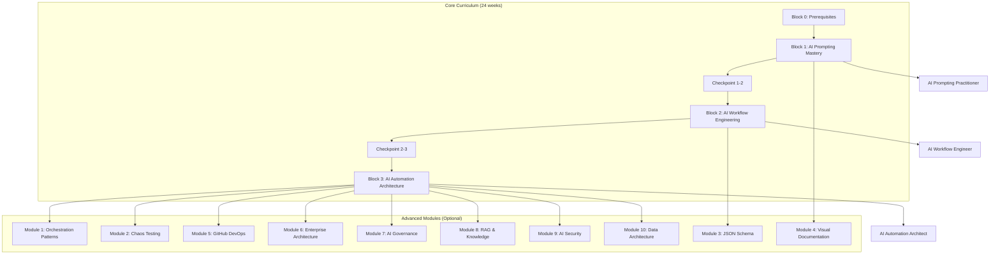

# Curriculum Review Implementation Plan

**Created:** 2026-01-01
**Status:** Ready for Implementation
**Estimated Effort:** 9-13 hours
**Total Items:** 35 recommendations

---

## Overview

This plan addresses coverage, coherence, and consistency issues identified in a comprehensive review of the AI Practitioner Training Curriculum. All items are actionable with specific file paths and changes.

### Key Decision Made

**Block 3 Certification Threshold:** Block 3 intentionally requires a higher standard (34/40 = 85%) compared to Blocks 1-2 (22/40 = 55%). This reflects the increased complexity of autonomous agent development. Update documentation to clarify this is intentional, not an error.

---

## Execution Order

Execute in this order for best results:

1. **Phase 1: Critical Fixes** (Items 1.2, 1.3, 2.1, 2.2, 3.1, 3.2) - 2-3 hours
2. **Phase 2: Important Updates** (Items 1.4-1.7, 2.3-2.6, 3.3-3.8) - 4-6 hours
3. **Phase 3: Minor Polish** (Items 1.8, 1.10-1.12, 2.7-2.12, 3.9-3.13) - 3-4 hours

---

## Phase 1: Critical Fixes

### 1.2 - Update CLAUDE.md Module Count

**File:** `/home/user/ai-basics-training/CLAUDE.md`
**Line:** 18
**Priority:** Critical

**Current text:**
```
advanced-modules/  5 optional post-Block 3 modules (2 weeks each)
```

**Change to:**
```
advanced-modules/  10 optional post-Block 3 modules (2 weeks each)
```

---

### 1.3 - Fix CLAUDE.md Directory Structure

**File:** `/home/user/ai-basics-training/CLAUDE.md`
**Lines:** 13-26
**Priority:** Critical

**Current text:**
```
block-0/           Prerequisites and self-assessment
block-1/           AI Prompting Mastery (8 weeks) - Foundation skills
block-2/           AI Workflow Engineering (8 weeks) - Automation and MCP
block-3/           AI Automation Architecture (8 weeks) - Autonomous agents
advanced-modules/  5 optional post-Block 3 modules (2 weeks each)
```

**Change to:**
```
materials/
├── block-0/           Prerequisites and self-assessment
├── block-1/           AI Prompting Mastery (8 weeks) - Foundation skills
├── block-2/           AI Workflow Engineering (8 weeks) - Automation and MCP
├── block-3/           AI Automation Architecture (8 weeks) - Autonomous agents
└── advanced-modules/  10 optional post-Block 3 modules (2 weeks each)
```

Also update the file path reference on line 33:
```
- Main curriculum file: `materials/block-N/block-N.md` (comprehensive, 78-92KB each)
- Weekly breakdown: `materials/block-N/week-N/week-N.md`
```

---

### 2.1 - Document Block 3 Higher Certification Standard

**Decision:** Block 3 intentionally requires 85% (34/40) vs 55% (22/40) for Blocks 1-2.

**Files to update:**

1. **CLAUDE.md** - Lines 57-59
   **Current:**
   ```
   ### Assessment Standards
   - Quality rubrics use 5-point scale: 5-Excellent, 4-Good, 3-Adequate, 2-Poor, 1-Missing
   - Certification threshold: 22/40 points (55%)
   ```

   **Change to:**
   ```
   ### Assessment Standards
   - Quality rubrics use 5-point scale: 5-Excellent, 4-Good, 3-Adequate, 2-Poor, 1-Missing
   - Certification threshold: 22/40 points (55%) for Blocks 1-2
   - Block 3 certification threshold: 34/40 points (85%) - reflects agent complexity
   ```

2. **README.md** - Add note in Block 3 section (around line 126-130)
   After the Block 3 capstone description, add:
   ```
   > **Certification Standard:** Block 3 requires 34/40 points (85%) for certification,
   > higher than Blocks 1-2 (22/40 = 55%), reflecting the critical nature of autonomous
   > agent deployment.
   ```

3. **Verify these files already have 34/40 (85%) - no changes needed:**
   - `materials/block-3/week-7/presentation.md` ✓
   - `materials/block-3/week-7/participant-guide.md` ✓
   - `materials/block-3/week-8/instructor-guide.md` ✓
   - `materials/block-3/week-8/presentation.md` ✓

---

### 2.2 - Fix Appendix Letter Overlap

**Issue:** Block 2 uses Appendices N-O, Block 3 also uses N-Q (overlap on N, O)

**Files to update:**

1. **CLAUDE.md** - Lines 44-46
   **Current:**
   ```
   - Block 2: Appendices J-O
   - Block 3: Appendices N-Q (note: some letter overlap)
   ```

   **Change to:**
   ```
   - Block 2: Appendices J-O
   - Block 3: Appendices P-S
   ```

2. **README.md** - Lines 420-425
   **Current:**
   ```
   ### Block 3 Appendices (N-Q)
   - N: Block 3 Capstone Rubric
   - O: Agent Design Template
   - P: Production Readiness Checklist
   - Q: ROI Calculation Template
   ```

   **Change to:**
   ```
   ### Block 3 Appendices (P-S)
   - P: Block 3 Capstone Rubric
   - Q: Agent Design Template
   - R: Production Readiness Checklist
   - S: ROI Calculation Template
   ```

3. **materials/block-3/block-3.md** - Search for all references to "Appendix N", "Appendix O", "Appendix P", "Appendix Q" and update:
   - Appendix N → Appendix P
   - Appendix O → Appendix Q
   - Appendix P → Appendix R
   - Appendix Q → Appendix S

4. **Update appendix headers within block-3.md** - Find each appendix section and rename

---

### 3.1 - Update README Directory Tree

**File:** `/home/user/ai-basics-training/README.md`
**Lines:** 337-383
**Priority:** Critical

**Current structure shows files at root level.** Update to reflect actual structure:

```
ai-basics-training/
├── README.md                    # This file - program overview
├── CLAUDE.md                    # Claude Code guidance
├── facilitator-guide.md         # Delivery guidance for trainers
├── learning-path.mermaid        # Visual learning path diagram
├── materials/                   # All curriculum content
│   ├── block-0/                 # Pre-program materials
│   │   └── prerequisites.md     # Pre-program self-assessment and setup
│   ├── block-1/                 # Block 1: AI Prompting Mastery (8 weeks)
│   │   ├── block-1.md           # Full curriculum
│   │   ├── block-1-executive-summary.md
│   │   └── week-1/ through week-8/  # Weekly breakdowns
│   ├── block-2/                 # Block 2: AI Workflow Engineering (8 weeks)
│   │   ├── block-2.md           # Full curriculum
│   │   └── week-1/ through week-8/  # Weekly breakdowns
│   ├── block-3/                 # Block 3: AI Automation Architecture (8 weeks)
│   │   ├── block-3.md           # Full curriculum
│   │   └── week-1/ through week-8/  # Weekly breakdowns
│   └── advanced-modules/        # Optional post-Block 3 learning (10 modules)
│       ├── module-1-orchestration-patterns.md
│       ├── module-2-chaos-testing.md
│       ├── module-3-json-schema.md
│       ├── module-4-visual-documentation.md
│       ├── module-5-github-devops.md
│       ├── module-6-enterprise-architecture.md
│       ├── module-7-ai-governance.md
│       ├── module-8-rag-knowledge-systems.md
│       ├── module-9-ai-security.md
│       └── module-10-data-architecture.md
├── checkpoints/                 # Inter-block skill verification
│   ├── block-1-to-2-checkpoint.md
│   └── block-2-to-3-checkpoint.md
├── quick-reference/             # One-page reference cards
│   ├── block-1-reference.md
│   ├── block-2-reference.md
│   └── block-3-reference.md
├── templates/                   # Reusable templates for trainers
│   ├── weekly-instructor-guide-template.md
│   ├── weekly-participant-guide-template.md
│   └── weekly-presentation-template.md
├── feedback/                    # Cohort feedback collection
│   └── cohort-feedback-template.md
├── marketing/                   # Marketing and sales materials
│   └── block1-sales-infographic.md
├── updates/                     # Curriculum updates and changelogs
│   ├── update-1.md
│   └── CHANGELOG-2025-12-31.md
└── archive/                     # Historical/reference documents
    ├── presentation.md          # Agent Memory Meta-Framework (48 slides)
    ├── checkpoint-1.md
    └── IMPLEMENTATION-PLAN.md
```

---

### 3.2 - Fix README Quick Navigation Links

**File:** `/home/user/ai-basics-training/README.md`
**Priority:** Critical

**Find and replace these broken links:**

| Line(s) | Current | Change To |
|---------|---------|-----------|
| 28-30 | `block-1/block-1.md` | `materials/block-1/block-1.md` |
| 28-30 | `block-2/block-2.md` | `materials/block-2/block-2.md` |
| 28-30 | `block-3/block-3.md` | `materials/block-3/block-3.md` |
| 36-45 | `advanced-modules/module-X-*.md` | `materials/advanced-modules/module-X-*.md` |
| 53-55 | `block-1/block-1.md` (Quick Navigation) | `materials/block-1/block-1.md` |
| 59-68 | All advanced module links | Add `materials/` prefix |
| 391-393 | Quick reference links | Verify paths are correct |
| 439 | `block-0/prerequisites.md` | `materials/block-0/prerequisites.md` |
| 475 | `block-1/block-1.md` | `materials/block-1/block-1.md` |

**Systematic approach:** Search README.md for:
- `](block-0/` → replace with `](materials/block-0/`
- `](block-1/` → replace with `](materials/block-1/`
- `](block-2/` → replace with `](materials/block-2/`
- `](block-3/` → replace with `](materials/block-3/`
- `](advanced-modules/` → replace with `](materials/advanced-modules/`

---

## Phase 2: Important Updates

### 1.4 - Create Glossary

**New file:** `/home/user/ai-basics-training/glossary.md`
**Priority:** Important

Create a glossary with the following terms (at minimum):

```markdown
# AI Practitioner Training Glossary

## A

**Agent** - An AI system that can autonomously perform multi-step tasks, make decisions, and interact with external tools without human intervention at each step.

**ASK-CONTEXT-CONSTRAINTS-EXAMPLE Framework** - Block 1 prompting methodology. ASK = clear request, CONTEXT = background information, CONSTRAINTS = limitations/requirements, EXAMPLE = desired output format.

## C

**Capstone** - End-of-block project demonstrating mastery of block skills. Required for certification.

**Checkpoint** - Inter-block assessment verifying readiness to proceed.

## D

**Domain Memory** - Structured external memory for AI agents consisting of three pillars: Explicit Goals, Progress Records, and Operating Procedures.

## L

**LLM-as-Judge Pattern** - Quality evaluation technique where an AI evaluates another AI's output against defined criteria.

## M

**MCP (Model Context Protocol)** - Protocol enabling AI assistants like Claude to access external resources (files, databases, APIs) through configured servers.

**Micro-Agent Pattern** - Design pattern using small, focused agents (3-20 steps) within deterministic workflows.

## O

**Orchestration** - Coordination of multiple agents or workflow steps to accomplish complex tasks.

## Q

**Quality Gate** - Automated checkpoint in a workflow that evaluates output quality before proceeding.

**Quality Rubric** - Structured evaluation criteria with defined scoring (typically 1-5 scale).

## T

**Two-Agent Pattern** - Core Block 3 architecture using an Executor agent (performs tasks) and Evaluator agent (assesses quality).

## W

**Workflow** - Multi-step automated process connecting AI operations with triggers, conditions, and outputs.
```

Add link to glossary in README.md Quick Navigation section.

---

### 1.5 - Create Block 2 Marketing Materials

**New file:** `/home/user/ai-basics-training/marketing/block2-sales-infographic.md`
**Priority:** Important

**Content structure (follow block1-sales-infographic.md format):**

```markdown
# Block 2: AI Workflow Engineering - Sales Infographic

## Headline
**From Manual Tasks to Automated Workflows**

## Target Audience
AI Prompting Practitioners ready to scale their skills

## Key Value Propositions
1. Build reusable multi-step workflows
2. Integrate AI with existing tools via MCP
3. Implement quality gates for consistent output
4. Track performance metrics

## Program Highlights
- 8 weeks, 1.75-2 hours/week
- Hands-on automation platform experience
- MCP configuration and troubleshooting
- Quality evaluation systems

## Capstone Deliverable
AI Workflow Toolkit with 3 documented workflow templates

## Certification
AI Workflow Engineer

## Prerequisites
Block 1 Capstone completed
```

---

### 1.6 - Create Block 3 Marketing Materials

**New file:** `/home/user/ai-basics-training/marketing/block3-sales-infographic.md`
**Priority:** Important

**Content structure:**

```markdown
# Block 3: AI Automation Architecture - Sales Infographic

## Headline
**Design Autonomous AI Agents for Complex Workflows**

## Target Audience
AI Workflow Engineers ready to build autonomous systems

## Key Value Propositions
1. Design agents that work independently
2. Implement multi-agent orchestration
3. Build production-ready AI systems
4. Deploy with confidence and monitoring

## Program Highlights
- 8 weeks, 2-2.25 hours/week
- Two-Agent Architecture Pattern
- Domain Memory implementation
- Production deployment planning

## Capstone Deliverable
End-to-end autonomous workflow with ROI documentation

## Certification
AI Automation Architect (requires 85% score)

## Prerequisites
Block 2 Capstone completed
```

---

### 1.7 - Verify Learning Path Visualization

**File:** `/home/user/ai-basics-training/learning-path.mermaid`
**Priority:** Important

**Action:**
1. Verify file exists
2. If exists, check it includes all 10 advanced modules
3. If missing, create Mermaid diagram:



---

### 2.3 - Verify Archive Link in Checkpoint

**File:** `/home/user/ai-basics-training/checkpoints/block-2-to-3-checkpoint.md`
**Line:** 96
**Priority:** Important

**Current link:** `../archive/presentation.md`

**Verification steps:**
1. From `checkpoints/` directory, `../archive/presentation.md` should resolve to `/home/user/ai-basics-training/archive/presentation.md`
2. Check if that file exists
3. If not, find correct path and update

---

### 2.4 - Standardize Entry/Exit Criteria Format

**Files:** All weekly files in `materials/block-*/week-*/`
**Priority:** Important

**Standard format to apply:**

```markdown
## Entry Criteria
- [ ] Criterion 1
- [ ] Criterion 2
- [ ] Criterion 3

## Exit Criteria
- [ ] Demonstrable skill 1
- [ ] Demonstrable skill 2
- [ ] Deliverable completed
```

Use checkbox format (`- [ ]`) consistently for all entry/exit criteria.

---

### 2.5 - Cross-Reference Advanced Modules in Block 3

**File:** `/home/user/ai-basics-training/materials/block-3/block-3.md`
**Priority:** Important

**Add "Extend Your Learning" notes in relevant weeks:**

| Week | Topic | Add Reference To |
|------|-------|------------------|
| Week 2 | Agent Design | Module 1: Orchestration Patterns |
| Week 3 | Multi-Agent | Module 1: Orchestration Patterns |
| Week 4 | Error Handling | Module 2: Chaos Testing |
| Week 5 | MCP Advanced | Module 8: RAG & Knowledge Systems |
| Week 6 | Monitoring | Module 5: GitHub DevOps |
| Week 7 | Deployment | Module 6: Enterprise Architecture |
| Week 8 | Capstone | Module 7: AI Governance |

**Format:**
```markdown
> **Extend Your Learning:** After completing Block 3, explore
> [Module X: Topic](../advanced-modules/module-X-name.md) for deeper coverage.
```

---

### 2.6 - Align Workshop Timing Segments

**Files:** All weekly files
**Priority:** Important

**Standard:** 4 segments totaling ~42 minutes (leaving 3-minute buffer for 45-min session)

**Audit each week and ensure segments follow pattern:**
- Segment 1: ~10 min (Opening/Review)
- Segment 2: ~12 min (Core Content)
- Segment 3: ~12 min (Demonstration)
- Segment 4: ~8 min (Practice/Wrap-up)

---

### 3.3 - Fix README Prerequisites Links

**File:** `/home/user/ai-basics-training/README.md`
**Priority:** Important

**Find:** `block-0/prerequisites.md`
**Replace with:** `materials/block-0/prerequisites.md`

This may appear in multiple locations (lines ~248, ~439).

---

### 3.4 - Standardize Date Formats

**Files:** All files with dates
**Priority:** Important

**Standard:** ISO 8601 format: `YYYY-MM-DD`

**Examples:**
- ✓ `2026-01-01`
- ✗ `January 1, 2026`
- ✗ `01/01/2026`
- ✗ `1 Jan 2026`

---

### 3.5 - Ensure Version Consistency

**Files:** README.md, materials files
**Priority:** Important

**Current version:** 3.1

Search all files for version references and ensure they say `3.1` or reference the correct version for that section's last update.

---

### 3.6 - Standardize Tool Name Capitalization

**Files:** All curriculum files
**Priority:** Important

**Apply these standards:**

| Correct | Incorrect |
|---------|-----------|
| GitHub | Github, github |
| Claude Desktop | Claude desktop, claude desktop |
| VS Code | VSCode, vscode, VS code |
| ChatGPT | Chatgpt, chatGPT |
| Microsoft Teams | MS Teams (acceptable abbreviation) |

Use find/replace across all .md files.

---

### 3.7 - Harmonize Framework Name References

**Files:** All curriculum files
**Priority:** Important

**Standard:** First reference in each file: "ASK-CONTEXT-CONSTRAINTS-EXAMPLE framework"
**Subsequent:** "ASK-CONTEXT-CONSTRAINTS-EXAMPLE" or "the framework" (avoid abbreviating to "ACCE")

---

### 3.8 - Standardize MCP Terminology

**Files:** Block 2, Block 3, and advanced module files
**Priority:** Important

**Pattern:**
- First mention in each document: "Model Context Protocol (MCP)"
- All subsequent mentions: "MCP"
- For servers: "MCP server" (not "MCP integration" or "MCP connection")

---

## Phase 3: Minor Polish

### 1.8 - Consider Advanced Module Quick Reference Cards

**Location:** `/home/user/ai-basics-training/quick-reference/`
**Priority:** Minor

**Decision needed:** Are quick reference cards needed for advanced modules?

**If yes:** Create condensed 1-page references for each of the 10 modules following the block reference card format.

**If no:** Document in README that advanced modules don't include quick reference cards by design.

---

### 1.10 - Standardize Advanced Module Time Estimates

**Files:** All files in `materials/advanced-modules/`
**Priority:** Minor

**Verify each module header matches README table:**

| Module | Live | Homework | Total |
|--------|------|----------|-------|
| 1: Orchestration | 45 min | 75 min | 2.0 hrs |
| 2: Chaos Testing | 45 min | 75 min | 2.0 hrs |
| 3: JSON Schema | 45 min | 60 min | 1.75 hrs |
| 4: Mermaid Docs | 45 min | 60 min | 1.75 hrs |
| 5: DevOps | 45 min | 60-75 min | 1.75-2.0 hrs |
| 6: Enterprise Arch | 45 min | 75 min | 2.0 hrs |
| 7: AI Governance | 45 min | 75 min | 2.0 hrs |
| 8: RAG & Knowledge | 45 min | 75 min | 2.0 hrs |
| 9: AI Security | 45 min | 75 min | 2.0 hrs |
| 10: Data Arch | 45 min | 75 min | 2.0 hrs |

---

### 1.11 - Document Advanced Module Structure

**File:** CLAUDE.md or README.md
**Priority:** Minor

Add note clarifying that advanced modules are self-contained 2-week units and don't follow the week-1/week-2 subdirectory pattern used in core blocks.

---

### 1.12 - Add Facilitator Notes for Advanced Modules

**Files:** All advanced modules
**Priority:** Minor

**Optional enhancement:** Add a "Facilitator Notes" section to each advanced module with:
- Common participant questions
- Timing adjustments
- Prerequisite verification tips

---

### 2.7 - Standardize Exercise Deliverable Format

**Files:** All weekly files
**Priority:** Minor

**Standard format:**

```markdown
### Deliverables
1. **[Deliverable Name]** - Brief description
   - Specific requirement 1
   - Specific requirement 2

2. **[Deliverable Name]** - Brief description
```

---

### 2.8 - Ensure Consistent Heading Hierarchy

**Files:** All curriculum files
**Priority:** Minor

**Standard:**
- `#` - Document title only
- `##` - Major sections (Week X, Workshop Content, Exercises)
- `###` - Subsections
- `####` - Sub-subsections (use sparingly)

---

### 2.9 - Standardize Code Block Formatting

**Files:** All curriculum files
**Priority:** Minor

**Standards:**
- JSON: Use ` ```json ` fence
- Markdown: Use ` ```markdown ` fence
- Shell commands: Use ` ```bash ` fence
- Plain text/output: Use ` ``` ` (no language)

---

### 2.10 - Align Template Usage Instructions

**Files:** All files in `templates/`
**Priority:** Minor

**Add consistent header to each template:**

```markdown
<!--
TEMPLATE: [Template Name]
PURPOSE: [One-line description]
USAGE: Copy this file and replace [BRACKETED] placeholders with your content.
LAST UPDATED: YYYY-MM-DD
-->
```

---

### 2.11 - Verify All Internal Links

**Files:** All markdown files
**Priority:** Minor

**Process:**
1. Use a markdown link checker tool, or
2. Manually search for `](` and verify each link resolves
3. Pay special attention to:
   - Links to archived files
   - Cross-block references
   - Appendix references

---

### 2.12 - Standardize Table Formatting

**Files:** All curriculum files
**Priority:** Minor

**Standards:**
- Use `|` alignment (left-align text, right-align numbers)
- Include header separator row: `|---|---|---|`
- No trailing spaces in cells

---

### 3.9 - Standardize Bullet Point Style

**Files:** All markdown files
**Priority:** Minor

**Standards:**
- Use `-` for all unordered lists (not `*`)
- 2-space indentation for nested lists
- One blank line before and after lists

---

### 3.10 - Harmonize Emphasis Formatting

**Files:** All curriculum files
**Priority:** Minor

**Standards:**
- `**bold**` - Key terms, definitions, important concepts
- `*italic*` - Emphasis, book/document titles, first use of term
- `` `code` `` - File names, commands, technical values

---

### 3.11 - Standardize File Path References

**Files:** All curriculum files
**Priority:** Minor

**Standard:** Always use inline code formatting for file paths:
- ✓ `materials/block-1/block-1.md`
- ✗ materials/block-1/block-1.md

---

### 3.12 - Fix Plural/Singular Inconsistencies

**Files:** Various
**Priority:** Minor

**Review and align usage:**
- "workflow" (singular for concept) vs "workflows" (plural for collections)
- "agent" (singular) vs "agents" (plural)
- Ensure grammatical consistency within paragraphs

---

### 3.13 - Standardize Numbering in Lists

**Files:** All curriculum files
**Priority:** Minor

**Standard:** Use `1. 2. 3.` format for ordered lists (not `1) 2) 3)`)

---

## Verification Checklist

After completing all phases, verify:

- [ ] All README links resolve correctly
- [ ] CLAUDE.md accurately describes repository structure
- [ ] Block 3 certification threshold is documented as 85%
- [ ] Appendix letters don't overlap between blocks
- [ ] Glossary is linked from README
- [ ] Marketing materials exist for all 3 blocks
- [ ] Date formats are consistent (ISO 8601)
- [ ] Tool names are capitalized correctly

---

## Notes

- **Excluded items:** 1.1 (Block 0→1 Checkpoint) and 1.9 (Block 0 Image) were excluded per stakeholder request
- **Block 3 threshold decision:** Confirmed that 85% is intentional for Block 3
- **Backup:** Consider creating a git branch before making bulk changes

---

**Document Author:** Claude Code Review
**Review Date:** 2026-01-01
**Approved By:** [Pending]
